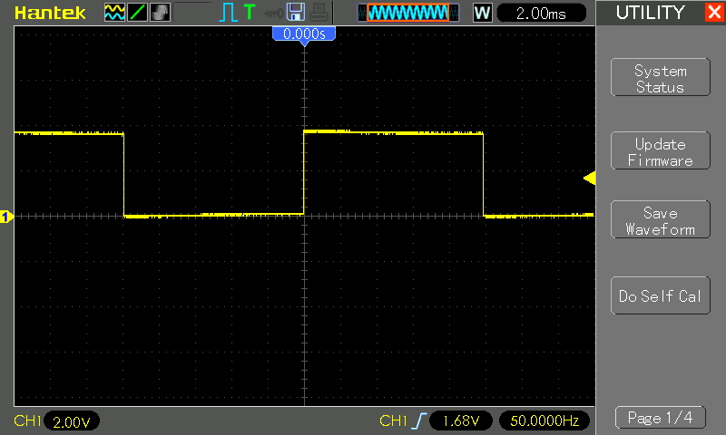
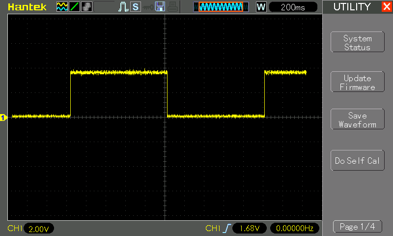

# #395 AT89C2051 Blinky

Simplest LED blinky program in C for the AT89C2051(8051/MCS51) microprocessor, built with the SDCC open-source toolchain on macOS.
Originally tested with Intel-based macOS, but now updated for Apple Silicon.


Here's a quick demo..

[](https://www.youtube.com/watch?v=HSkF3Fejx3c)

## Notes

The main purpose of this program is simply to have something for testing the [LEAP#394 AT89C2051 Programmer](../Programmer/),
and also my first trial of [SDCC - Small Device C Compiler](https://sdcc.sourceforge.net/).

It is almost but not quite the simplest LED blinky program possible.
It blinks an LED on P1_0, using a do-nothing loop to toggles the LED state every 1 second.

## Installing SDCC

SDCC can be compiled from source or installed with a range of pre-compiled distributions available for Linux, Mac and Windows.

I previously installed SDCC [using a pre-compiled distribution for macOS](https://sdcc.sourceforge.net/snap.php#MacOSX),
specifically
[this version](https://excellmedia.dl.sourceforge.net/project/sdcc/snapshot_builds/i386_universal-apple-macosx/sdcc-snapshot-i386_universal-apple-macosx-20150214-9180.tar.bz2),
but that was when I was still using an Intel-based machine.

I now run macOS on Apple Silicon (M3), and it seems there are no pre-compiled distributions for this platform.
Can it be compiled from source? Luckily it seems the hard work has already been done - there is a [brew formula](https://formulae.brew.sh/formula/sdcc) that is Apple Silicon-compatible:

```sh
$ brew install sdcc
...
==> Pouring sdcc--4.5.0.arm64_sequoia.bottle.tar.gz
🍺  /opt/homebrew/Cellar/sdcc/4.5.0: 1,942 files, 146.1MB
==> Running `brew cleanup sdcc`...
...
==> Caveats
Emacs Lisp files have been installed to:
  /opt/homebrew/share/emacs/site-lisp/sdcc
$ which sdcc
/opt/homebrew/bin/sdcc
```

Homebrew appears to setup the environment sufficiently,
but in other circumstances it may be necessary to set the `SDCC_HOME` environment variable so the compiler can find all its bits and pieces (like library header files).

```sh
export SDCC_HOME=./sdcc
export PATH=$PATH:${SDCC_HOME}/bin
```

## The Blinky Program

The [src/Blinky.c](./src/Blinky.c) source file is the entire program:

* a `main` function that toggles the state of the `P1_0` port bit evert `DELAY` milliseconds.
* a `ms_delay` function that "sleeps" for the specified number of milliseconds

### Header Files

The program needs to access some processor-specific features - in this case the port register `P1_0`.
What header files do we need to include to achieve this?

My Homebrew-installed SDCC header files are located in `/opt/homebrew/Cellar/sdcc/4.5.0/share/sdcc/include/`,
with a large number of header files specific to Intel MCS-51 compatible processors in the sub-folder `./mcs51`.
A small selection:

```sh
$ ls -1  /opt/homebrew/Cellar/sdcc/4.5.0/share/sdcc/include/mcs51
8051.h
8052.h
..
at89x051.h
at89x51.h
at89x52.h
..
mcs51reg.h
msc1210.h
...
reg51.h
..
```

One approach is to include the generic `mcs51reg.h` (Register Declarations for the mcs51 compatible microcontrollers).
It will include the necessary definitions based on the `MICROCONTROLLER_xxx` defined.
This makes the code potentially easier to compile for different microprocessors.
For example, I have used in this case:

```c
#define MICROCONTROLLER_AT89CX051
#include <mcs51/mcs51reg.h>
```

Note: the sdcc organises headers by processor family into subfolders e.g. `mcs51/`. While it is not strictly necessary to specify the subfolder (using `#include <mcs51reg.h>` instead will still work), it is better to include it to avoid unexpected name collisions. The Keil compiler headers are not organised by folder, so the Keil equivalent would be `#include <reg51.h>`.

One can be more specific and include the header file for the specific processor in use.
The pre-compiler speedup of specific header files is probably negligible.
In my case that could be `at89x51.h` (register declarations for ATMEL 89x51 processors)
or better yet `at89x051.h` (Register Declarations for Atmel AT89C1051, AT89C2051 and AT89C4051 Processors).

```c
#include <mcs51/at89x51.h>
// or
// #include <mcs51/at89x051.h>
```

Is there any benefit to one approach over the other?
Probably not much, unless you are specifically writing code to be compiled for multiple targets,
in which case I'd prefer `mcs51reg.h` with defines.

NOTE: there is a currently [bug in the `at89x51.h` header file](https://sourceforge.net/p/sdcc/bugs/3861/)
included in the latest sdcc release (4.5.2), so it can't be used without patching anyway.

One may also see `reg51.h` or `reg52.h` in use. I have seen this in old code compiled with Keil, for example.
These are obsolete and shouldn't be used with sdcc - `reg52.h` won't work, and `reg51.h` will just
raise a warning before falling back on including generic  `8052.h` headers.

### Calibrating the Delay Function

The `ms_delay` function does not rely on timers or counters - it simply goes into a "do nothing" loop to waste a specified amount of time. The loop duration needs to be calibrated for the processor speed (16MHz in my case).

Calibrating the delay can be done by at least 3 methods:

* count the operation CPU cycles and calculate the expected duration
* run the code in a simulator such as [Proteus](https://www.labcenter.com/), or use the logic analyzer of a compiler such as [Keil](https://www.keil.com)
* measure the resulting behaviour with an oscilloscope or frequency counter

For now, I'm going to measure with an oscilloscope. Since they don't like working at lower frequencies, I initially compile the code with a `DELAY` of 10ms. After adjusting the delay loop counter, I have the output toggling at the expected 50Hz:



Reverting to a `DELAY` of 1000ms, we see the expected behaviour: toggling the LED state every 1 second:



## Compiling

The [src/Makefile](./src/Makefile) is setup to compile the code using the SDCC compiler .. running on macOS in this instance:

```sh
$ cd src
$ make
sdcc -mmcs51 --code-size 2048 Blinky.c -o Blinky.ihx
packihx Blinky.ihx > Blinky.hex
packihx: read 16 lines, wrote 21: OK.
```

I've checked-in all the products of the compilation for study purposes:

| File       | Description |
|------------|-------------|
| [Blinky.asm](./src/Blinky.asm) | Assembler source file created by the compiler  |
| [Blinky.c](./src/Blinky.c)     | C source file |
| [Blinky.hex](./src/Blinky.hex) | Optional packed hex file created by packihx |
| [Blinky.ihx](./src/Blinky.ihx) | The load module in Intel hex format |
| [Blinky.lk](./src/Blinky.lk)   | linker options (I think) |
| [Blinky.lst](./src/Blinky.lst) | Assembler listing file created by the Assembler |
| [Blinky.map](./src/Blinky.map) | The memory map for the load module, created by the Linker |
| [Blinky.mem](./src/Blinky.mem) | A file with a summary of the memory usage |
| [Blinky.rel](./src/Blinky.rel) | Object file created by the assembler, input to Linkage editor |
| [Blinky.rst](./src/Blinky.rst) | Assembler listing file updated with link edit information, created by linkage editor  |
| [Blinky.sym](./src/Blinky.sym) | Symbol listing for the sourcefile, created by the assembler |

### Controlling the RST line

I haven't found the definitive specification for this yet - but I quickly learned that you can't just ground the RST pin
and have the chip run!

The AT89C2051 data sheet actually specifies a RST pull-down of 50kΩ-300kΩ, but it seems to be important to also
couple to VCC with a capacitor of say 2.2µF or more.
Googling for 8051 circuit schematics, I see a common combination is 8.2kΩ pull-down and 2.2µF or 10µF to VCC.

### Programming

I've programmed the chip using `at89overlord` and
the [LEAP#394 AT89C2051 Programmer](../Programmer/):

```sh
$ at89overlord -p /dev/tty.usbserial-2420 -f ./Blinky.hex
# Initializing the programmer...
# Initialized!
# Confirming chip ID...
# Confirmed!
# Erasing flash...
# Done!
# Writing flash...
# Done!
# Verifying...
# Done!
```

## Construction

Designed with Fritzing: see [Blinky.fzz](./Blinky.fzz).


## Credits and References

* [AT89C2051 product info and datasheet](https://www.microchip.com/wwwproducts/en/AT89c2051)
* [Intel MCS-51](https://en.wikipedia.org/wiki/Intel_MCS-51)
* [SDCC - Small Device C Compiler](https://sdcc.sourceforge.net/)
* [LEAP#394 AT89C2051 Programmer](../Programmer/)
* [..as mentioned on my blog](https://blog.tardate.com/2018/07/leap395-8051-programming-with-sdcc.html)
