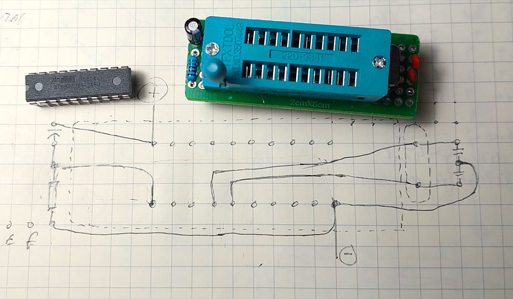
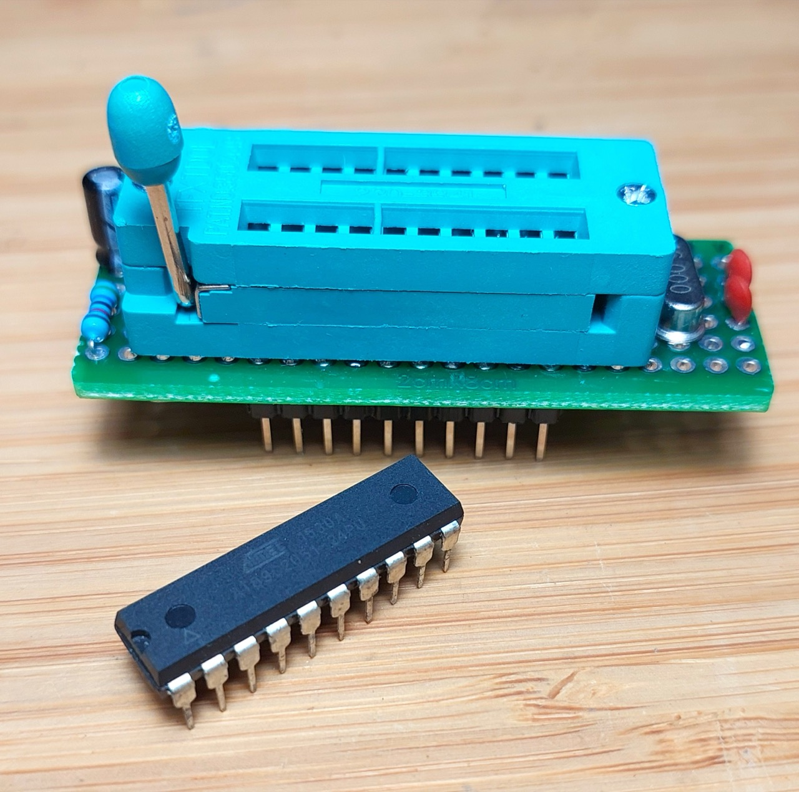
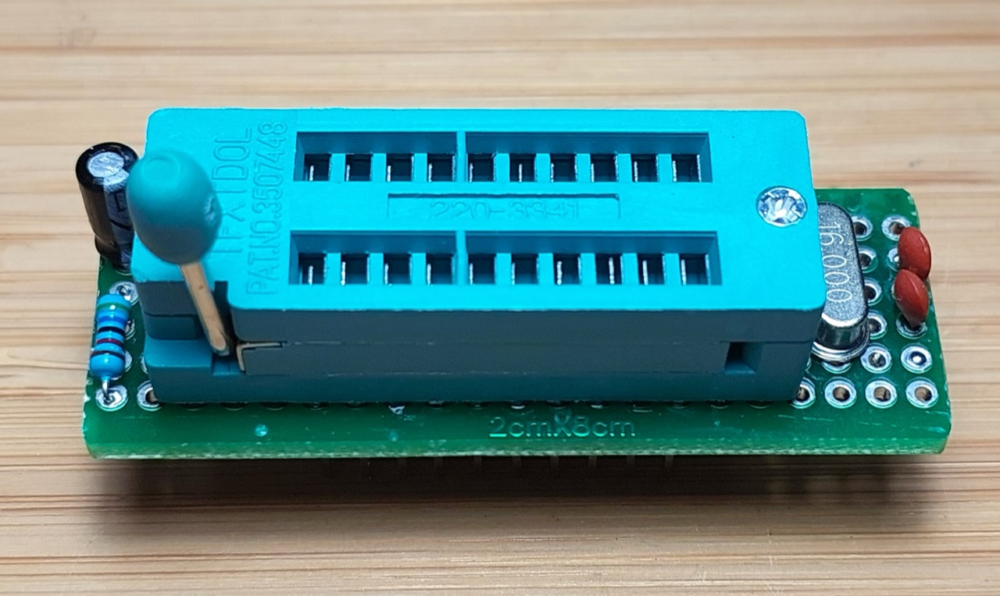
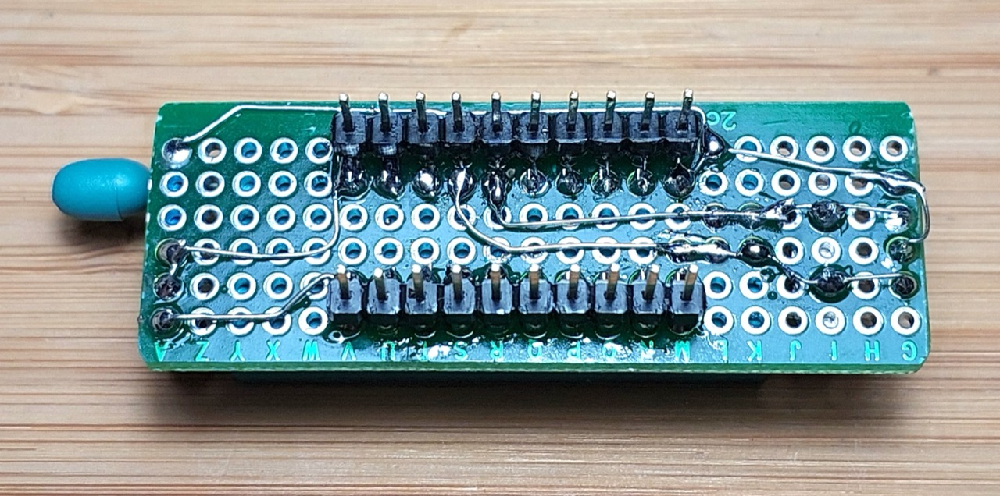

# #xxx AT89C2051 Breadboard Adapter

Wiring up the reset and oscillator support circuits gets a little tired each time one wants to prototype an AT89C2051(8051/MCS51) project. I made a little breadboard-compatible module that let's me easily pop the microprocessor in and out, and just requires a power and ground connection on the breadboard.

## Notes

I've been doing a few projects using the 20-pin
AT89C2051, 8051/MCS51-compatible chip.
To run, it requires:

* an external oscillator - I'm using 16 MHz with loading capacitors
* the RST pin to be pulled low with an RC circuit. The AT89C2051 data sheet actually specifies a RST pull-down of 50kΩ-300kΩ, but it seems important to also couple to VCC with a capacitor of 2.2µF or more.

Rather than need all this external support circuitry to be setup on a breadboard when prototyping, I decided to load it all on a
breadboard-compatible board with a ZIF socket to allow the microprocessor to be easily popped in and out.

### Circuit Design

The minimal support circuitry:

### Protoboard Design

Sketching out a compact design:

### Testing the Board

Running the [Blinky](../Blinky/) program:

## Credits and References

* [name](url)
