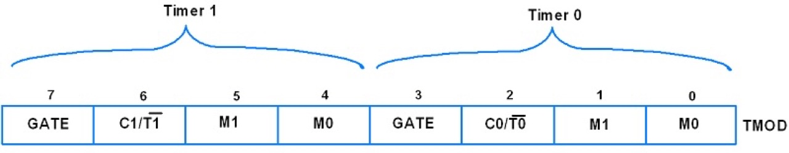

# #788 AT89C2051 Counters

Using an 8051 timer register as a counter with the AT89C2051.
Demonstrates a manually triggered counter with the current count printed to an LCD.

Here's a quick demo..

## Notes

8051 timers may be configured as counters by setting the C/T flag in the TMOD register.
Behaviour is the same as for timer mode, the only difference is clock source.
For counters, the clock source is pins T0/T1. Sampled every machine cycle, with the counter incremented on falling transition.

* T0: counter 0, P3.4
* T1: counter 1, P3.5

### TMOD Register

TMOD is an 8-bit register used to set timer mode of Timer0 and Timer1.

| Bit             | Value | Description |
|-----------------|-------|-------------|
| GATE (7,3)      | 0     | Enable Timer/Counter when TR0/TR1 is set |
| GATE (7,3)      | 1     | Enable Timer/Counter only when the INT0/INT1 pin is high and TR0/TR1 is set. |
| C/T (6,2)       | 0     | Use as Timer |
| C/T (6,2)       | 1     | Use as Counter |
| M1+M0 (5+4,1+0) | 00    | Mode 0: 13-bit timer/counter, 8-bit of THx & 5-bit of TLx |
| M1+M0 (5+4,1+0) | 01    | Mode 1: 16-bit timer/counter, THx cascaded with TLx|
| M1+M0 (5+4,1+0) | 10    | Mode 2: 8-bit timer/counter (auto-reload mode), TLx reload with the value held by THx each time TLx overflow |
| M1+M0 (5+4,1+0) | 11    | Mode 3: Split the 16-bit timer into two 8-bit timers i.e. THx and TLx like two 8-bit timer |

### Demo Circuit Design

Designed with Fritzing: see [Counters.fzz](./Counters.fzz).

A push-button is attached to T0 counter input, with the input normally pulled high. Simple RC debouncing is provided with C4.

The current count is written to an LCD screen.

### The Code

See [src/Counters.c](./src/Counters.c).

Most of the code relates to the LCD control.

The counter demonstration is contained within the `run_counter` method:

    void run_counter(void) {
        TMOD=0b00000110; // counter 0, mode 2, 8 bit mode
        while(1) {
            TL0 = 0x00;
            TH0 = 0x00;
            TR0 = 1; // counter 0 on
            while(!TF0) { // loop until overflow
                if (TL0 == 43) break; // limit the count
                write_count(TL0);
            }
            TR0 = 0; // counter 0 off
            TF0 = 0; // clear flag
        }
    }

This is a very naïve use of the counter:

* the counter is initialised with a starting value of 0
* the external trigger (button press to T0) increments the counter
* the current count (in `TL0`) is repeatedly written to the LCD screen
* when the count reaches the pre-determined limit, it resets the count

## Programming

The [src/Makefile](./src/Makefile) is setup to compile the code using the SDCC compiler .. running on macOS in this instance:

    $ cd src
    $ make
    sdcc -mmcs51 --code-size 2048 Counters.c -o Counters.ihx
    packihx Counters.ihx > Counters.hex
    packihx: read 32 lines, wrote 51: OK.

Program the chip using `at89overlord` and
the [LEAP#394 AT89C2051 Programmer](../Programmer/):

    $ at89overlord -p /dev/tty.usbserial-2420 -f ./Counters.hex
    # Initializing the programmer...
    # Initialized!
    # Confirming chip ID...
    # Confirmed!
    # Erasing flash...
    # Done!
    # Writing flash...
    # Done!
    # Verifying...
    # Done!

## Testing

I have the circuit setup on a breadboard with the [#780 AT89C2051 Breadboard Adapter](../BreadboardAdapter/):

## Credits and References

* [AT89C2051 product info and datasheet](https://www.microchip.com/wwwproducts/en/AT89c2051)
* [Intel MCS-51](https://en.wikipedia.org/wiki/Intel_MCS-51)
* [SDCC - Small Device C Compiler](https://sdcc.sourceforge.net/)
* [LEAP#394 AT89C2051 Programmer](../Programmer/)
* [LEAP#780 AT89C2051 Breadboard Adapter](../BreadboardAdapter/)
