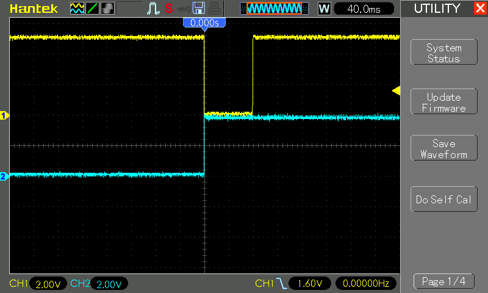
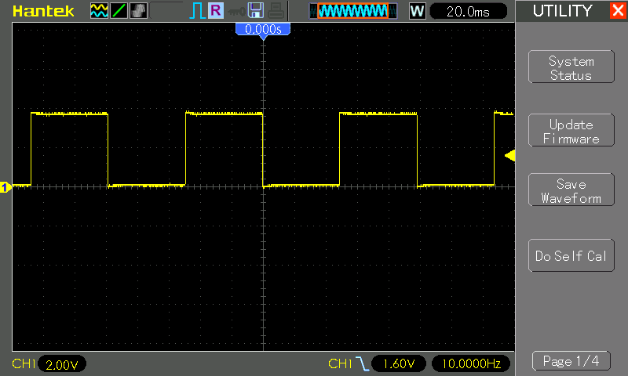

# #xxx AT89C2051 Interrupts

All about using 8051 interrupts with the AT89C2051. Demonstrates timer and external hardware interrupts toggling LEDs.


Here's a quick demo..

[](https://www.youtube.com/watch?v=syx89EdCERg)

## Notes

### 8051 Interrupts

An interrupt is an event that occurs randomly in the flow of continuity. It is just like a call you have when you are busy with some work and depending upon call priority you decide whether to attend or neglect it.

The same thing happens in microcontrollers. 8051 architecture handles 5 interrupt sources, out of which two are internal (Timer Interrupts), two are external and one is a serial interrupt. Each of these interrupts has its interrupt vector address. The highest priority interrupt in 8051 Microcontroller is the Reset, with vector address 0x0000.

#### 8051 interrupt vector table

Vector Address: This is the address where the controller jumps after the interrupt to serve the ISR (interrupt service routine).

| Interrupt# | Name               | Flag  | Interrupt vector address | Pin  | Flag Clearing |
|------------|--------------------|-------|--------------------------|------|---------------|
|            | Reset              | -     | 0000H                    | 9    | Auto |
| 0          | INT0 (Ext. int. 0) | IE0   | 0003H                    | P3.2 | Auto |
| 1          | Timer 0            | TF0   | 000BH                    |      | Auto |
| 2          | INT1 (Ext. int. 1) | IE1   | 0013H                    | P3.3 | Auto |
| 3          | Timer 1            | TF1   | 001BH                    |      | Auto |
| 4          | Serial             | TI/RI | 0023H                    |      | Program |
| 5          | Timer 2 (8052)     |       | 002BH                    |      | Auto |
| ..         |                    |       |                          |      | |
| n          |                    |       | 0003H + 8n               |      | |

#### IE register: Interrupt Enable Register

8-bit IE register is used to enable/disable interrupt sources.

| Bit             | Value | Description |
|-----------------|-------|-------------|
| EA (7)          | 0     | Enable All Bit: Disable all interrupts |
| EA (7)          | 1     | Enable All Bit: Enable all interrupts |
| Reserved (6)    | x     |  |
| Reserved (5)    | x     |  |
| ES (4)          | 0     | Enable Serial Interrupt Bit: Disable interrupt |
| ES (4)          | 1     | Enable Serial Interrupt Bit: Enable interrupt |
| ET1 (3)         | 0     | Enable Timer1 Interrupt Bit: Disable interrupt |
| ET1 (3)         | 1     | Enable Timer1 Interrupt Bit: Enable interrupt |
| EX1 (2)         | 0     | Enable External1 Interrupt Bit: Disable interrupt |
| EX1 (2)         | 1     | Enable External1 Interrupt Bit: Enable interrupt |
| ET0 (1)         | 0     | Enable Timer0 Interrupt Bit: Disable interrupt |
| ET0 (1)         | 1     | Enable Timer0 Interrupt Bit: Enable interrupt |
| EX0 (0)         | 0     | Enable External0 Interrupt Bit: Disable interrupt |
| EX0 (0)         | 1     | Enable External0 Interrupt Bit: Enable interrupt |

#### 8051 MCU Interrupt priority

Priority to the interrupt can be assigned by using the interrupt priority register (IP)

Interrupt priority after Reset:

| Priority | Interrupt source     | Intr. bit / flag |
|----------|----------------------|------------------|
| 1        | External Interrupt 0 | INT0 |
| 2        | Timer Interrupt 0    | TF0 |
| 3        | External Interrupt 1 | INT1 |
| 4        | Timer Interrupt 1    | TF1 |
| 5        | Serial interrupt     | (TI/RI) |

In the table, interrupts priorities upon reset are shown. As per 8051 interrupt priorities, the lowest priority interrupts are not served until the microcontroller is finished with higher priority ones. In a case when two or more interrupts arrive microcontroller queues them according to priority.

#### IP Register: Interrupt priority register

8051 has an interrupt priority register to assign priority to interrupts.

| Bit             | Value | Description |
|-----------------|-------|-------------|
| Reserved (7)    | -     |             |
| Reserved (6)    | -     |             |
| Reserved (5)    | -     |             |
| PS (4)          | 0     | Serial Interrupt Priority Bit: Assign low priority to interrupt |
| PS (4)          | 1     | Serial Interrupt Priority Bit: Assign a high priority to interrupt |
| PT1 (3)         | 0     | Timer1 Interrupt Priority Bit: Assign low priority to interrupt |
| PT1 (3)         | 1     | Timer1 Interrupt Priority Bit: Assign a high priority to interrupt |
| PX1 (2)         | 0     | External Interrupt1 Priority Bit: Assign low priority to interrupt |
| PX1 (2)         | 1     | External Interrupt1 Priority Bit: Assign a high priority to interrupt |
| PT0 (1)         | 0     | Timer0 Interrupt Priority Bit: Assign low priority to interrupt |
| PT0 (1)         | 1     | Timer0 Interrupt Priority Bit: Assign a high priority to interrupt |
| PX0 (0)         | 0     | External Interrupt0 Priority Bit: Assign low priority to interrupt |
| PX0 (0)         | 1     | External Interrupt0 Priority Bit: Assign a high priority to interrupt |

#### External interrupts in 8051

* 8051 has two external interrupt INT0 and INT1.
* 8051 controller can be interrupted by external Interrupt, by providing level or edge on external interrupt pins PORT3.2, PORT3.3.
* External peripherals can interrupt the microcontroller through these external interrupts if global and external interrupts are enabled.
* Then the microcontroller will execute current instruction and jump to the Interrupt Service Routine (ISR) to serve to interrupt.
* In the polling, method the microcontroller has to continuously check for a pulse by monitoring pin, whereas, in the interrupt method, the microcontroller does not need to poll. Whenever an interrupt occurs microcontroller serves the interrupt request.

8051 mcu has two types of external interrupts of activation level

* Edge triggered (Interrupt occur on rising/falling edge detection)
* Level triggered (Interrupt occur on high/low-level detection)

There are lower four flag bits in the TCON register required to select and monitor the external interrupt type and ISR status.

| Bit             | Value | Description |
|-----------------|-------|-------------|
| IE1 (3)         | 0     | External interrupt1 Processed. |
| IE1 (3)         | 1     | External interrupt1 occurred.. |
| IT1 (2)         | 0     | External Interrupt1 Trigger Type Select Bit: Interrupt occur on a low level at the INT1 pin. |
| IT1 (2)         | 1     | External Interrupt1 Trigger Type Select Bit: Interrupt occurs on falling edge at INT1 pin. |
| IE0 (1)         | 0     | External interrupt0 Processed. |
| IE0 (1)         | 1     | External interrupt0 occurred.. |
| IT0 (0)         | 0     | External Interrupt0 Trigger Type Select Bit: Interrupt occur on a low level at the INT0 pin. |
| IT0 (0)         | 1     | External Interrupt0 Trigger Type Select Bit: Interrupt occurs on falling edge at INT0 pin. |

#### Interrupt Service Routines with SDCC

SDCC allows interrupt service routines to be coded in C, with some extended keywords.

```c
void timer_isr (void) __interrupt (1) __using (1)
{
...
}
```

The optional number following the `__interrupt` keyword is the interrupt number this routine will service. When present,
the compiler will insert a call to this routine in the interrupt vector table for the interrupt number specified. If you have
multiple source files in your project, interrupt service routines can be present in any of them, but a prototype of the isr
MUST be present or included in the file that contains the function main. The optional (8051 specific) keyword `__using`
can be used to tell the compiler to use the specified register bank when generating code for this function.

### Demo Circuit Design

Designed with Fritzing: see [Interrupts.fzz](./Interrupts.fzz).

Essentials:

* LED attached to P1_0 - toggled every external interrupt 0
* LED attached to P1_1 - toggled every Timer0 interrupt
* Push-button, normally pulled high, attached to INT0, with a debouncing capacitor


### The Code

See [src/Interrupts.c](./src/Interrupts.c).

The main function configures interrupts and then does nothing.

* INT0 is configured to trigger on the falling edge
* Timer 0 is loaded with the maximum 16-bit value
    * i.e overflow interrupt after a count of `0xFFFF`
    * running at 16 MHz, that means the interrupt frequency should be:
        * = `16 MHz / 12 / 0xFFFF / 2`
        * = [10.17 Hz](https://www.wolframalpha.com/input?i=16+MHz+%2F+12+%2F+65535+%2F2)

```c
void main(void)
{
  EX0 = 1; // Enable external interrupt 0
  IT0 = 1; // Configure INT0 for falling edge trigger

  TMOD = 0b00000001; // Set Timer 0 to mode 1 (16-bit timer)
  TH0 = 0; // Load Timer 0 high byte
  TL0 = 0; // Load Timer 0 low byte
  ET0 = 1; // Enable Timer 0 interrupt
  TR0 = 1; // Start Timer 0

  EA = 1; // Enable global interrupts

  while(1);
}
```

Interrupt service routines handle the timer and external interrupts:

```c

/*
 * Command: external interrupt 0 ISR - toggles P1_0
 */
void external_interrupt_0_isr(void) __interrupt (0)
{
  P1_0 = !P1_0;
}

/*
 * Command: timer 0 interrupt ISR - toggles P1_1
 */
void timer_0_interrupt_isr(void) __interrupt (1)
{
  P1_1 = !P1_1;
}
```

## Programming

The [src/Makefile](./src/Makefile) is setup to compile the code using the SDCC compiler .. running on macOS in this instance:

```sh
$ cd src
$ make
sdcc -mmcs51 --code-size 2048 Interrupts.c -o Interrupts.ihx
packihx Interrupts.ihx > Interrupts.hex
packihx: read 17 lines, wrote 22: OK.
```

Program the chip using `at89overlord` and
the [LEAP#394 AT89C2051 Programmer](../Programmer/):

```sh
$ at89overlord -p /dev/tty.usbserial-2420 -f ./Interrupts.hex
# Initializing the programmer...
# Initialized!
# Confirming chip ID...
# Confirmed!
# Erasing flash...
# Done!
# Writing flash...
# Done!
# Verifying...
# Done!
```

## Testing

I have the circuit setup on a breadboard with the [LEAP#780 AT89C2051 Breadboard Adapter](../BreadboardAdapter/).


Oscilloscope probes are attached:

* CH1 (Yellow) - INT0 push-button input
* CH2 (Blue) - P1_0 output

The following trace shows the P1_0 LED changing state on the falling edge of the push-button, as expected:



Switching the oscilloscope probe to measure the Timer0 behaviour:

* CH1 (Yellow) - P1_1 output

The following trace shows the ~10Hz square wave on the LED, as expected:



## Credits and References

* [AT89C2051 product info and datasheet](https://www.microchip.com/wwwproducts/en/AT89c2051)
* [Intel MCS-51](https://en.wikipedia.org/wiki/Intel_MCS-51)
* [SDCC - Small Device C Compiler](https://sdcc.sourceforge.net/)
* [LEAP#394 AT89C2051 Programmer](../Programmer/)
* [LEAP#780 AT89C2051 Breadboard Adapter](../BreadboardAdapter/)
* <https://www.electronicwings.com/8051/8051-interrupts>
