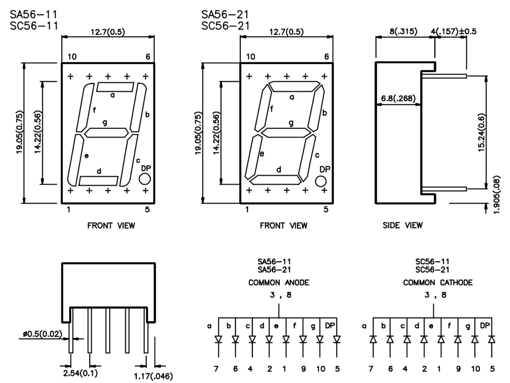

# #793 AT89C2051 7-Segment LED Control

Driving a common-cathode 7-Segment LED with the AT89C2051.


Here's a quick demo..

[](https://www.youtube.com/watch?v=K3GfeQfV2wI)

## Notes

I am using a common cathode 7-segment LED similar to the SC56-11
(see the [datasheet](../../../playground/LED7Segment/assets/SC56-11_datasheet.pdf)).



### Segment-Pin Mapping

Here's a summary of how the bits in the shift register are mapped to LED segments:

| Port   | LED Pin | Segment                    |
|--------|---------|----------------------------|
|  P1_0  |  7      |  A - top horizontal        |
|  P1_1  |  6      |  B - top right vertical    |
|  P1_2  |  4      |  C - bottom right vertical |
|  P1_3  |  2      |  D - bottom horizontal     |
|  P1_4  |  1      |  E - bottom left vertical  |
|  P1_5  |  9      |  F - top left vertical     |
|  P1_6  |  10     |  G - center  horizontal    |
|  P1_7  |  5      |  dp - decimal point        |

### Character Encoding

With common cathode, port bit needs to be asserted for the corresponding segment to light.
If a common anode LED is used, the port bit needs to be low for the segment to light i.e. it is the bitwise complement of the common cathode value.

| Character | P1 (common cathode) | P1 (common anode) |
|-----------|---------------------|-------------------|
| 0         | 0b00111111          | 0b11000000        |
| 1         | 0b00000110          | 0b11111001        |
| 2         | 0b01011011          | 0b10100100        |
| 3         | 0b01001111          | 0b10110000        |
| 4         | 0b01100110          | 0b10011001        |
| 5         | 0b01101101          | 0b10010010        |
| 6         | 0b01111101          | 0b10000010        |
| 7         | 0b00000111          | 0b11111000        |
| 8         | 0b01111111          | 0b10000000        |
| 9         | 0b01101111          | 0b10010000        |

### Demo Circuit Design

Designed with Fritzing: see [Led7SegmentControl.fzz](./Led7SegmentControl.fzz).

With the AT89C2051, Port 1 is an 8-bit bi-directional I/O port. Port pins P1.2 to P1.7 provide internal pull-ups. P1.0 and P1.1 require external pull-ups.
The Port 1 output buffers can sink 20 mA and can drive LED displays directly.

With a common-cathode LED display:

* the internal pull-up resistors on P1.2 to P1.7 provide a suitable drive current for an LED segment. They do not require additional external pull-up or current limiting resistors.
* P1.0 and P1.1 require an external pull-up to drive the LED segment. Using 10kΩ appears to provide a similar drive current to the pins with internal pull-ups

Note that if using a common-anode LED display, current limiting resistors will need to be added for the LED segments. The code has a setting to flip between common-anode and common-cathode logic.


### The Code

See [src/Led7SegmentControl.c](./src/Led7SegmentControl.c)

It uses a timer to increment the digit written to the LED display every second.

## Programming

The [src/Makefile](./src/Makefile) is setup to compile the code using the SDCC compiler .. running on macOS in this instance:

```sh
$ cd src
$ make
sdcc -mmcs51 --code-size 2048 Led7SegmentControl.c -o Led7SegmentControl.ihx
packihx Led7SegmentControl.ihx > Led7SegmentControl.hex
packihx: read 20 lines, wrote 29: OK.
```

Program the chip using `at89overlord` and
the [LEAP#394 AT89C2051 Programmer](../Programmer/):

```sh
$ at89overlord -p /dev/tty.usbserial-2420 -f ./Led7SegmentControl.hex
# Initializing the programmer...
# Initialized!
# Confirming chip ID...
# Confirmed!
# Erasing flash...
# Done!
# Writing flash...
# Done!
# Verifying...
# Done!
```

## Testing

I have the circuit setup on a breadboard with the [LEAP#780 AT89C2051 Breadboard Adapter](../BreadboardAdapter/):


## Credits and References

* [SC56-11 Datasheet](../../../playground/LED7Segment/assets/SC56-11_datasheet.pdf)
* [AT89C2051 product info and datasheet](https://www.microchip.com/wwwproducts/en/AT89c2051)
* [Intel MCS-51](https://en.wikipedia.org/wiki/Intel_MCS-51)
* [SDCC - Small Device C Compiler](https://sdcc.sourceforge.net/)
* [LEAP#394 AT89C2051 Programmer](../Programmer/)
* [LEAP#780 AT89C2051 Breadboard Adapter](../BreadboardAdapter/)
