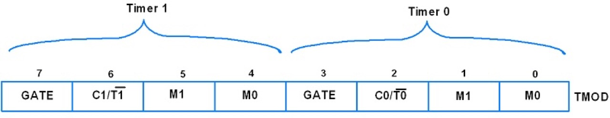
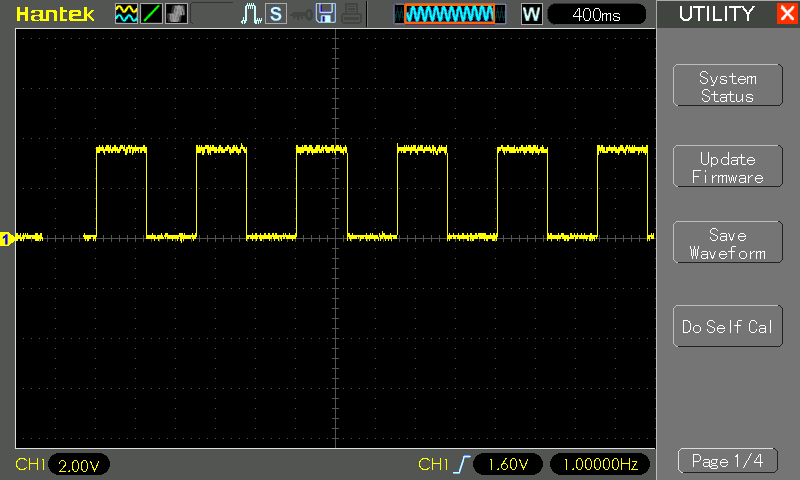

# #xxx AT89C2051 Timers

All about using 8051 timer registers with the AT89C2051.

## Notes

### 8051 Timers

The 8051 has two timers Timer0 (T0) and Timer1 (T1), both are 16-bit wide.
Since 8051 has 8-bit architecture, each of these is accessed by two separate high/low 8-bit registers (TH0, TL0, TH1, TH0). These registers are used to load timer count.

Each timer may be configured to operate in one of four modes:

* Mode 0: 13-bit timer/counter, 8-bit of THx & 5-bit of TLx
* Mode 1: 16-bit timer/counter, THx cascaded with TLx
* Mode 2: 8-bit timer/counter (auto-reload mode), TLx reload with the value held by THx each time TLx overflows
* Mode 3: Split the 16-bit timer into two 8-bit timers i.e. THx and TLx like two 8-bit timer

### Timer Clock

The 8051 microcontrollers provides a clock source to the timers operating at 1/12th of the frequency of crystal attached to the microcontroller (the machine cycle).

For example, with a 16 MHz crystal:

    Timer clock frequency
    = 16 MHz / 12
    = 1.333... MHz
    Period T
    = 12 / 16 MHz
    = 0.75 μs
    Clock cycles per millisecond
    = 1 ms / 0.75 μs
    = 1333.333...

Note that at 16 MHz we don't get a clean division to 1ms / 1 Hz.
This could be a good reason for using a 12 MHz crystal instead, if accurate timing is required.

### 8051 Timer Registers

8051 has a Timer Mode Register and Timer Control Register for selecting a mode of operation and controlling purpose.

#### TMOD Register

TMOD is an 8-bit register used to set timer mode of timer0 and timer1.

| Bit             | Value | Description |
|-----------------|-------|-------------|
| GATE (7,3)      | 0     | Enable Timer/Counter when TR0/TR1 is set |
| GATE (7,3)      | 1     | Enable Timer/Counter only when the INT0/INT1 pin is high and TR0/TR1 is set. |
| C/T (6,2)       | 0     | Use as Timer |
| C/T (6,2)       | 1     | Use as Counter |
| M1+M0 (5+4,1+0) | 00    | Mode 0: 13-bit timer/counter, 8-bit of THx & 5-bit of TLx |
| M1+M0 (5+4,1+0) | 01    | Mode 1: 16-bit timer/counter, THx cascaded with TLx|
| M1+M0 (5+4,1+0) | 10    | Mode 2: 8-bit timer/counter (auto-reload mode), TLx reload with the value held by THx each time TLx overflow |
| M1+M0 (5+4,1+0) | 11    | Mode 3: Split the 16-bit timer into two 8-bit timers i.e. THx and TLx like two 8-bit timer |

#### TCON Register

TCON is an 8-bit control register and contains a timer and interrupt flags.

| Bit             | Value | Description |
|-----------------|-------|-------------|
| TF1 (7)         | 0     | Timer1 overflow not occurred. |
| TF1 (7)         | 1     | Timer1 overflow occurred (i.e. Timer1 goes to its max and roll over back to zero). |
| TR1 (6)         | 0     | Timer1 stop. |
| TR1 (6)         | 1     | Timer1 start. |
| TF0 (5)         | 0     | Timer0 overflow not occurred. |
| TF0 (5)         | 1     | Timer0 overflow occurred (i.e. Timer1 goes to its max and roll over back to zero). |
| TR0 (4)         | 0     | Timer0 stop. |
| TR0 (4)         | 1     | Timer0 start. |
| IE1 (3)         | 0     | External interrupt1 Processed. |
| IE1 (3)         | 1     | External interrupt1 occurred.. |
| IT1 (2)         | 0     | External Interrupt1 Trigger Type Select Bit: Interrupt occur on a low level at the INT1 pin. |
| IT1 (2)         | 1     | External Interrupt1 Trigger Type Select Bit: Interrupt occurs on falling edge at INT1 pin. |
| IE0 (1)         | 0     | External interrupt0 Processed. |
| IE0 (1)         | 1     | External interrupt0 occurred.. |
| IT0 (0)         | 0     | External Interrupt0 Trigger Type Select Bit: Interrupt occur on a low level at the INT0 pin. |
| IT0 (0)         | 1     | External Interrupt0 Trigger Type Select Bit: Interrupt occurs on falling edge at INT0 pin. |

Note:

* Timer1/Timer0 Overflow Flag: It is cleared through software. In the Timer1 overflow interrupt service routine, this bit will get cleared automatically while exiting from ISR.
* Timer1/Timer0 Run Control Bit. It is set and cleared by software.
* External Interrupt1/Interrupt0 Edge Flag: It is set and cleared by hardware.

### Demo Circuit Design

Designed with Fritzing: see [Timers.fzz](./Timers.fzz).

### The Code

See [Timers.c](./Timers.c)

The core `ms_delay` function is implemented as follows:

    #define CPU_MHZ (16)
    #define TIMER_TICKS_PER_MS ((CPU_MHZ * 1000000UL) / 12 / 1000)
    #define MAX_STEPS_PER_TIMER_CYCLE (0xFFFF / TIMER_TICKS_PER_MS)

    void ms_delay(unsigned int ms) {
        TMOD = 0x01; // timer 0, mode 1, 16 bit mode
        unsigned int counter;
        unsigned int step = MAX_STEPS_PER_TIMER_CYCLE;
        while (ms > 0) {
            if (ms < step) step = ms;
            ms -= step;
            counter = 0xFFFF - step * TIMER_TICKS_PER_MS + 1;
            TL0 = counter & 0xFF;        // Low byte
            TH0 = (counter >> 8) & 0xFF; // High byte
            TR0 = 1;                     // timer on
            while (!TF0);                // wait until overflow
            TR0 = 0;                     // timer off
            TF0 = 0;                     // clear flag
        }
    }

Key points to note:

* The timing calculation is based on the clock frequency.
    * If a different crystal is used, just need to change `CPU_MHZ` accordingly
* We use the timer to wait for `TIMER_TICKS_PER_MS` machine cycles per ms
* Since we can only count to 0xFFFF (just over 49ms at 16 MHz) per timer cycle,we need to loop over the timer multiple times to reach the desired delay
    * We set the timer for `MAX_STEPS_PER_TIMER_CYCLE` for n-1 loops
    * Then set the final loop to any remaining time left over

## Programming

The [Makefile](./Makefile) is setup to compile the code using the SDCC compiler .. running on macOS in this instance:

    $ make
    sdcc -mmcs51 --code-size 2048 Timers.c -o Timers.ihx
    packihx Timers.ihx > Timers.hex
    packihx: read 18 lines, wrote 25: OK.

Program the chip using `at89overlord` and
the [LEAP#394 AT89C2051 Programmer](../Programmer/):

    $ at89overlord -p /dev/tty.usbserial-2420 -f ./Timers.hex
    # Initializing the programmer...
    # Initialized!
    # Confirming chip ID...
    # Confirmed!
    # Erasing flash...
    # Done!
    # Writing flash...
    # Done!
    # Verifying...
    # Done!

## Testing

I have the circuit setup on a breadboard with the [#780 AT89C2051 Breadboard Adapter](../BreadboardAdapter/):

Monitoring the LED output on the scope, running at 1Hz as expected:

## Credits and References

* <https://www.electronicwings.com/8051/8051-timers>
* <https://www.tutorialspoint.com/timers-of-8051>
