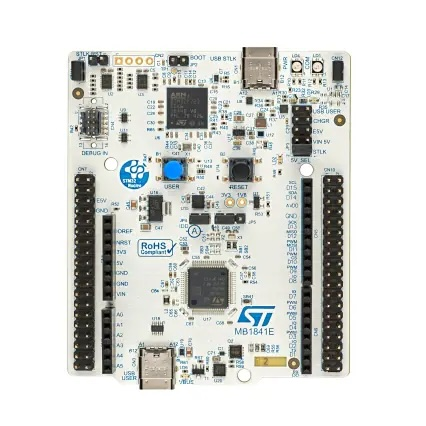
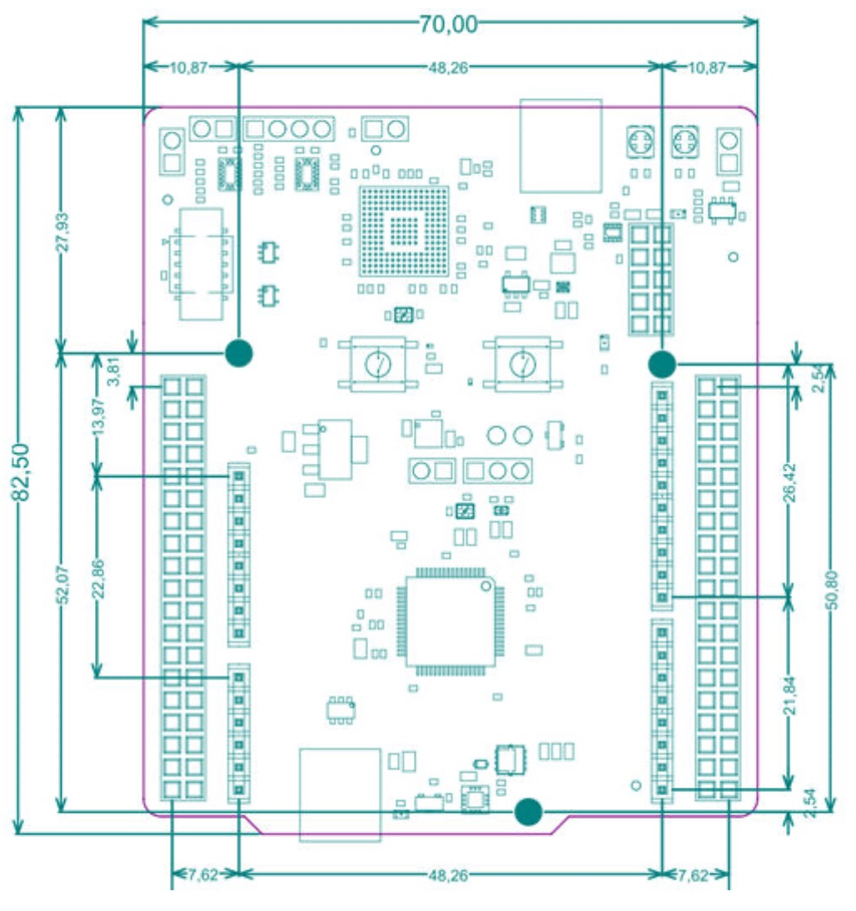
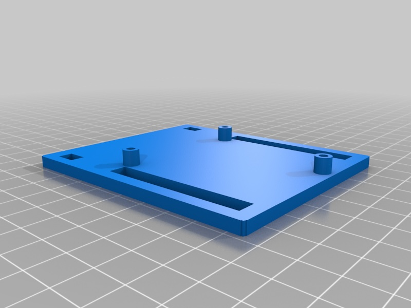
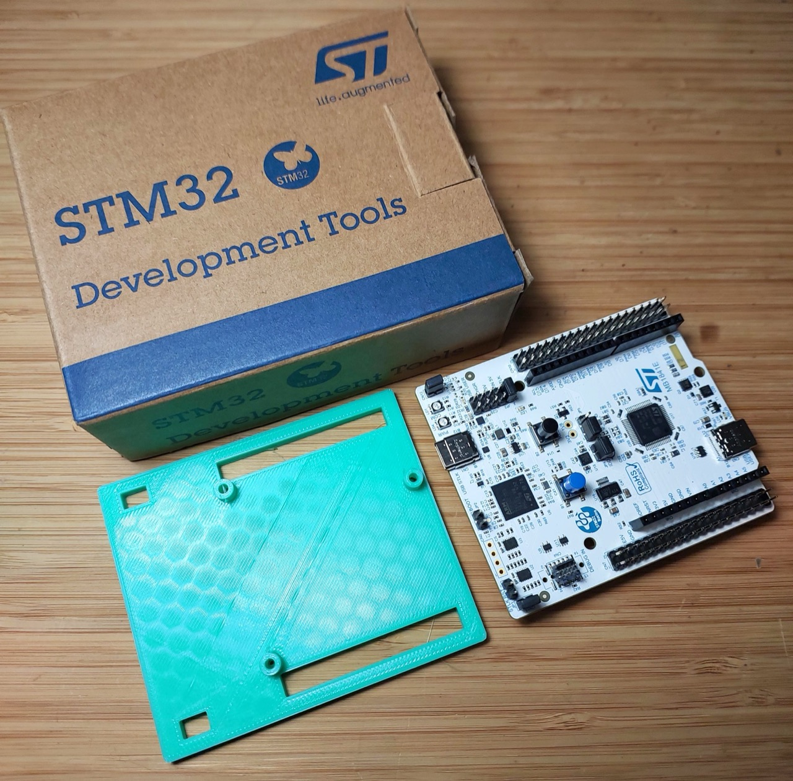
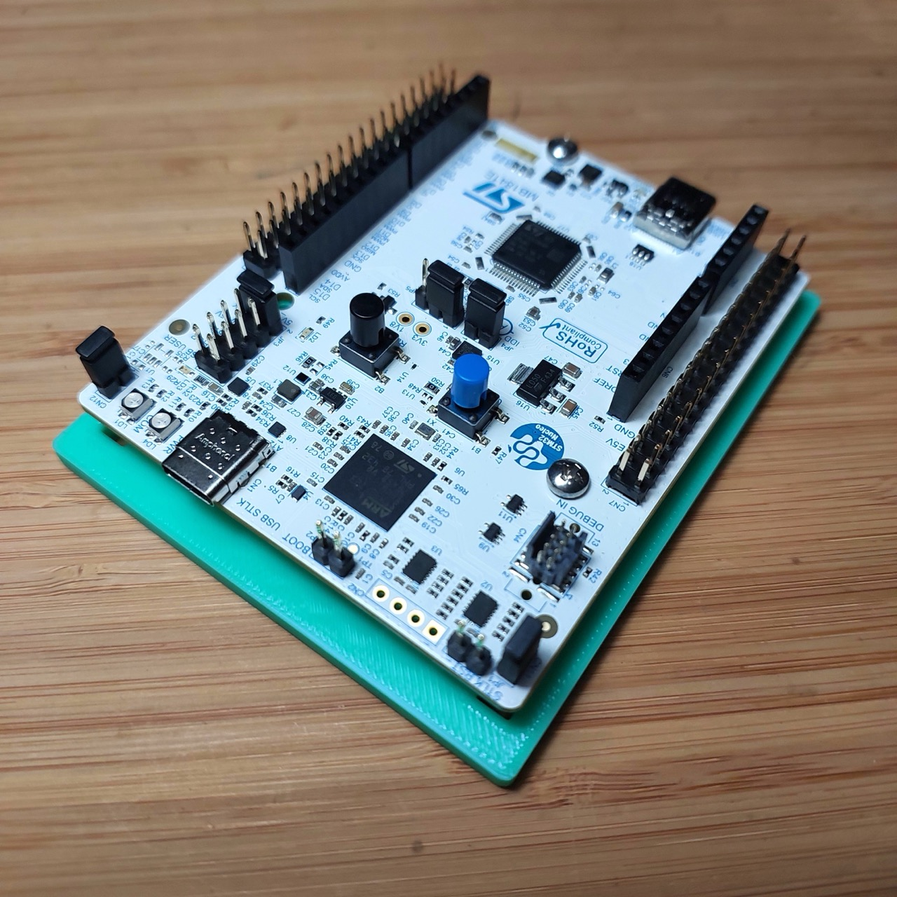
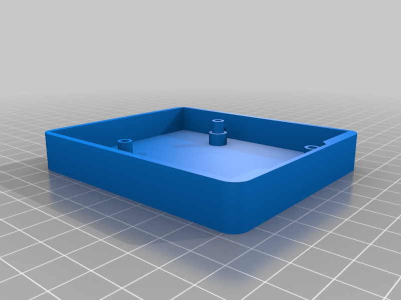
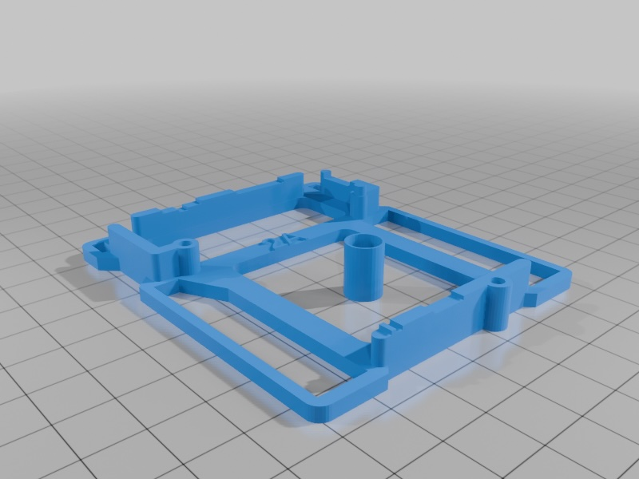

# #739 Nucleo-64 Case

Testing various 3D printed bases and cases for the STM32 Nucleo-64 development board with STM32U385RG.

## Notes

The following are the designs I have checked out so far, printed at the [library](../../Equipment/NLB/FlashforgeCreatorPro2/).

## STM32 Nucleo-64 Board Dimensions

[NUCLEO-U385RG-Q](https://www.st.com/en/evaluation-tools/nucleo-u385rg-q.html)
STM32 Nucleo-64 development board with STM32U385RG, supports Arduino and ST morpho connectivity

Board reference MB1841

## Base 1: STM32 Nucleo coaster

A basic mounting plate - ideal for protecting the board on the workbench without inhibiting access.

* source: <https://www.thingiverse.com/thing:1589714>
* printed from: [1589714-NucleoCoaster.stl](./assets/1589714-NucleoCoaster.stl)

Printed and ready to mount the STM32U385RG:

Attached with M2.9x6.5 screws -
only used 2, the third is unnecessary and little too tight a fit against the D15 header.

## Base 2: Nucleo Case Openscad by ChrisDSA

Not tried yet.
A more substantial base; should not require screws to attach the board.

Source: <https://www.thingiverse.com/thing:1859561>

## Base 3: Nucleo-64 development board base

Not tried yet.
Minimal mounting frame. Seems to be an issue with the central cylinder - seems redundant.

Source: <https://www.thingiverse.com/thing:2918243>

