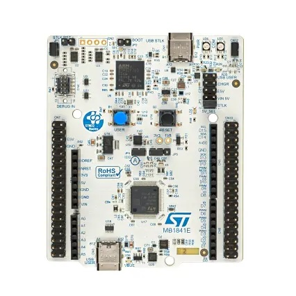
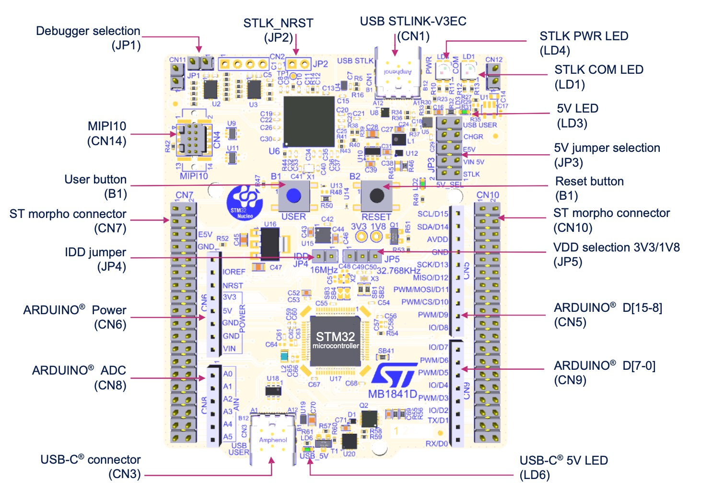
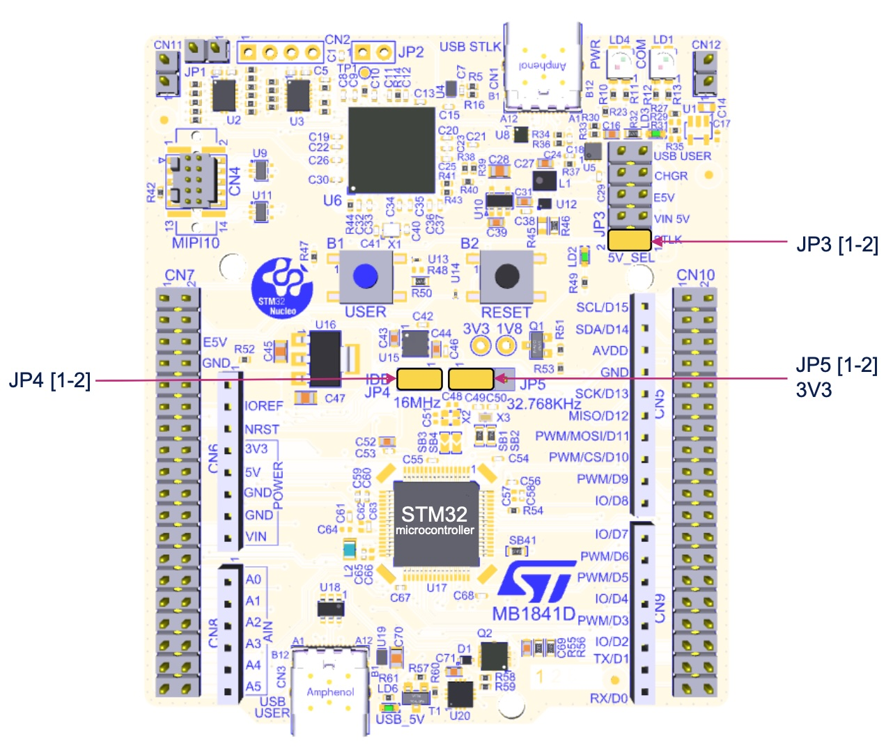
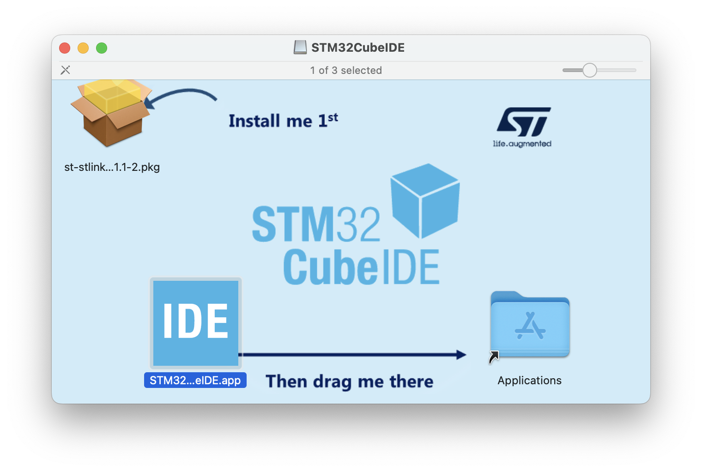
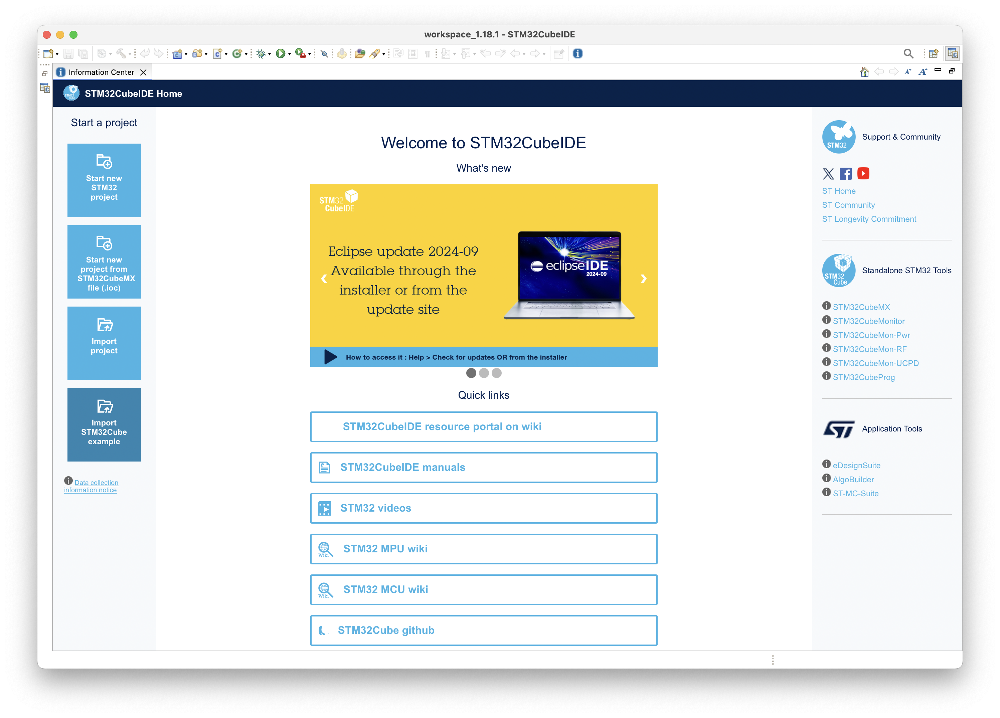
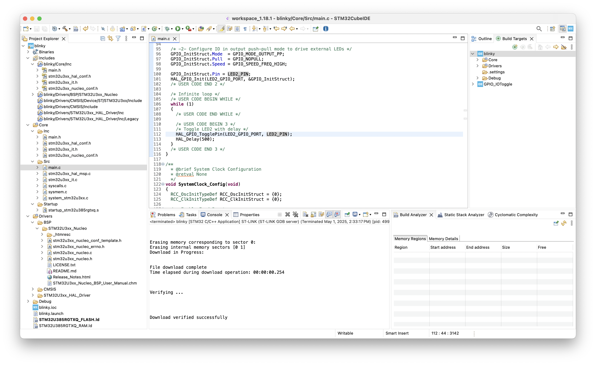

# #774 STM32U385RG Dev Board

About the STM32U385RG development board, installing STM32CubeIDE on macOS, and making a simple LED blinky demo from scratch.


## Notes

### About the NUCLEO-U385RG-Q

The [NUCLEO-U385RG-Q](https://www.st.com/en/evaluation-tools/nucleo-u385rg-q.html) evaluation board is an
STM32 Nucleo-64 development board with STM32U385RG, supports Arduino and ST morpho connectivity.



### Features

* STM32 microcontroller in an LQFP 64‑pin package
* Internal SMPS to generate Vcore logic supply, identified by '-Q' suffixed boards
* USB Type-C® sink device FS
* One user LED shared with ARDUINO® Uno V3
* RESET and USER push-buttons
* 32.768 kHz crystal oscillator
* Board connectors:
    * USB Type-C®
    * ARDUINO® Uno V3
    * ST morpho extension pin headers for full access to all STM32 I/Os
* Flexible power-supply options: ST-LINK USB VBUS, user USB connector, or external sources
* On-board STLINK-V3EC debugger/programmer with USB re-enumeration capability: mass storage, Virtual COM port, and debug port
* Comprehensive free software libraries and examples available with the STM32Cube MCU Package
* Support of a wide choice of Integrated Development Environments (IDEs) including IAR Embedded Workbench®, MDK-ARM, and STM32CubeIDE

#### Board Features and Configuration

See <https://www.st.com/resource/en/user_manual/um3062-stm32u3u5-nucleo64-board-mb1841-stmicroelectronics.pdf>





#### STM32 NUCLEO Features

[](https://www.youtube.com/watch?v=bKegJ0hNfhc)

#### ST-LINK Status LED

* The LED is blinking red: the first USB enumeration with the PC is taking place. If an STLinkUpgrade application is running, the firmware is being programmed.
* The LED is red: the ST-LINK is in the idle state (the USB enumeration with the PC is finished and the ST-LINK is waiting for an application to connect).
* The LED is blinking green and red alternately: data is being exchanged between the target and the PC.
* The LED is green: the last communication with the target has been successful.
* The LED is orange: the last communication with the target has failed.
* The LED is blinking red then orange: USB port detection failure. Check the USB connectors and cable.

## Building a "blinky" Demo

To exercise the board, I'll create a program to flash the onboard LED,
using the STM32CubeIDE on macOS.

### Installing STM32CubeIDE

STM32CubeIDE is an all-in-one multi-OS development tool, which is part of the STM32Cube software ecosystem.

The ID is available for free down
[download here](https://www.st.com/en/development-tools/stm32cubeide.html).

More information about the IDE:

* [STM32 Developer Zone > STM32CubeIDE](https://www.st.com/content/st_com/en/stm32cubeide.html)
* [Introduction to STM32CubeIDE](https://wiki.st.com/stm32mcu/wiki/STM32CubeIDE:Introduction_to_STM32CubeIDE#Getting_started_with_STM32_and_STM32CubeIDE)

Installing on macOS:



Welcome screen:

* to enable updates and examples etc, sign into myST from "Help > STM32Cube Updates > connection to myST"



### Create new STM32 Project

Start new STM32 project in the [blinky](./blinky/) folder.

### Adding STM32U3xx_Nucleo BSP Driver

To add specific board support for STM32U3xx_Nucleo, need to add the driver.
I was a little surprised this is not handled through the IDE, but
it [seems](https://community.st.com/t5/stm32-mcus/how-to-add-a-bsp-to-an-stm32cubeide-project/ta-p/49812)
we just need to copy the correct BSP files into our project.

The STM32U3xx_Nucleo BSP Driver fiels can be obtained from either:

* [STM32Cube MCU Package for STM32U3 series](https://www.st.com/en/embedded-software/stm32cubeu3.html) download
* or from the GitHub source <https://github.com/STMicroelectronics/stm32u3xx-nucleo-bsp>

I copyied and including the files as follows:

* copied STM32U3xx_Nucleo drivers to [blinky/Drivers/BSP/STM32U3xx_Nucleo/](./blinky/Drivers/BSP/STM32U3xx_Nucleo/)
* "File > Refresh" the project to have the new files appear in the IDE
* Right-click the `blinky/Drivers/BSP/STM32U3xx_Nucleo/` driver folder and choose "Add/remove include path" add to debug and release
* copy `stm32u3xx_nucleo_conf_template.h` from the BSP folder to the project includes as `stm32u3xx_nucleo_conf.h`. It did not need any modification - defaults work OK

### Customizing the main function

A simple blinky in [main.c](./blinky/Core/Src/main.c)
(with boilerplate comments removed):

```c
int main(void)
{
  /* Reset of all peripherals, Initializes the Flash interface and the Systick. */
  HAL_Init();

  /* Configure the system clock */
  SystemClock_Config();

  /* Initialize all configured peripherals */
  MX_ICACHE_Init();

   /* -1- Enable GPIO Clock (to be able to program the configuration registers) */
  LED2_GPIO_CLK_ENABLE();

  /* -2- Configure IO in output push-pull mode to drive external LEDs */
  GPIO_InitStruct.Mode  = GPIO_MODE_OUTPUT_PP;
  GPIO_InitStruct.Pull  = GPIO_NOPULL;
  GPIO_InitStruct.Speed = GPIO_SPEED_FREQ_HIGH;
  GPIO_InitStruct.Pin = LED2_PIN;
  HAL_GPIO_Init(LED2_GPIO_PORT, &GPIO_InitStruct);

  while (1)
  {
    /* Toggle LED2 with delay */
    HAL_GPIO_TogglePin(LED2_GPIO_PORT, LED2_PIN);
    HAL_Delay(500);
  }
}
```

### Programming

With the board connected with USB-C cable,
build and run the project



Transcript from the console:

```sh


STMicroelectronics ST-LINK GDB server. Version 7.10.0
Copyright (c) 2025, STMicroelectronics. All rights reserved.

Starting server with the following options:
        Persistent Mode            : Disabled
        Logging Level              : 1
        Listen Port Number         : 61234
        Status Refresh Delay       : 15s
        Verbose Mode               : Disabled
        SWD Debug                  : Enabled
        InitWhile                  : Enabled

Waiting for debugger connection...
Debugger connected
Waiting for debugger connection...
Debugger connected
Waiting for debugger connection...
      -------------------------------------------------------------------
                        STM32CubeProgrammer v2.19.0
      -------------------------------------------------------------------


Log output file:   /tmp/STM32CubeProgrammer_5XnD4q.log
ST-LINK SN  : 0027002F3333511731363730
ST-LINK FW  : V3J16M7
Board       : NUCLEO-U385RG-Q
Voltage     : 3.29V
SWD freq    : 8000 KHz
Connect mode: Under Reset
Reset mode  : Hardware reset
Device ID   : 0x454
Revision ID : Rev Z
Device name : STM32U3xx
Flash size  : 1 MBytes (default)
Device type : MCU
Device CPU  : Cortex-M33
BL Version  : 0xE2
Debug in Low Power mode enabled

      -------------------------------------------------------------------
        Choose flashing speed for Cortex M33 series.(default speed=Reliable)
      -------------------------------------------------------------------

Opening and parsing file: ST-LINK_GDB_server_myMFdf.srec


Memory Programming ...
  File          : ST-LINK_GDB_server_myMFdf.srec
  Size          : 6.11 KB
  Address       : 0x08000000


Erasing memory corresponding to sector 0:
Erasing internal memory sectors [0 1]
Download in Progress:


File download complete
Time elapsed during download operation: 00:00:00.256


Verifying ...


Download verified successfully


Shutting down...
Exit.
```

And now I have a blinking LED!


## Credits and References

* [STM32 Nucleo-64 development board with STM32U385RG](https://www.st.com/en/evaluation-tools/nucleo-u385rg-q.html)
* [STM32U3 series](https://www.st.com/en/microcontrollers-microprocessors/stm32u3-series.html)
* [STM32U3 Online Training](https://www.st.com/content/st_com/en/support/learning/stm32-education/stm32-online-training/stm32u3-online-training.html)
* <https://github.com/STMicroelectronics/STM32CubeU3/tree/main/Projects/NUCLEO-U385RG-Q>
