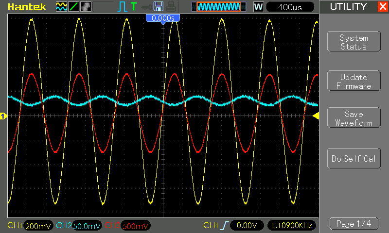
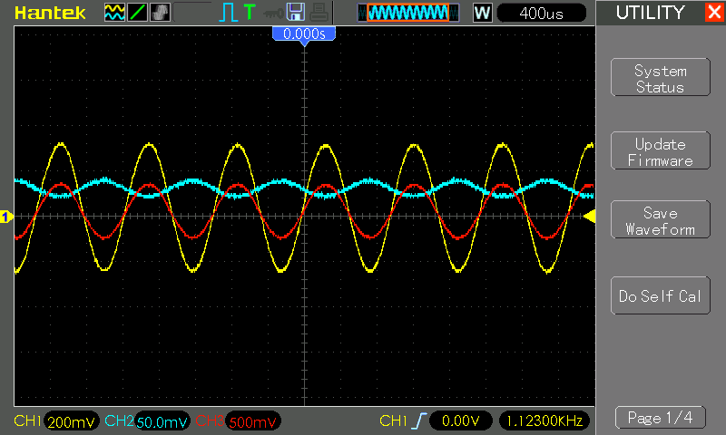

# #622 Electret Audio Pre-amplifier

Design and test an electret pre-amplifier comprising an LM358 op-amp active high-pass filter.

## Notes

I've used electret microphones in many projects before. Each time the electret biasing is about the same, but the coupling and
amplification stages have varied. I've had it in my to-do list for a long time to find a common design can be used in most cases.

Of course one could just buy a module, like the [SparkFun Electret Microphone Breakout](https://www.sparkfun.com/products/12758).
And that is probably the cheapest and easiest option in most cases. But it is always nice to know how to build one from scratch,
and understand what decisions have been made in designing commercial modules.

Looking around at various examples, for example the [SparkFun board](https://www.sparkfun.com/products/12758)
[va3iul](https://www.qsl.net/va3iul/Homebrew_RF_Circuit_Design_Ideas/Microphone_Preamp_Electret.gif),
a common approach is obviously an op-amp high-pass active filter with gain in the order of 60 to 100 (actually -60 to -100 as the amp is inverting).

So that's the approach I'll take here.

Note: there are also many electret input modules, usually marketed as "sound detectors",
that are not actually audio pre-amplifiers.
They are actually configured as binary sound level triggers. An example is covered in
[LEAP#682](../ElectretPreamp).

### Circuit Design

The electret output is fed to an active high-pass filter:

The expected passband gain is `−R2/R1` and corner frequency `1/2πRC Hz`.

In the actual circuit I have used R1=10kΩ and R2 comprising a 330kΩ fixed resistor and 500kΩ pot.
This allows for a variable gain from
[-33](https://www.wolframalpha.com/input?i=-%28330k%CE%A9+%2B+0%CE%A9%29%2F10k%CE%A9) to
[-83](https://www.wolframalpha.com/input?i=-%28330k%CE%A9+%2B+500k%CE%A9%29%2F10k%CE%A9).

The cut-off frequency of the filter can be adjusted by selecting an appropriate capacitor C, for example:

* [3.4 Hz for C=4.7µF](https://www.wolframalpha.com/input?i=1%2F%282%CF%80*10k%CE%A9*4.7%C2%B5F%29)
* [72.3 Hz for C=220nF](https://www.wolframalpha.com/input?i=1%2F%282%CF%80*10k%CE%A9*220nF%29)
* [159.2 Hz for C=100nF](https://www.wolframalpha.com/input?i=1%2F%282%CF%80*10k%CE%A9*100nF%29)

I've chosen 220nF, mainly because it puts it just above any household AC hum.

Here's the actual schematic and indicative breadboard layout. Some points to note:

* The electret microphone is biased with a 2.2kΩ R1. If higher voltage supply is used, for example 9V, this may be increased to say 10kΩ.
* The AC output coupling via C4 is optional.
* C2 simply provides stability for the non-inverting reference voltage. It is not critical.

Breadboard testing with oscilloscope probes connected as indicated in the schematic:

* CH1 Yellow: AOUT (DC)
* CH2 Blue: AIN
* CH3 Red: AOUT (AC)

### Behaviour

I've tested the circuit with both an LM358 and LMC6482 op-amp. They both work fine. The results shown here are for the LM358.

I used a simple [Javascript tone generator](https://codingkata.tardate.com/javascript/tone_generator/) to provide an input signal at 1kHz.

Adjusted for maximum gain:

Adjusted for minimum gain:

### Protoboard Build

Putting the circuit on a piece of protoboard for convenient use while minimizing noise:

## Credits and References

* [SparkFun Electret Microphone Breakout](https://www.sparkfun.com/products/12758)
* [SparkFun Electret Microphone Breakout](https://github.com/sparkfun/Electret_Microphone_Breakout/tree/Revision) - github sources
* [LMC6482 datasheet](https://www.futurlec.com/Linear/LMC6482IN.shtml)
* [Electret Microphone Preamplifier](https://www.qsl.net/va3iul/Homebrew_RF_Circuit_Design_Ideas/Microphone_Preamp_Electret.gif) - [va3iul](https://www.qsl.net/v/va3iul//Homebrew_RF_Circuit_Design_Ideas/Homebrew_RF_Circuit_Design_Ideas.htm)
* [High-pass filter](https://en.wikipedia.org/wiki/High-pass_filter) - wikipedia
* [Javascript tone generator](https://codingkata.tardate.com/javascript/tone_generator/)
