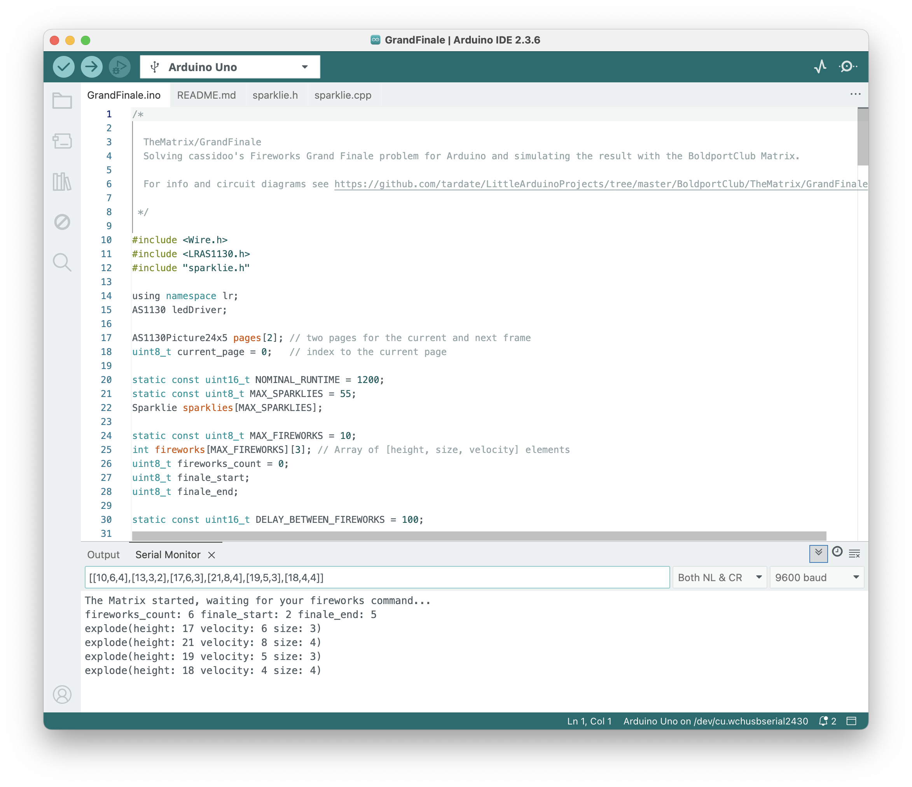

# #777 Fireworks Grand Finale

Solving cassidoo's Fireworks Grand Finale challenge for Arduino and simulating the result with the BoldportClub Matrix


Here's a quick demo..

[](https://www.youtube.com/watch?v=3yQSyyRHmyI)

## Notes

The [interview question of the week (2025-07-06)](https://buttondown.com/cassidoo/archive/a-genius-is-the-one-most-like-himself-thelonious/)
posed a deceptively simple algorithmic challenge:

> Given an array of fireworks representing a series going off, write a function to find the "grand finale" of the show!
> A grand finale is defined as the longest sub-array where the average size is at least 5,
> the minimum velocity is 3, and the difference between the min and max height is no more than 10.
> Return the starting index of the grand finale.
>
> Example:
>
> const fireworks = [
> {height: 10, size: 6, velocity: 4},
> {height: 13, size: 3, velocity: 2},
> {height: 17, size: 6, velocity: 3},
> {height: 21, size: 8, velocity: 4},
> {height: 19, size: 5, velocity: 3},
> {height: 18, size: 4, velocity: 4}
> ];
>
> grandFinaleStart(fireworks)
> 2

I've analysed and solved the problem with ruby: see
[LCK#339 Fireworks Grand finale](https://codingkata.tardate.com/ruby/grand-finale/)
for the full write-up.

But wouldn't it be really nice to see the actual fireworks grand finale after all that work?

So that's why I came here and decided to re-implement the solution for the Arduino (C++)
and animate the display using the [BoldportClub TheMatrix](../).

### Circuit Design

The wiring is pretty simple, as the system comprises an Arduino Uno, TheMatrix board, and a host computer for control.

In operation:

* an Arduino Uno plugged into the USB port of my host computer
* the fireworks commands are sent over the serial connection to the Arduino
* the Arduino controls TheMatrix over I²C


### The Arduino Sketch

The [GrandFinale.ino](./GrandFinale.ino) sketch implements the main algorithm:

* initialising the matrix support library
* reading and parsing the fireworks command from the serial input
* evaluating the fireworks array to find the "grand finale" sub-array
    * it implements the rules as specified in the problem. Essentially it finds the longest fireworks sequence that meets the criteria:
        * `average(size) >= 5`
        * `minimum(velocity) == 3`
        * `maximum(height) - minimum(height) <= 10`
* running the fireworks animation on TheMatrix.
    * The particle animation is implemented in [sparklie.h](./sparklie.h) / [sparklie.cpp](./sparklie.cpp)

The sketch requires the the following libraries:

* The standard [Wire](https://docs.arduino.cc/language-reference/en/functions/communication/wire/) library for I²C support
* [LuckyResistor/LRAS1130](https://github.com/LuckyResistor/LRAS1130) library to control the AS1130 LED driver chip.

### Sending Data to the Arduino

The sketch expects the fireworks information to be sent in a simple 2D array, for example: `[[15,5,3],[5,1,3]]`.
It is defined as follows:

* Accepts up to 10 firework specifications. This is fixed limit, but can be increased by changing the `MAX_FIREWORKS` constant.
* each firework specified as an array of 3 integers: height, size, and velocity
    * height is maxed out at 23 (the size of TheMatrix board)
    * size is used to determine how many particles are included in the firework animation. It is maxed out at 55, adjustable by changing the `MAX_SPARKLIES` constant.
    * the velocity is used to reduce the animation cycles per frame. It maxes out at 12 (fastest).

The fireworks data can be sent using the Serial Monitor in the Arduino IDE.
This has the benefit of also displaying information back from the Arduino sketch including details of the "grand finale" sub-array the sketch has determined to run.

The commands can also be sent directly from the command-line.
The [send_matrix.sh](./send_matrix.sh) script is an example of sending the fireworks data to the Arduino over the serial port, including setting the necessary device port settings.

On macOS, the Arduino will uses `tty.*` and `cu.*` device files:

* `tty.*`: used for inbound communication (like a modem receiving data).
* `cu.*`: used for outbound communication (like sending from your Mac to the device).

For sending data, it's usually better to use the `cu.*` device. With my board plugged-in, I'm seeing the Arduino on:

```sh
$ ls -1 /dev/cu*usb*
/dev/cu.usbserial-2430
/dev/cu.wchusbserial2430
```

So I can run a fireworks sequence like this:

```sh
$ ./send_matrix.sh /dev/cu.wchusbserial2430 "[[15,5,3],[5,1,3]]"
Configuring serial port /dev/cu.wchusbserial2430 at 9600 bps...
Sent [[15,5,3],[5,1,3]] to /dev/cu.wchusbserial2430.
```

### The Grand Finale

First let's verify that the example provided in the problem statement runs correctly.
Using the IDE, I can see the feedback that the correct "grand finale" sequence has been selected:



Running the same using the shell script:

```sh
$ ./send_matrix.sh /dev/cu.wchusbserial2430 "[[10,6,4],[13,3,2],[17,6,3],[21,8,4],[19,5,3],[18,4,4]]"
Configuring serial port /dev/cu.wchusbserial2430 at 9600 bps...
Sent [[10,6,4],[13,3,2],[17,6,3],[21,8,4],[19,5,3],[18,4,4]] to /dev/cu.wchusbserial2430.
```

This runs a single-firework finale (`[15,5,3]`):

```sh
$ ./send_matrix.sh /dev/cu.wchusbserial2430 "[[15,5,3]]"
Configuring serial port /dev/cu.wchusbserial2430 at 9600 bps...
Sent [[15,5,3]] to /dev/cu.wchusbserial2430.
```

This should also a single-firework finale (`[15,5,3]`), since the second element reduces the average size below 5:

```sh
$ ./send_matrix.sh /dev/cu.wchusbserial2430 "[[15,5,3],[5,1,3]]"
Configuring serial port /dev/cu.wchusbserial2430 at 9600 bps...
Sent [[15,5,3],[5,1,3]] to /dev/cu.wchusbserial2430.
```

Now let's open the flood-gates and put on a more impressive display:

```sh
$ ./send_matrix.sh /dev/cu.wchusbserial2430 "[[20,55,12],[10,10,3],[15,35,7]]"
Configuring serial port /dev/cu.wchusbserial2430 at 9600 bps...
Sent [[20,55,12],[10,10,3],[15,35,7]] to /dev/cu.wchusbserial2430.
```

See the demo video for the fireworks in action:

[](https://www.youtube.com/watch?v=3yQSyyRHmyI)

## Credits and References

* [cassidoo's interview question of the week (2025-07-06)](https://buttondown.com/cassidoo/archive/a-genius-is-the-one-most-like-himself-thelonious/)
* [LuckyResistor/LRAS1130](https://github.com/LuckyResistor/LRAS1130) - A library to control the AS1130 LED driver chip.
