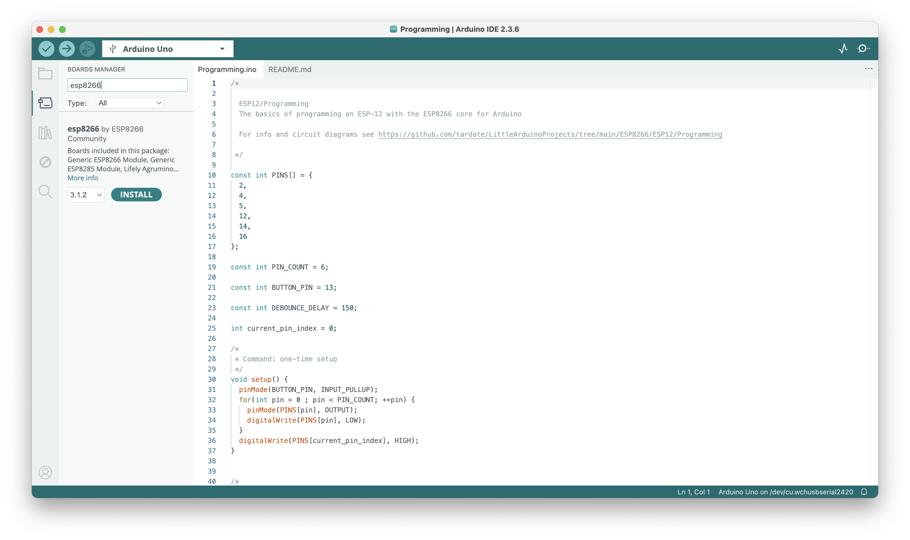

# #534 ESP-12 Programming

The basics of programming an ESP-12 with the ESP8266 core for Arduino.

Here's a quick demo..

## Notes

I bought some [ESP-12E](https://www.aliexpress.com/item/32339917567.html) ESP8266 modules a while back,
along with some [adapter boards](https://www.aliexpress.com/item/32649040259.html) but they've been sitting
in a drawer ever since. Time to crack them open!

NB: I purchased the ESP-12E module for US$1.92 in Mar-2016, currently listing for SG$1.39 in Jan-2026.
The adapters were US$1.25 for 10 in Oct-2017, currently listing for SG$1.70 for 10 in Jan-2026.

These notes cover the basics of programming the devices with ESP8266 core for Arduino, using the Arduino IDE.

### ESP-12E Features

* 20 active pins
    * GPIO 0-15 all have a built-in pull-up resistor, just like in an Arduino.
    * GPIO16 has a built-in pull-down resistor.
    * GPIO2 has a built-in LED (may be on GPIO1 on other boards)
* 4Mib flash
* Requires 3.3V supply
* PCB trace antenna

For more board specifications and comparisons, see
<https://en.wikipedia.org/wiki/ESP8266#Ai-Thinker_modules>

## Construction

I'm using a breadboard layout with:

* the ESP-12 on an adapter board
* separate 3.3V power supply for the ESP
* CH340 USB to TTL adapter
* level-shifter for 5V signals to/from the USB to TTL adapter

## Demo Sketch

The [Programming.ino](./Programming.ino) sketch is a simple demonstration of GPIO input and output:

* button press (GPIO13)
* sequences output on GPIO 2, 4, 5, 12, 14, 16.

An LED bar graph module is used for display of the GPIO output.

### Installing ESP8266 core for Arduino

See the [docs here](https://arduino-esp8266.readthedocs.io/en/2.6.3/installing.html). Essentially:

* add the Additional Board Manager URL in settings: `https://arduino.esp8266.com/stable/package_esp8266com_index.json`
* install "esp8266 by ESP8266 Community" in the Board Manager. I have updated to v3.1.2 as of Jan-2026.

### Programming with ESP8266 core for Arduino

My selected settings in the Arduino IDE:

The adapter boards have fixed pull-up/down resistors included:

* 10kΩ pull-down on GPIO15
* 10kΩ pull-up on CH_PD

Externally (on the breadboard):

* 10kΩ pull-up on RESET (with pushbutton to pull-down)
* 10kΩ on GPIO0 (switchable as pull-up/pull-down)

Programming mode is engaged by:

* set GPIO0 to pull-down
* toggle reset

Run mode is engaged by:

* set GPIO0 to pull-up
* toggle reset

Compile and push the code with the Arduino IDE:

## Credits and References

* ESP-12E: ["ESP8266 ESP-01 ESP-01S ESP-07 ESP-12E ESP-12F Remote Serial Port WIFI Wireless Module Intelligent Housing System Adapter 2.4G" (aliexpress seller listing)](https://www.aliexpress.com/item/32339917567.html)
* ESP-7/12 adapter boards: ["10PC ESP8266 serial WIFI Module Adapter Plate Applies to ESP-07, ESP-12F, ESP-12E for arduino" (aliexpress seller listing)](https://www.aliexpress.com/item/32649040259.html)
* [ESP8266 Arduino Core - boards doc](https://arduino-esp8266.readthedocs.io/en/2.6.3/boards.html)
* [ESP-01/07/12 Series Modules User's Manual](http://wiki.ai-thinker.com/_media/esp8266/esp8266_series_modules_user_manual_v1.1.pdf)
* [Simple Arduino Web Server on ESP-07/ESP-12 Tutorial](https://www.youtube.com/watch?v=8J7zflVO8K0)
* [Ai-Thinker ESP8266 modules](https://en.wikipedia.org/wiki/ESP8266#Ai-Thinker_modules)
