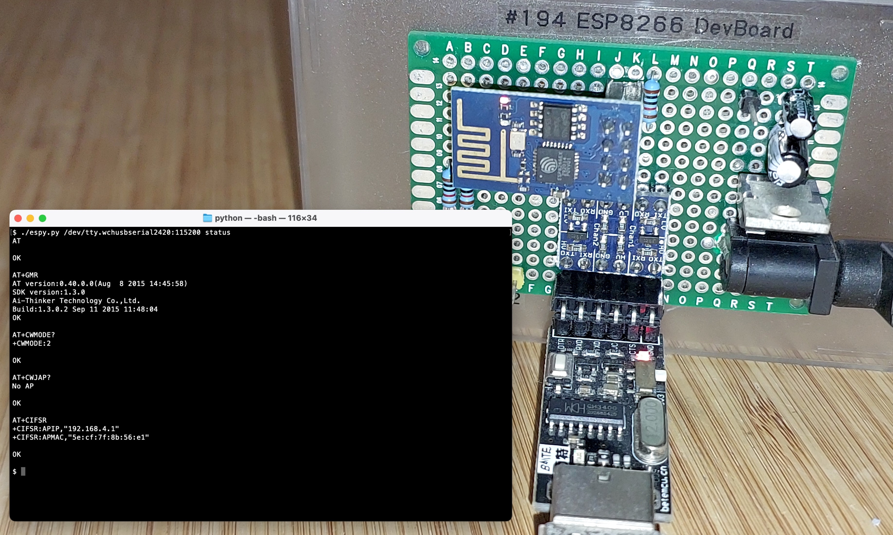

# #558 ESP8266 SerialTest (python)

Exercising ESP8266 module serial communications with python



## Notes

I'm using an ESP8266 ESP-01 module with default firmware as detailed in the [ESP8266/SerialTest](../) project.

This is a test of driving it with a simple python script [espy.py](./espy.py)

```sh
$ ./espy.py
Usage: espy.py <serial_port>[:baud_rate] <command> [<args>]
Commands:
  status
  reset
  join <ssid> <password>
  leave
```

### status

if possible it will return software details, access point and IP address..

```sh
$ ./espy.py /dev/tty.wchusbserial2420:115200 status
AT

OK

AT+GMR
AT version:0.40.0.0(Aug  8 2015 14:45:58)
SDK version:1.3.0
Ai-Thinker Technology Co.,Ltd.
Build:1.3.0.2 Sep 11 2015 11:48:04
OK

AT+CWMODE?
+CWMODE:2

OK

AT+CWJAP?
No AP

OK

AT+CIFSR
+CIFSR:APIP,"192.168.4.1"
+CIFSR:APMAC,"5e:cf:7f:8b:56:e1"

OK
```


### reset

Reset the ESP board:

```sh
$ ./espy.py /dev/tty.wchusbserial2420:115200 reset
AT+RST

OK

 ets Jan  8 2013,rst cause:2, boot mode:(3,6)

load 0x40100000, len 1396, room 16
tail 4
chksum 0x89
load 0x3ffe8000, len 776, room 4
tail 4
chksum 0xe8
load 0x3ffe8308, len 540, room 4
tail 8
chksum 0xc0
csum 0xc0

2nd boot version : 1.4(b1)
  SPI Speed      : 40MHz
  SPI Mode       : DIO
  SPI Flash Size & Map: 8Mbit(512KB+512KB)
jump to run user1 @ 1000

n't use rtc mem data
{l{l
Ai-Thinker Technology Co.,Ltd.

ready
```

### Join an AP SSID

```sh
$ ./espy.py /dev/tty.wchusbserial2420:115200 join MySSID my-password
AT+CWMODE=1

OK

AT+CWJAP="MySSID","my-password"

```

Getting the status:

```sh
$ ./espy.py /dev/tty.wchusbserial2420:115200 status
AT
busy p...

OK

AT+GMR
AT version:0.40.0.0(Aug  8 2015 14:45:58)
SDK version:1.3.0
Ai-Thinker Technology Co.,Ltd.
Build:1.3.0.2 Sep 11 2015 11:48:04
OK

AT+CWMODE?
+CWMODE:1

OK

AT+CWJAP?
+CWJAP:"MySSID","90:72:40:0f:5b:f8",11,-56

OK

AT+CIFSR
+CIFSR:STAIP,"192.168.10.66"
+CIFSR:STAMAC,"5c:cf:7f:8b:56:e1"

OK

```

### Disconnect from the SSID

Disconnect from the SSID:

```sh
$ ./espy.py /dev/tty.wchusbserial2420:115200 leave
AT+CWQAP

OK
WIFI DISCONNECT

```

Check the status. Confirm: no AP connected.

```sh
$ ./espy.py /dev/tty.wchusbserial2420:115200 status
AT

OK

AT+GMR
AT version:0.40.0.0(Aug  8 2015 14:45:58)
SDK version:1.3.0
Ai-Thinker Technology Co.,Ltd.
Build:1.3.0.2 Sep 11 2015 11:48:04
OK

AT+CWMODE?
+CWMODE:1

OK

AT+CWJAP?
No AP

OK

AT+CIFSR
+CIFSR:STAIP,"0.0.0.0"
+CIFSR:STAMAC,"5c:cf:7f:8b:56:e1"

OK

```

## Construction

NB: diagrams drawn with the custom parts from [ESP8266_fritzing](https://github.com/ydonnelly/ESP8266_fritzing).


## Credits and References

* [pyserial](https://pyserial.readthedocs.io/en/latest/pyserial.html) library documentation
* [ESP8266 English datasheet](https://nurdspace.nl/File:ESP8266_Specifications_English.pdf)
* [LD1117 datasheet](http://pdf1.alldatasheet.com/datasheet-pdf/view/173710/UTC/LD1117AL-15-TA3-A-R.html)
* [ESP8266 Tutorial AT Commands](https://youtu.be/uznq8W9sOKQ)
* [ESP8266 Quick Start](http://benlo.com/esp8266/esp8266QuickStart.html)
* [electrodragon ESP8266 reference](http://www.electrodragon.com/w/ESP8266)
* [ESP8266 Community Forum](http://www.esp8266.com/)
* [nurdspace AT command reference](https://nurdspace.nl/ESP8266#AT_Commands)
