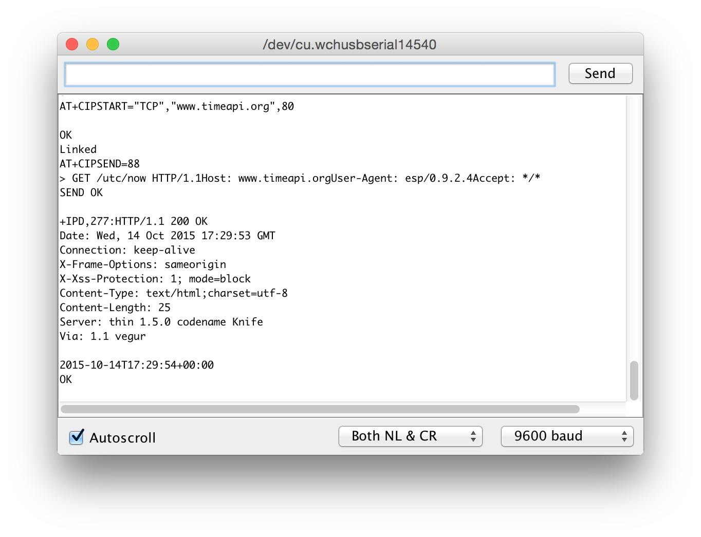

# #155 ESP8266 SerialTest (ruby)

Exercising ESP8266 module serial communications with Ruby



## Notes

I'm using an ESP8266 ESP-01 module with default firmware as detailed in the [ESP8266/SerialTest](../) project.

This is a test of driving it with a simple [ruby script](./espy.rb).
The script has been updated to use a [fork of the serialport](https://github.com/hparra/ruby-serialport/pull/79) gem -
a modernised version, with updates yet to be released as a formal gem update.

See <https://codingkata.tardate.com/ruby/serial/> for notes on the current state of ruby serial libraries.

```sh
bundle                  # install gem dependencies
bundle exec ./espy.rb   # prints command help
```

### status

If possible it will return software details, access point and IP address..

```sh
$ bundle exec ./espy.rb /dev/tty.wchusbserial2420 status
ESP8266 Client initialised for : /dev/tty.wchusbserial2420
            connection options : {"baud"=>115200, "data_bits"=>8, "stop_bits"=>1, "parity"=>0}
                       signals : {"rts"=>1, "dtr"=>1, "cts"=>0, "dsr"=>0, "dcd"=>0, "ri"=>0}
Waiting to warm up the connection..
AT

OK
AT+GMR
AT version:0.40.0.0(Aug  8 2015 14:45:58)
SDK version:1.3.0
Ai-Thinker Technology Co.,Ltd.
Build:1.3.0.2 Sep 11 2015 11:48:04
OK
AT+CWMODE?
+CWMODE:1

OK
AT+CWJAP?
+CWJAP:"Sunshine","90:72:40:0f:5b:f8",1,-51

OK
AT+CIFSR
+CIFSR:STAIP,"192.168.10.66"
+CIFSR:STAMAC,"5c:cf:7f:8b:56:e1"

OK
```

### reset

```sh
$ bundle exec ./espy.rb /dev/tty.wchusbserial2420 reset
ESP8266 Client initialised for : /dev/tty.wchusbserial2420
            connection options : {"baud"=>115200, "data_bits"=>8, "stop_bits"=>1, "parity"=>0}
                       signals : {"rts"=>1, "dtr"=>1, "cts"=>0, "dsr"=>0, "dcd"=>0, "ri"=>0}
Waiting to warm up the connection..
AT+RST

OK
WIFI DISCONNECT

 ets Jan  8 2013,rst cause:2, boot mode:(3,6)

load 0x40100000, len 1396, room 16
tail 4
chksum 0x89
load 0x3ffe8000, len 776, room 4
tail 4
chksum 0xe8
load 0x3ffe8308, len 540, room 4
tail 8
chksum 0xc0
csum 0xc0

2nd boot version : 1.4(b1)
  SPI Speed      : 40MHz
  SPI Mode       : DIO
  SPI Flash Size & Map: 8Mbit(512KB+512KB)
jump to run user1 @ 1000

�n't use rtc mem data
sd��sl��
Ai-Thinker Technology Co.,Ltd.

ready
```

### get web page

In the past I've used <http://www.timeapi.org/utc/now>, but that has disappeared, as have many alternatives.
For a reliable HTTP time service, I now run <https://hub.docker.com/r/tardate/echo-tools> in Docker for testing.
In the run below, my docker container is running on `http://192.168.10.87/time/now.txt`.

```sh
$ bundle exec ./espy.rb /dev/tty.wchusbserial2420 get http://192.168.10.87/time/now.txt
ESP8266 Client initialised for : /dev/tty.wchusbserial2420
            connection options : {"baud"=>115200, "data_bits"=>8, "stop_bits"=>1, "parity"=>0}
                       signals : {"rts"=>1, "dtr"=>1, "cts"=>0, "dsr"=>0, "dcd"=>0, "ri"=>0}
Waiting to warm up the connection..
AT+CIPSTART="TCP","192.168.10.87",80
CONNECT

OK
AT+CIPSEND=96

OK
>
Recv 96 bytes

SEND OK

+IPD,170:HTTP/1.1 200 OK
Content-Type: text/plain;charset=utf-8
Content-Length: 20
X-Content-Type-Options: nosniff
Connection: keep-alive
Server: thin

2025-06-13T06:59:29Z
AT+CIPCLOSE
CLOSED

OK
```

## Construction

NB: diagrams drawn with the custom parts from [ESP8266_fritzing](https://github.com/ydonnelly/ESP8266_fritzing).


## Credits and References

* [Ruby Serial Communications](https://codingkata.tardate.com/ruby/serial/)
* [serialport gem](https://rubygems.org/gems/serialport)
* [ESP8266 English datasheet](https://nurdspace.nl/File:ESP8266_Specifications_English.pdf)
* [LD1117 datasheet](http://pdf1.alldatasheet.com/datasheet-pdf/view/173710/UTC/LD1117AL-15-TA3-A-R.html)
* [ESP8266 Tutorial AT Commands](https://youtu.be/uznq8W9sOKQ)
* [ESP8266 Quick Start](http://benlo.com/esp8266/esp8266QuickStart.html)
* [electrodragon ESP8266 reference](http://www.electrodragon.com/w/ESP8266)
* [ESP8266 Community Forum](http://www.esp8266.com/)
* [nurdspace AT command reference](https://nurdspace.nl/ESP8266#AT_Commands)
