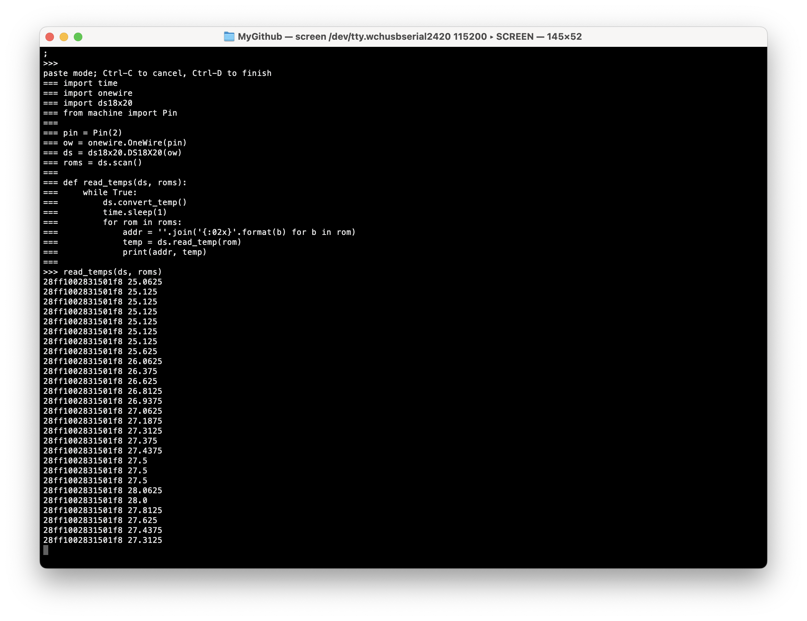
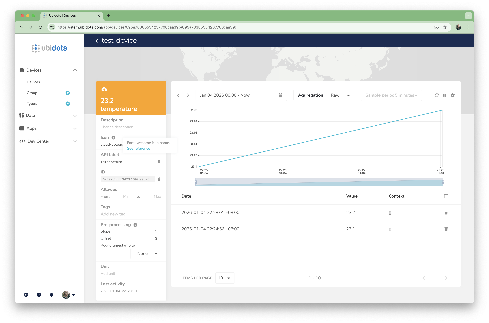
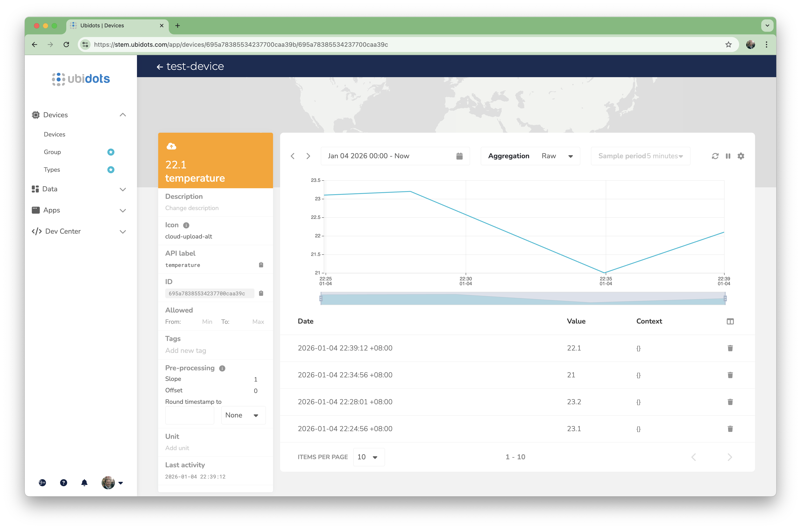
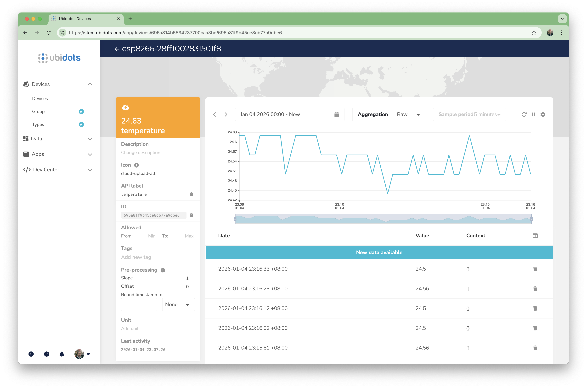
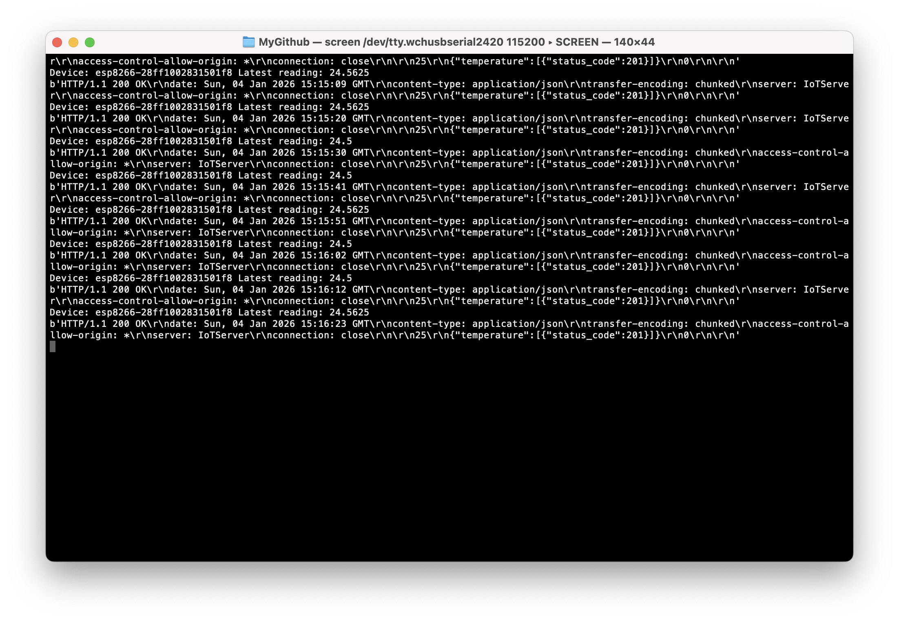
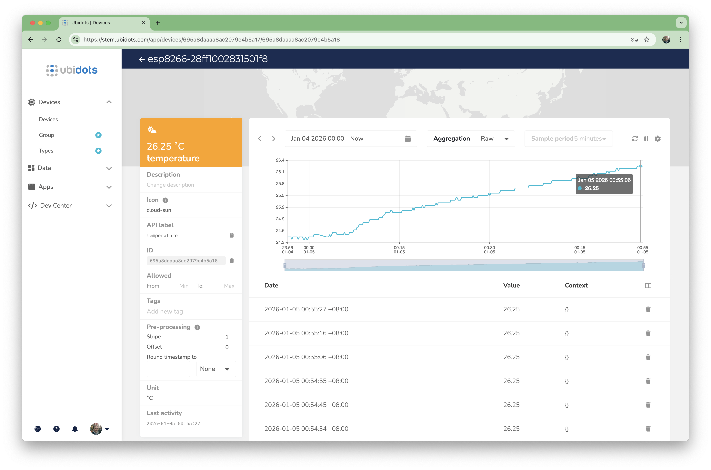

# #811 ESP8266 (ESP-01) IoT Temperature Sensor

Using MicroPython on an ESP8266 (512kb ESP01) to capture DS18S20 temperature readings and log to a cloud data collection service (Ubidots).


## Notes

I'm reviving this very simple project from an initial investigation I did way back in 2016 but never got around to posting after watching the "MicroPython on ESP8266 update" (see the video below).

At the time, it was quite exiting to see python running on the amazingly cheap early generations of the ESP8266. One of the demonstrations in the video showed:

* reading temperature from a DS1822-class 1-wire device
* posting the data to the [Xively](http://xively.com) cloud service

[](https://www.youtube.com/watch?v=_voIwFB4mu0)

### Objectives

Here's what I want to attempt again, now in 2026:

* using the ESP-01 512kb ESP8266 with the latest MicroPython
* read temperatures from a DS18S20 1-wire device
* post the data to a cloud service

### Circuit Design

Here's the basic setup:

* a 512kb ESP-01 loaded with MicroPython, per [LEAP#344 ESP8266 GettingStarted with MicroPython](../GettingStarted/)
* the [LEAP#194 DIYDevBoard](../../DIYDevBoard/) for programming and communications
* a [DS18S20](https://www.maximintegrated.com/en/products/sensors/DS18S20.html) 1-wire temperature sensor

Designed with Fritzing: see [esp-01-temperature-logger.fzz](./esp-01-temperature-logger.fzz).


### Step 1: Logging to Console

After booting the ESP8266 with MicroPython, I connect using screen:

```sh
export ESP_PORT=$(ls /dev/tty.wchusb*)
screen ${ESP_PORT} 115200
```

The first test is to read the DS18S20 sensor and log the temperature to the console.
I simply paste the source from [log-temperature-to-console.py](./log-temperature-to-console.py) into the REPL:

```sh
=== import ds18x20
=== from machine import Pin
===
=== pin = Pin(2)
=== ow = onewire.OneWire(pin)
=== ds = ds18x20.DS18X20(ow)
=== roms = ds.scan()
===
=== def read_temps(ds, roms):
===     while True:
===         ds.convert_temp()
===         time.sleep(1)
===         for rom in roms:
===             addr = ''.join('{:02x}'.format(b) for b in rom)
===             temp = ds.read_temp(rom)
===             print(addr, temp)
===
>>> read_temps(ds, roms)
28ff1002831501f8 25.0625
28ff1002831501f8 25.125
...
```

All good! We are successfully capturing temperature readings from the DS18S20 sensor.



For more information on the python API calls, see:

* [Pins and GPIO](https://docs.micropython.org/en/latest/esp8266/quickref.html#pins-and-gpio)
* [OneWire driver](https://docs.micropython.org/en/latest/esp32/quickref.html#onewire-driver)

### Sending the Readings to a Cloud Data Service

Now we have temperature readings, the next step is to send the data somewhere useful.

The original demo used the [Xively](http://xively.com) cloud service,
but that no longer exists....

#### What happened to Xively?

Xively was an IoT platform originally founded in 2007 (initially named Pachube) and later rebranded as Cosm and then Xively. It provided cloud services to connect, manage, and gather data from internet-connected devices—handling device messaging (MQTT), dashboards, analytics, and APIs.

In 2018, Google acquired Xively from LogMeIn for about $50 M and integrated its technology and team into Google Cloud’s IoT efforts.

Xively as a standalone platform no longer exists. Its domain redirects to Google Cloud IoT information, and the original service was absorbed into Google’s offerings.

Google continued IoT work under Google Cloud IoT Core, which built on parts of Xively’s tech. However Google Cloud IoT Core was officially retired in August 2023, with device connections and APIs shut down, forcing users to migrate to other IoT platforms or partner solutions.

#### An alternative: Ubidots

It's now 2026, and things have changed quite a bit since 2016:

* huge churn in cloud/IoT platforms - seems no-one survived!
* pretty much everyone now does TLS/HTTPS by default (usually **only**), so constrained devices struggle to even connect

After much searching and review, I have found one that fits the bill: [Ubidots](https://ubidots.com/):

* still supports an HTTP interface
* simple API for posting data
* and has a free trial plan to allow no-cost review

### Testing Ubidots from the console

Before trying to do this on the ESP8266, let's test the API from a desktop device. In my case, macOS.

We first need to use our account API key generate a token that can be used in subsequent data requests:

```sh
$ curl -X POST "https://industrial.api.ubidots.com/api/v1.6/auth/token" \
-H "x-ubidots-apikey: ${UDIBOTS_API_KEY}" \
-H "Content-Type: application/json"
{"token": "my-new-token"}
$ export UDIBOTS_TOKEN="my-new-token"
```

Now we have an API token, I can post data to the standard HTTPS endpoint:

```sh
$ curl -X POST "https://industrial.api.ubidots.com/api/v1.6/devices/test-device" \
-H "X-Auth-Token: ${UDIBOTS_TOKEN}" \
-H "Content-Type: application/json" \
-d '{"temperature":{"value": 23.1, "units": "C"}}'
{"temperature":[{"status_code":201}]}
```

Now let's verify we can also post data to the HTTP endpoint:

```sh
$ curl -X POST "http://industrial.api.ubidots.com/api/v1.6/devices/test-device" \
-H "X-Auth-Token: ${UDIBOTS_TOKEN}" \
-H "Content-Type: application/json" \
-d '{"temperature":{"value": 23.2, "units": "C"}}'
{"temperature":[{"status_code":201}]}
```

That all works well, and I'm seeing the data immediately in the Ubidots web console:



#### Sending To Ubidots from MicroPython

Now let's try the web request from MicroPython on the ESP-01.

The ESP device needs to be connected to the network first.
Use [wifi.py](./wifi.py) to connect if not already connected:

```python
def do_connect():
    import network

    wlan = network.WLAN(network.STA_IF)
    wlan.active(True)
    if not wlan.isconnected():
        print('connecting to network...')
        wlan.connect('mySSID', 'password')
        while not wlan.isconnected():
            pass
    print('network config:', wlan.ifconfig())

do_connect()
```

See [ubidots.py](./ubidots.py), which I pasted directly into the ESP repl to execute:

```python
import socket
import ujson

HOST = "industrial.api.ubidots.com"
PORT = 80
PATH = "/api/v1.6/devices/test-device"
TOKEN = "my-api-token"

payload = {
    "temperature": {
        "value": 22.1, "units": "C"
    }
}

body = ujson.dumps(payload)

addr = socket.getaddrinfo(HOST, PORT)[0][-1]
s = socket.socket()
s.connect(addr)

request = (
    "POST {} HTTP/1.1\r\n"
    "Host: {}\r\n"
    "X-Auth-Token: {}\r\n"
    "Content-Type: application/json\r\n"
    "Content-Length: {}\r\n"
    "Connection: close\r\n"
    "\r\n"
    "{}"
).format(PATH, HOST, TOKEN, len(body), body)

s.send(request.encode())
print(s.recv(1024))
s.close()

```

We now see the additional datapoints in the web console:



For more information see:

* [Networking](https://docs.micropython.org/en/latest/esp8266/quickref.html#networking)

#### Logging Temperature To Ubidots

Now we are ready to pull it all together:
capture the temperature readings from the DS18S20 sensor,
and post the results to Ubidots

The source is in [log-temperature-to-ubidots.py](./log-temperature-to-ubidots.py), which I paste into the MicroPython REPL:

```python
import socket
import ujson
import time
import onewire
import ds18x20
from machine import Pin

HOST = "industrial.api.ubidots.com"
PORT = 80
DEVICES_PATH = "/api/v1.6/devices/"
TOKEN = "my-api-token"
ONEWIRE_PIN = 2


def post_temperature(api_host_address, device_name, temperature):
    payload = {
        "temperature": {
            "value": temperature, "units": "C"
        }
    }
    body = ujson.dumps(payload)

    s = socket.socket()
    s.connect(api_host_address)

    request = (
        "POST {}{} HTTP/1.1\r\n"
        "Host: {}\r\n"
        "X-Auth-Token: {}\r\n"
        "Content-Type: application/json\r\n"
        "Content-Length: {}\r\n"
        "Connection: close\r\n"
        "\r\n"
        "{}"
    ).format(DEVICES_PATH, device_name, HOST, TOKEN, len(body), body)

    s.send(request.encode())
    print(s.recv(1024))
    s.close()

def read_and_log_temps(ds, api_host_address):
    roms = ds.scan()
    while True:
        ds.convert_temp()
        time.sleep(1)
        for rom in roms:
            device_name = 'esp8266-' + ''.join('{:02x}'.format(b) for b in rom)
            temperature = ds.read_temp(rom)
            print('Device:', device_name, 'Latest reading:', temperature)
            post_temperature(api_host_address, device_name, temperature)
        time.sleep(9)

ubidots_addr = socket.getaddrinfo(HOST, PORT)[0][-1]
ds = ds18x20.DS18X20(onewire.OneWire( Pin(ONEWIRE_PIN)))

read_and_log_temps(ds, ubidots_addr)

```

And that works very nicely:



One doesn't need to keep the console open while the script runs,
but if one does, we see the temperature readings and API postings logged on screen:



### Next steps?

So we have a basic data collection process running on the ESP-01.



But there are issues:

* the Ubidots token appears to only have a 1 hour life.
    * I can't find docs to confirm this.
    * It does mean, however, that my code above is only good for ~hour.
    * It needs to be enhanced to re-generate tokens as required in order to run for periods over 1 hour
* the 512kb ESP-01 doesn't have a filesystem to allow boot sequences to be specified
    * means that every time I restart the ESP-02, I have to reload the script

Rather than try and work around these issues with the ESP-01, I think it would be better to try one of the more capable ESP8266 boards first.
Coming next!

## Credits and References

* <https://docs.micropython.org/en/latest/esp8266/quickref.html>
* [DS18S20](https://www.maximintegrated.com/en/products/sensors/DS18S20.html) product page and datasheet
    * now at <https://www.analog.com/en/products/ds18s20.html>
* <https://ubidots.com/>
