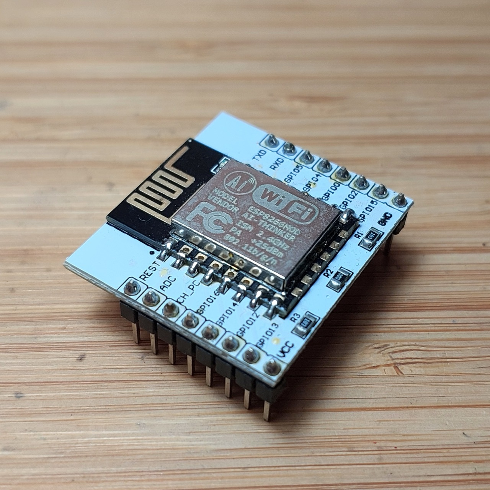
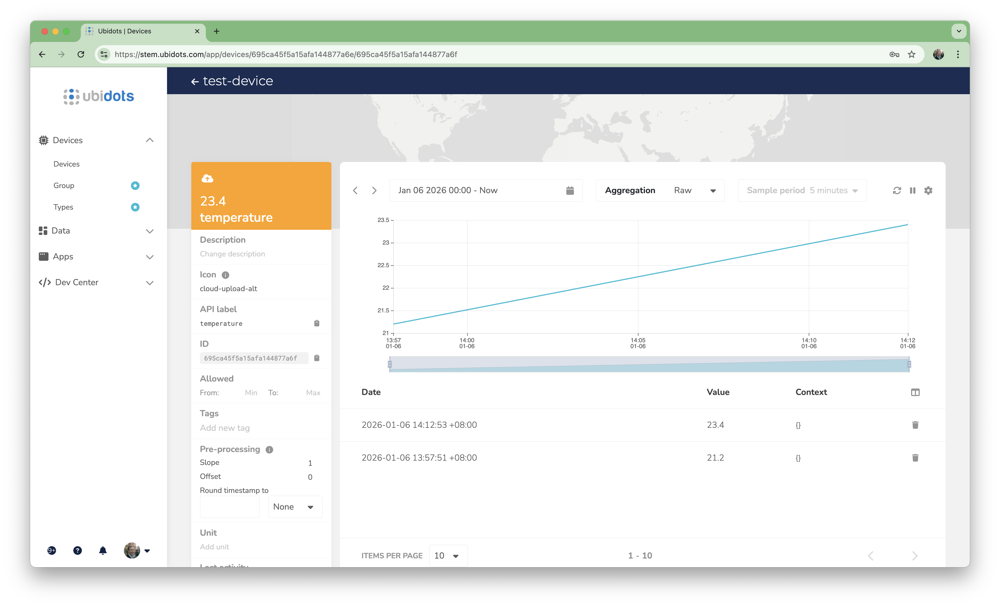
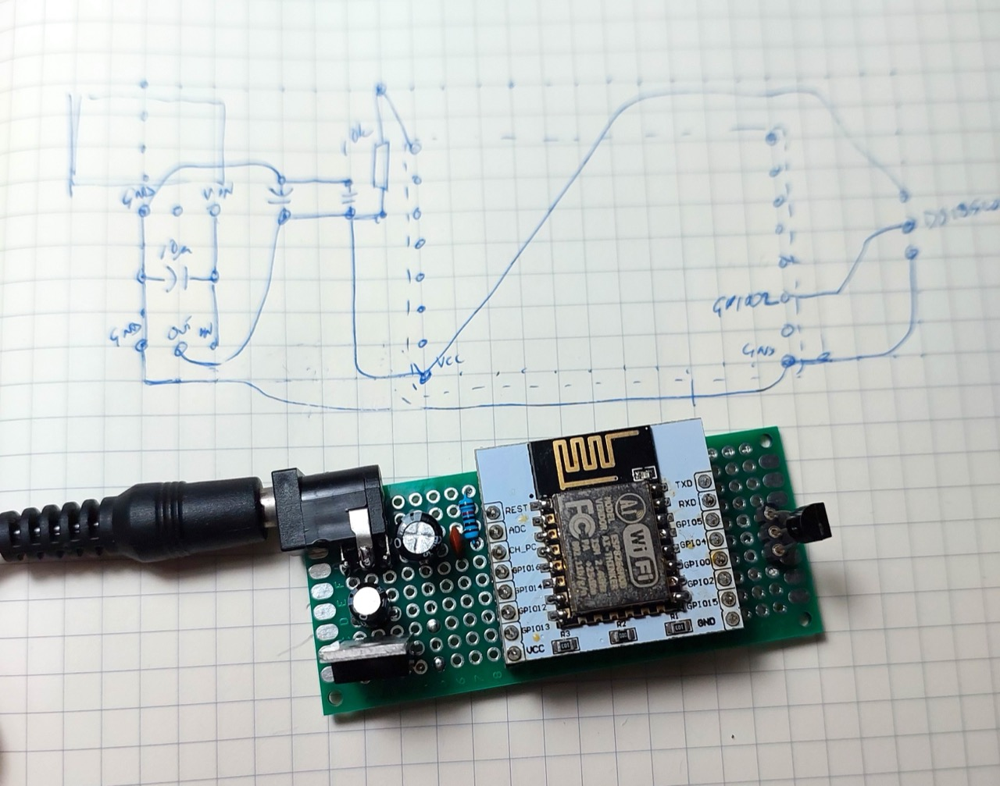
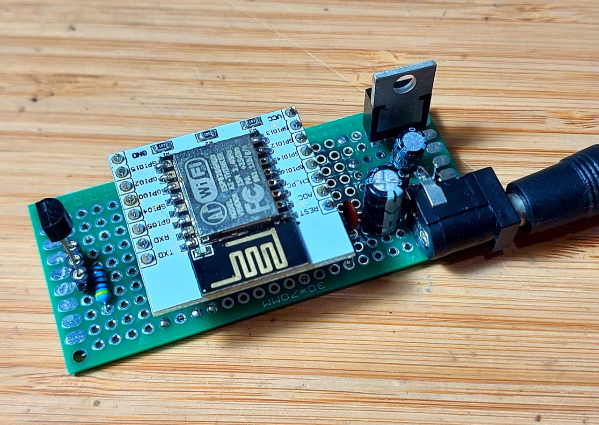
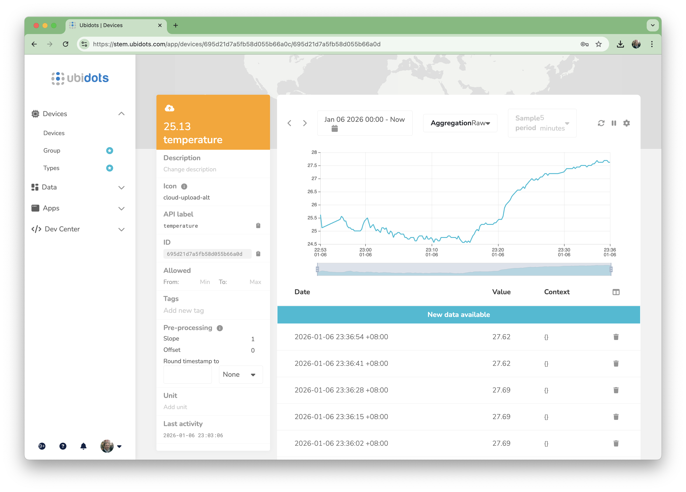
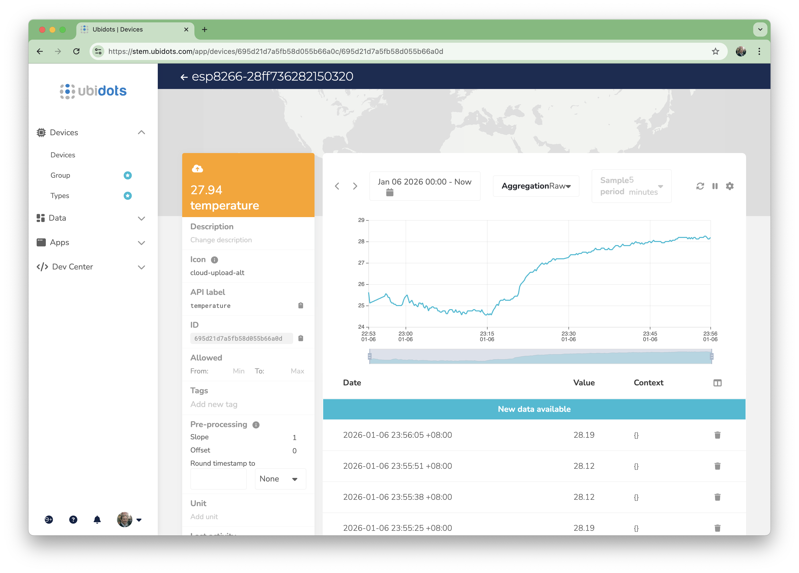

# #xxx ESP8266 (ESP-12E) IoT Temperature Sensor

Using MicroPython on an ESP-12E (4Mib ESP8266) to capture DS18S20 temperature measurements and log continuous readings to a cloud data collection service (Ubidots).


## Notes

This project expands on [LEAP#811 ESP8266 (ESP-01) IoT Temperature Sensor](../esp-01-temperature-logger/)
by porting the concept to an [ESP-12E](https://www.aliexpress.com/item/32339917567.html) ESP8266 module,
mounted on an [adapter board](https://www.aliexpress.com/item/32649040259.html).

Critically, the ESP-12E has 4Mib of flash so we get a full featured MicroPython environment.
This allows me to address key limitations in the ESP-01 demo:

* install the python script to automatically run after boot
* use HTTPS/TLS for web requests
* access to more convenient libraries such as `urequests`

NB: I purchased the ESP-12E module for US$1.92 in Mar-2016, currently listing for SG$1.39 in Jan-2026.
The adapters were US$1.25 for 10 in Oct-2017, currently listing for SG$1.70 for 10 in Jan-2026.



### Loading MicroPython

#### Testing the Connection

First find the device the CH340G-based USB to UART adapter is connected on, and set that as a variable for later use:

```sh
$ export ESP_PORT=$(ls /dev/tty.wchusb*)
$ echo ${ESP_PORT}
/dev/tty.wchusbserial2420
```

Verify the esptool install and connection by getting the chip_id.
This requires a switch into flash mode and reset on the dev board before it responds...

```sh
$ esptool.py --port ${ESP_PORT} chip_id
esptool.py v4.8.1
Serial port /dev/tty.wchusbserial2420
Connecting...
Detecting chip type... Unsupported detection protocol, switching and trying again...
Connecting...
Detecting chip type... ESP8266
Chip is ESP8266EX
Features: WiFi
Crystal is 26MHz
MAC: 18:fe:34:d4:7a:a5
Stub is already running. No upload is necessary.
Chip ID: 0x00d47aa5
Hard resetting via RTS pin...
```

```sh
$ esptool.py --port ${ESP_PORT} flash_id
esptool.py v4.8.1
Serial port /dev/tty.wchusbserial2420
Connecting....
Detecting chip type... Unsupported detection protocol, switching and trying again...
Connecting...
Detecting chip type... ESP8266
Chip is ESP8266EX
Features: WiFi
Crystal is 26MHz
MAC: 18:fe:34:d4:7a:a5
Uploading stub...
Running stub...
Stub running...
Manufacturer: e0
Device: 4016
Detected flash size: 4MB
Hard resetting via RTS pin...
```

### Flashing with MicroPython

Downloading the [latest generic build](https://micropython.org/download/ESP8266_GENERIC/):

```sh
wget https://micropython.org/resources/firmware/ESP8266_GENERIC-20251209-v1.27.0.bin
```

Erasing then flash first (as recommended, probably not really necessary).
Again, this requires a switch into flash mode and reset on the dev board before it responds...

```sh
$ esptool.py --port ${ESP_PORT} erase_flash
esptool.py v4.8.1
Serial port /dev/tty.wchusbserial2420
Connecting...
Detecting chip type... Unsupported detection protocol, switching and trying again...
Connecting...
Detecting chip type... ESP8266
Chip is ESP8266EX
Features: WiFi
Crystal is 26MHz
MAC: 18:fe:34:d4:7a:a5
Stub is already running. No upload is necessary.
Erasing flash (this may take a while)...
Chip erase completed successfully in 11.0s
Hard resetting via RTS pin...
```

```sh
$ esptool.py --port ${ESP_PORT} --baud 115200 write_flash --flash_size=detect 0 ESP8266_GENERIC-20251209-v1.27.0.bin
esptool.py v4.8.1
Serial port /dev/tty.wchusbserial2420
Connecting....
Detecting chip type... Unsupported detection protocol, switching and trying again...
Connecting...
Detecting chip type... ESP8266
Chip is ESP8266EX
Features: WiFi
Crystal is 26MHz
MAC: 68:c6:3a:85:3a:41
Uploading stub...
Running stub...
Stub running...
Configuring flash size...
Auto-detected Flash size: 4MB
Flash will be erased from 0x00000000 to 0x0009cfff...
Flash params set to 0x0040
Compressed 640832 bytes to 428824...
Wrote 640832 bytes (428824 compressed) at 0x00000000 in 37.7 seconds (effective 135.9 kbit/s)...
Hash of data verified.

Leaving...
Hard resetting via RTS pin...
```

### Testing the MicroPython REPL

```python
$ screen ${ESP_PORT} 115200
>>> import os
>>> os.uname()
(sysname='esp8266', nodename='esp8266', release='2.2.0-dev(9422289)', version='v1.27.0 on 2025-12-09', machine='ESP module with ESP8266')
>>>
```

### Ubidots

See [ubidots.py](./ubidots.py) for an updated implementation that:

* uses the Ubidits HTTPS/TLS API endpoints
* uses `urequests` for a simpler, more high-level interaction
* demonstrates using the permanent API key to generate temporary API tokens
    * if a request returns 401, it indicates a new token is required
* demonstrates posting data to the API

```python
import urequests
import ujson

UBIDOTS_API_KEY="%{UBIDOTS_API_KEY}%"

def get_new_token():
    url = "https://industrial.api.ubidots.com/api/v1.6/auth/token"
    headers = {
        "x-ubidots-apikey": UBIDOTS_API_KEY,
        "Content-Type": "application/json"
    }
    resp = urequests.post(
        url,
        headers=headers
    )
    print(resp.status_code)
    print(resp.text)
    try:
        token = ujson.loads(resp.text).get("token")
    except Exception:
        token = None
    resp.close()
    return token

def post_temperature(token, temperature):
    url = "https://industrial.api.ubidots.com/api/v1.6/devices/test-device"
    payload = {"temperature":{"value": temperature, "units": "C"}}

    headers = {
        "X-Auth-Token": token,
        "Content-Type": "application/json"
    }

    resp = urequests.post(
        url,
        data=ujson.dumps(payload),
        headers=headers
    )

    print(resp.status_code)
    print(resp.text)
    resp.close()
    return resp.status_code

token = get_new_token()
if token:
    post_temperature(token, 23.4)

```

I make the appropriate `%{UBIDOTS_API_KEY}%` substitution to a private file that cannot accidentally be checked into the repository.
The resulting `ubidots-private.py` file contents are pasted directly into the ESP MicroPython REPL to execute.

```sh
sed "s|%{UBIDOTS_API_KEY}%|${UBIDOTS_API_KEY}|g" ubidots.py > ubidots-private.py
```

And I'm seeing the data appear correctly in the Ubidots dashboard:



### Full Implementation

Now let's put it all together:

* measuring temperature
* posting data to Ubidots
    * getting a fresh API token when required

#### Circuit Design

Designed with Fritzing: see [esp-12-temperature-logger.fzz](./esp-12-temperature-logger.fzz).


I'm using the [LEAP#540 ESP-12 DIY Dev Board](../../ESP12/DIYDevBoard/) for programming,
but broken out onto a breadboard to easily allow the
wiring of the DS18S20 on the 1-wire bus.


#### The Program

See [log-temperature-to-ubidots.py](./log-temperature-to-ubidots.py) for the full source:

```python
import urequests
import ujson
import time
import onewire
import ds18x20
from machine import Pin

UBIDOTS_API_KEY="%{UBIDOTS_API_KEY}%"
ONEWIRE_PIN = 2

class UbidotsApi():

    @property
    def token(self):
        if not hasattr(self, '_token'):
            self._token = self.get_token()
        return self._token

    def get_token(self):
        url = "https://industrial.api.ubidots.com/api/v1.6/auth/token"
        headers = {
            "x-ubidots-apikey": UBIDOTS_API_KEY,
            "Content-Type": "application/json"
        }
        resp = urequests.post(
            url,
            headers=headers
        )
        print(resp.status_code)
        print(resp.text)
        try:
            token = ujson.loads(resp.text).get("token")
        except Exception:
            token = None
        resp.close()
        return token

    def _post_request(self, url, payload):
        headers = {
            "X-Auth-Token": self.token,
            "Content-Type": "application/json"
        }
        resp = urequests.post(
            url,
            data=ujson.dumps(payload),
            headers=headers
        )
        print(resp.status_code)
        print(resp.text)
        resp.close()
        if resp.status_code == 401:
            print("Unauthorized - token may have expired")
            self._token = None
        return resp.status_code

    def post_request(self, url, payload):
        status_code = self._post_request(url, payload)
        if status_code == 401:
            # retry once with new token
            print("Retrying with new token...")
            status_code = self._post_request(url, payload)
        return status_code

    def post_temperature(self, device_name, temperature):
        url = "https://industrial.api.ubidots.com/api/v1.6/devices/{}".format(device_name)
        payload = {
            "temperature": {
                "value": temperature, "units": "C"
            }
        }
        self.post_request(url, payload)

def read_and_log_temps():
    ds = ds18x20.DS18X20(onewire.OneWire( Pin(ONEWIRE_PIN)))
    roms = ds.scan()
    api = UbidotsApi()
    while True:
        ds.convert_temp()
        time.sleep(1)
        for rom in roms:
            device_name = 'esp8266-' + ''.join('{:02x}'.format(b) for b in rom)
            temperature = ds.read_temp(rom)
            print('Device:', device_name, 'Latest reading:', temperature)
            api.post_temperature(device_name, temperature)
        time.sleep(9)

def demo_read_and_log_temps():
    import random

    roms = [b'\xff\xff\xff\xff\x12\x34\x56\x78']
    api = UbidotsApi()
    while True:
        time.sleep(1)
        for rom in roms:
            device_name = 'demo-' + ''.join('{:02x}'.format(b) for b in rom)
            temperature = 20.0 + random.getrandbits(5) / 10.0
            print('Device:', device_name, 'Latest reading:', temperature)
            api.post_temperature(device_name, temperature)
        time.sleep(9)

read_and_log_temps()

```

I make the appropriate `%{UBIDOTS_API_KEY}%` substitution to a private file that cannot accidentally be checked into the repository.
The resulting `log-temperature-to-ubidots-private.py` file contents are pasted directly into the ESP MicroPython REPL to execute.

```sh
sed "s|%{UBIDOTS_API_KEY}%|${UBIDOTS_API_KEY}|g" log-temperature-to-ubidots.py > log-temperature-to-ubidots-private.py
```

And I'm seeing the data appear correctly in the Ubidots dashboard:


### Using mpremote to install startup script

We don't want to paste the python code into the ESP8266 repl every time it boots.
Thankfully, the ESP-12E has enough memory that it supports a filesystem.
If we load a file called `main.py`, it will be executed automatically after boot.

The [mpremote](https://docs.micropython.org/en/latest/reference/mpremote.html) tool
provides a convenient way of managing the boot script.

First, install mpremote:

```sh
pip install mpremote
```

The connect command opens a console to the ESP8266. You will see whatever it is running...

```sh
mpremote connect
```

Finally, to copy the boot script from a local `main.py` file to `:main.py` on the ESP8266. The `:` signifies the remote file system.

```sh
mpremote fs cp log-temperature-to-ubidots.py :main.py
```

To remove the startup script later on:

```sh
mpremote fs rm :main.py
```

### Deploying the Ubidots Script

```sh
sed "s|%{UBIDOTS_API_KEY}%|${UBIDOTS_API_KEY}|g" log-temperature-to-ubidots.py > log-temperature-to-ubidots-private.py
mpremote fs cp log-temperature-to-ubidots-private.py :main.py
rm log-temperature-to-ubidots-private.py
```

### Making a Custom Protoboard

Transferring the circuit to a 3x7cm protoboard:

* I've added an LD1117 linear regulator to take any supply above ~4V to 3.3V
* headers to accept an ESP-12E module on adapter board
* plug pins for a DS18S20





And we have results being logged continuously:



### Long Running Test

So I left it running overnight and it kept on capturing nicely. Some explanations of the readings:

* the monitor is running in my work area, which is often air-conditioned during the day
* I turned off the air-con in the evening
* this is Singapore, but a relatively cool period



## Credits and References

* ESP-12F: ["ESP8266 ESP-01 ESP-01S ESP-07 ESP-12E ESP-12F Remote Serial Port WIFI Wireless Module Intelligent Housing System Adapter 2.4G" (aliexpress seller listing)](https://www.aliexpress.com/item/32339917567.html)
* ESP-7/12 adapter boards: ["10PC ESP8266 serial WIFI Module Adapter Plate Applies to ESP-07, ESP-12F, ESP-12E for arduino" (aliexpress seller listing)](https://www.aliexpress.com/item/32649040259.html)
* <https://docs.micropython.org/en/latest/esp8266/quickref.html>
* [DS18S20](https://www.maximintegrated.com/en/products/sensors/DS18S20.html) product page and datasheet
    * now at <https://www.analog.com/en/products/ds18s20.html>
* <https://ubidots.com/>
* [esptool](https://github.com/themadinventor/esptool)
    * <https://docs.espressif.com/projects/esptool/en/latest/esp8266/index.html>
* <https://docs.micropython.org/en/latest/reference/mpremote.html>
* [LD1117 datasheet](http://pdf1.alldatasheet.com/datasheet-pdf/view/173710/UTC/LD1117AL-15-TA3-A-R.html)
