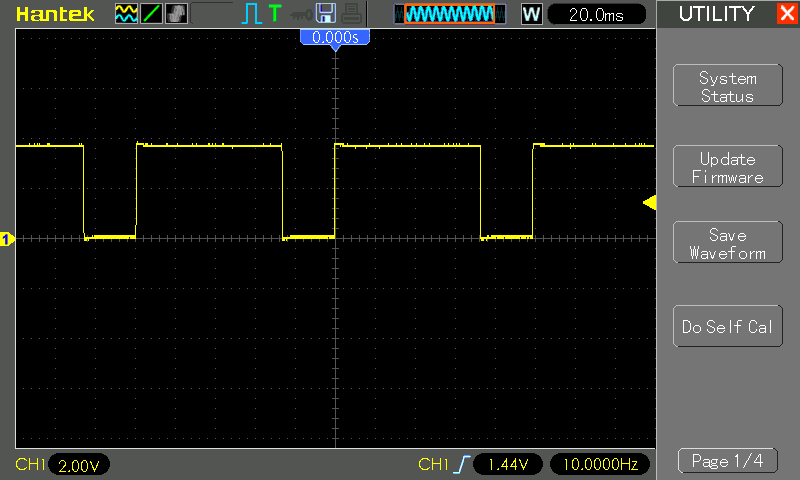
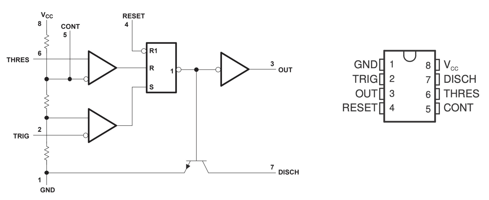

# #xxx Minimal 555 A-Stable Oscillator

Demonstrating the most minimal 555 oscillator configuration requiring just a single capacitor and resistor.

## Notes

The conventional 555 astable oscillator configuration uses two resistors and a capacitor to select the frequency and duty cycle,
as covered in [LEAP#016 555 Timer - A-Stable Oscillator](../).

There is a simpler configuration using just a single resistor and capacitor,
and uses the output to charge and discharge rather than the built-in discharge circuit.

The circuit has the the advantage of simplicity and low parts count.
The main disadvantage is that the behaviour is highly dependent upon the output load.
Also, most 555 calculators cannot handle the configuration, so setting frequency and duty cycle is usually left to experimentation.

This is most commonly seen in circuits where the 555 is used to provide a trigger to a digital circuit, where the duty cycle is irrelevant, and the next stage present a relatively high impedance to the 555 output.

### Circuit Design

Designed with Fritzing: see [Minimal.fzz](./Minimal.fzz).

This circuit demonstrates the basic behaviour, driving an LED on the output.

Tested on a bread board:

With C1=1µF R1=10kΩ, the frequency is measured at ~10Hz with a 74% duty cycle:

### How it Works

The circuit uses the 555 output to alternately charge or discharge the R1/C1 circuit:

* when the output is HIGH:
    * C1 is charged via R1 (at a rate according the the RC time constant)
    * when the C1 anode voltage exceeds 2/3 * VCC, the threshold comparator output goes high
    * this resets the flip-flop so that the output goes LOW
* when the output is LOW:
    * C1 is discharged via R1 (at a rate according the the RC time constant)
    * when the C1 anode voltage falls below 1/3 * VCC, the trigger comparator output goes high
    * this sets the flip-flop so that the output goes HIGH

## Credits and References

* [LM555 Datasheet](https://www.futurlec.com/Linear/LM555CN.shtml)
* [LEAP#016 555 Timer - A-Stable Oscillator](../)
