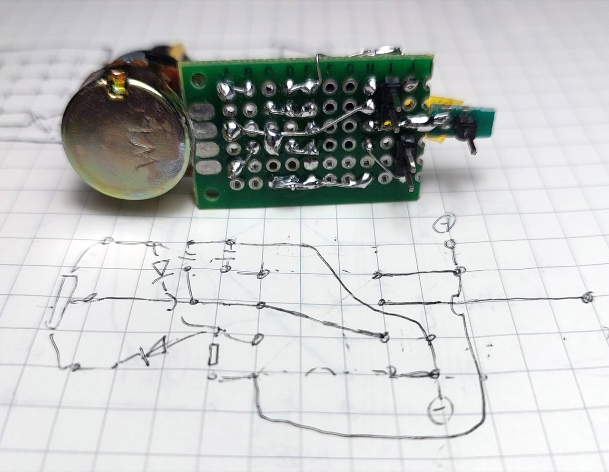
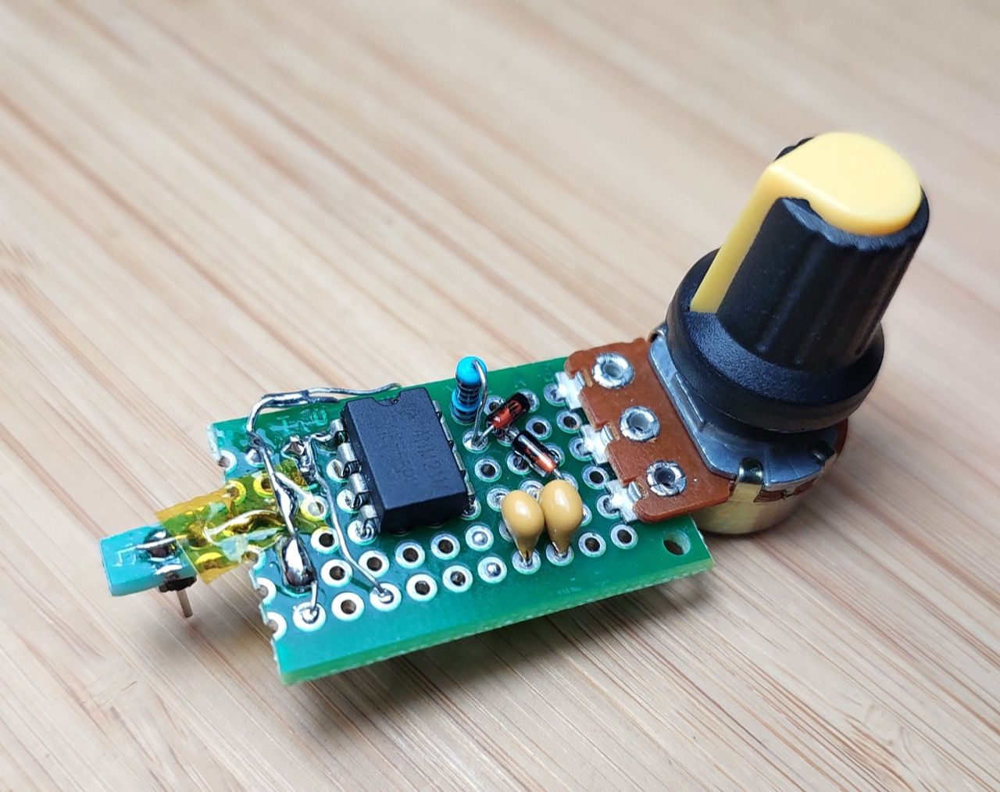
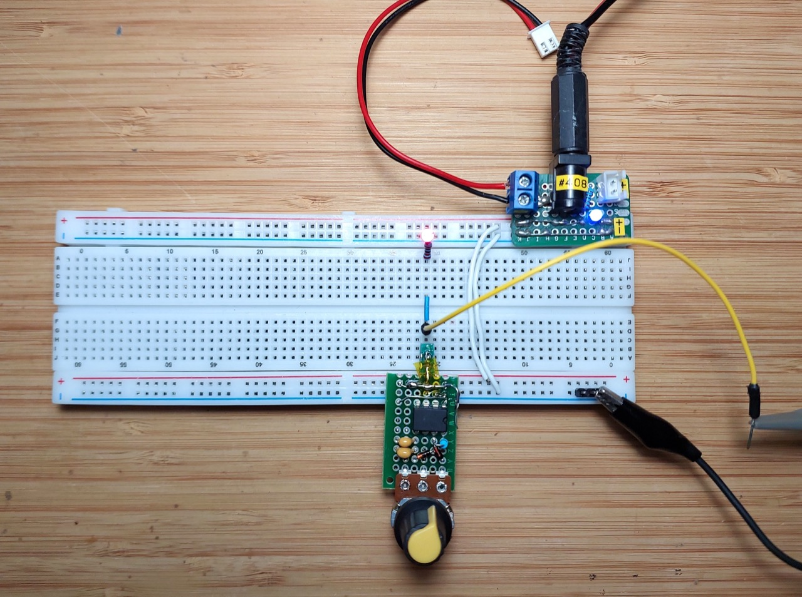
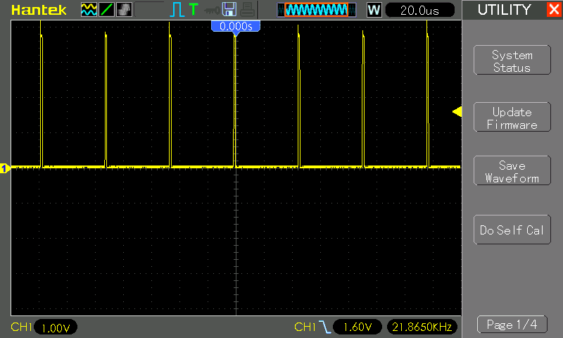
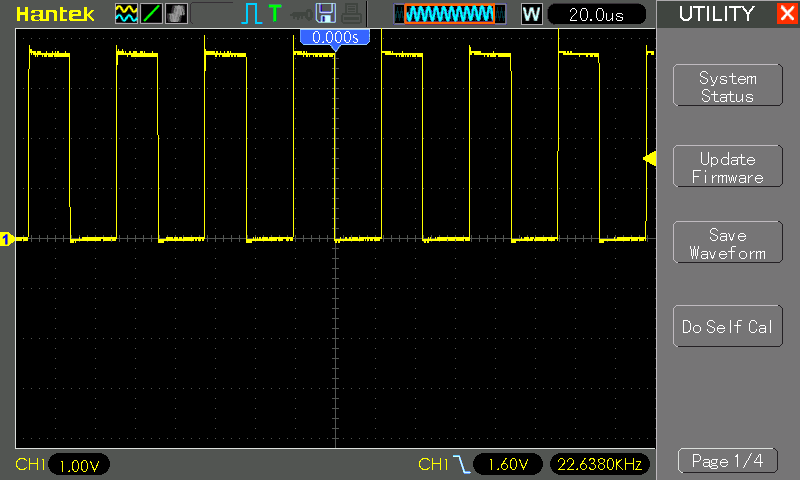
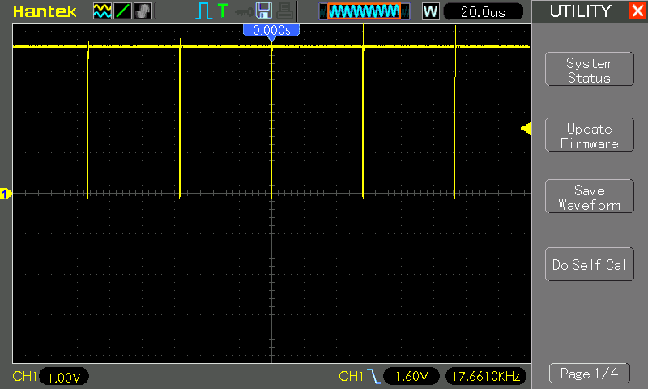

# #xxx 555 Breadboard PWM Generator

A simple PWM generator circuit using the 555 timer IC designed for use on a breadboard.

## Notes

It's often useful to have a PWM square wave generator to use on a breadboard circuit, without having to deploy a full function generator.

This project adapts the basic [LEAP#573 555 PWM Motor Control](../PwmMotorControl/) circuit and puts it on a small protoboard designed to plug into a breadboard.

### Circuit Design

Designed with Fritzing: see [BreadboardPWMGen.fzz](./BreadboardPWMGen.fzz).

### Protoboard Build

Transferring the circuit to a small piece of protoboard:

Testing the breadboard adapter:

Minimum duty cycle:

Mid-point duty cycle:

Maximum duty cycle:

## Credits and References

* [LM555 Datasheet](https://www.futurlec.com/Linear/LM555CN.shtml)
