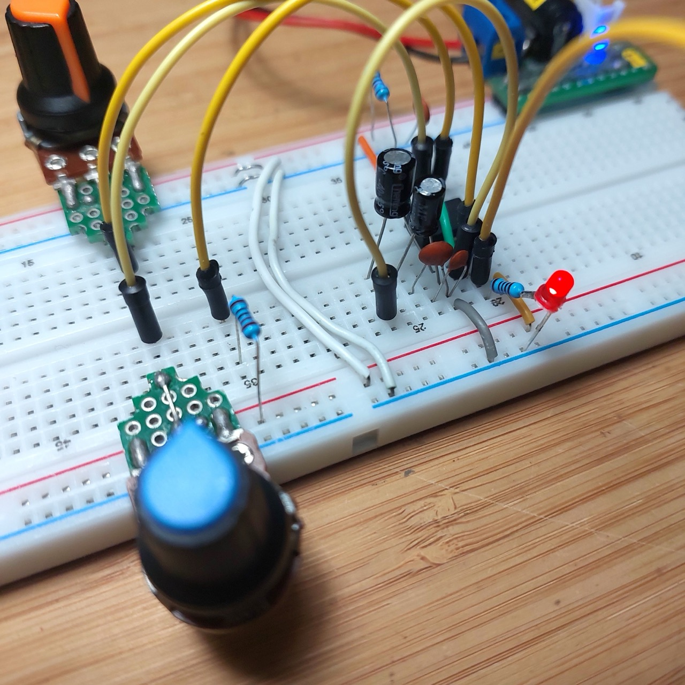
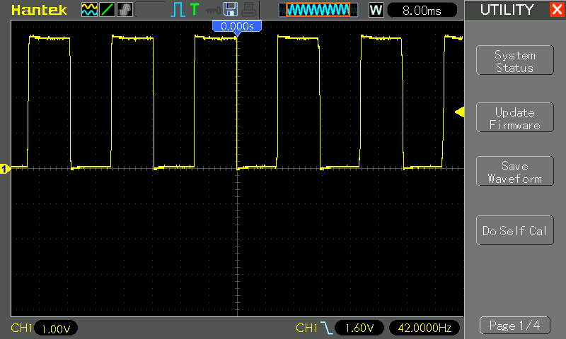
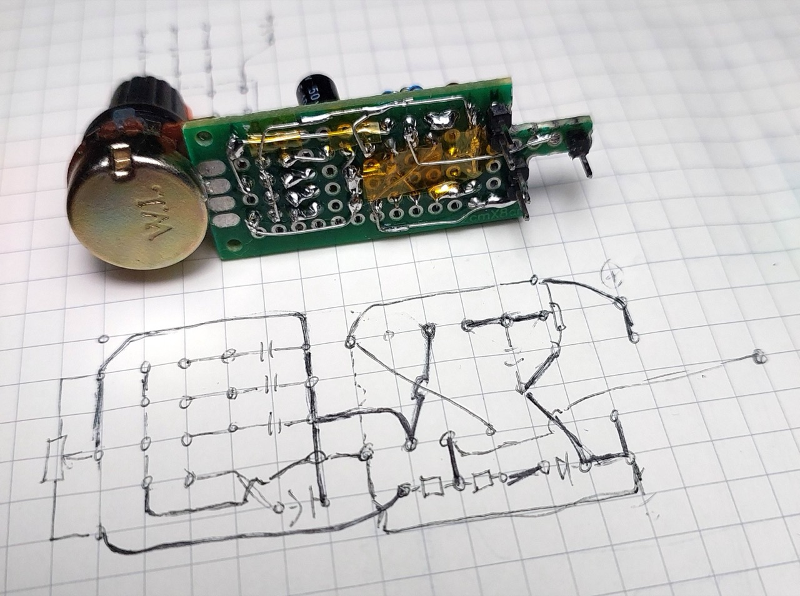
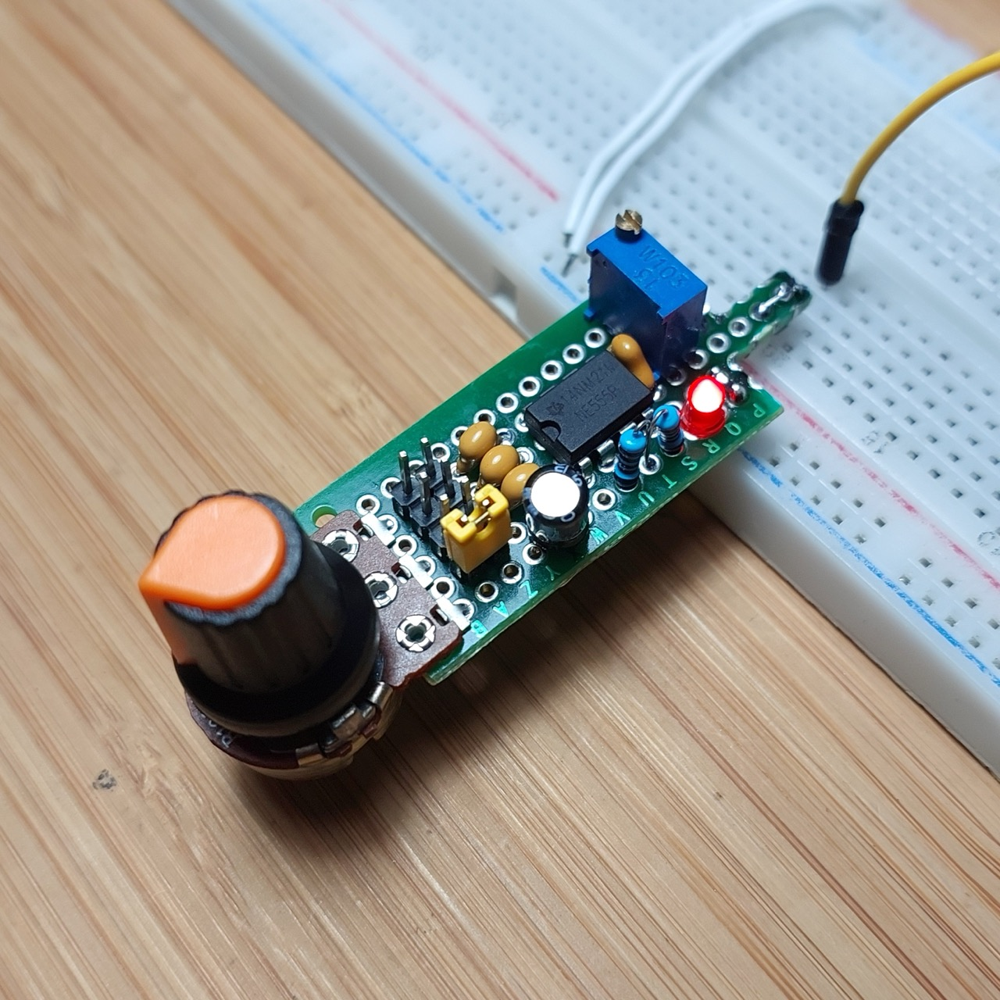
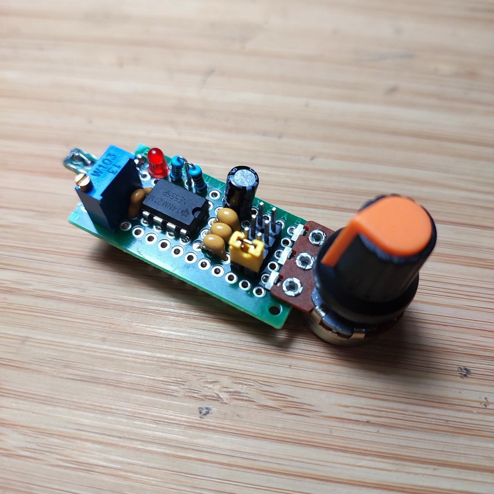
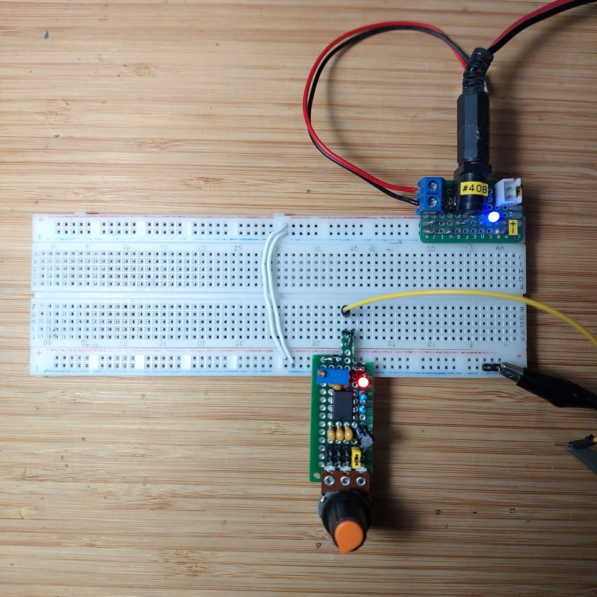

# #791 555 Breadboard Pulse Generator

A 555 timer-based square wave generator designed for use on a breadboard. Provides variable frequency control in 4 ranges, with a fixed (adjustable) duty cycle.

## Notes

It's often useful to have a square wave generator to use on a breadboard circuit, without having to deploy a full function generator.

This project takes the basic [LEAP#517 555 Timer Fixed-duty VFO](../PrecisionVariableFrequencyFixedDuty/) circuit and puts it on a small protoboard designed to plug into a breadboard.

### Circuit Design

Designed with Fritzing: see [BreadboardPulseGen.fzz](./BreadboardPulseGen.fzz).

* VR1 provides frequency control
    * 4 frequency ranges based on which capacitor (C1-C4) is connected
    * R1 ensures a minimum 1kΩ resistance
* VR2 provides fine adjustment of the duty cycle

Expected frequency ranges:

|Capacitor  | Min Frequency | Max Frequency |
|-----------|---------------|---------------|
|C1 - 10µF  |  [0.713 Hz](https://visual555.tardate.com/?mode=astable&r1=0&r2=101&c=10) | [72 Hz](https://visual555.tardate.com/?mode=astable&r1=0&r2=1&c=10) |
|C2 - 1µF   |  [7.129 Hz](https://visual555.tardate.com/?mode=astable&r1=0&r2=101&c=1) | [720 Hz](https://visual555.tardate.com/?mode=astable&r1=0&r2=1&c=1) |
|C3 - 100nF |  [71.287 Hz](https://visual555.tardate.com/?mode=astable&r1=0&r2=101&c=0.1) | [7.2 kHz](https://visual555.tardate.com/?mode=astable&r1=0&r2=1&c=0.1) |
|C4 - 10nF  |  [712.871 Hz](https://visual555.tardate.com/?mode=astable&r1=0&r2=101&c=0.01) | [72 kHz](https://visual555.tardate.com/?mode=astable&r1=0&r2=1&c=0.01) |

### Breadboard Testing

### Protoboard Build

Transferring the circuit to a small piece of protoboard:

Testing the breadboard adapter:

## Credits and References

* [LM555 Datasheet](https://www.futurlec.com/Linear/LM555CN.shtml)
