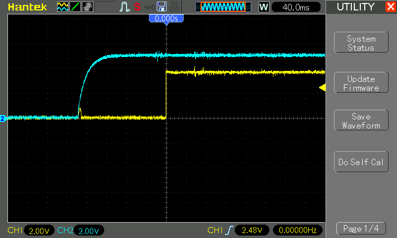

# #783 555 Delay On

A simple 555 circuit that provides a power-on delay.

## Notes

This circuit provides an output (pin 3) that does not go high until some time after power is applied. Adjustable from 1 second to 2 minutes.
One can find variations of this circuit in many places, for example:

* [Delay Before Turning On](https://www.talkingelectronics.com/projects/50%20-%20555%20Circuits/50%20-%20555%20Circuits.html#74) on Talking Electronics

### Circuit Design

Designed with Fritzing: see [DelayOn.fzz](./DelayOn.fzz).

### Testing

With the resistor set for a pretty short delay, I've captured the on-sequence with an oscilloscope:

* CH1 (Yellow) - 555 output (pin 3)
* CH2 (Blue) - power rail

## Credits and References

* [LM555 Datasheet](https://www.futurlec.com/Linear/LM555CN.shtml)
* Reference Circuits:
    * [Delay Before Turning On](https://www.talkingelectronics.com/projects/50%20-%20555%20Circuits/50%20-%20555%20Circuits.html#74) on Talking Electronics
