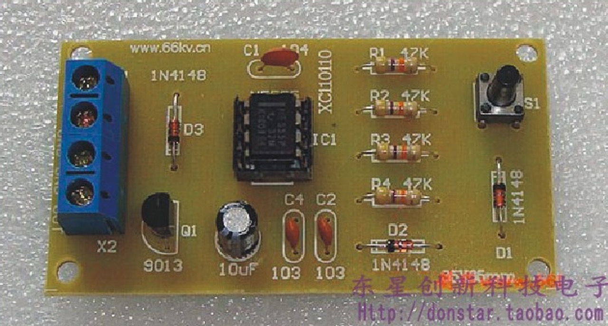

# #784 Another Two-tone Doorbell Kit

Another two-tone doorbell circuit using a 555 timer oscillator.
Designed to drive a speaker, it produces a classic ding-dong.

Here's a quick demo..

## Notes

I originally saw this circuit
[on aliexpress](http://www.aliexpress.com/item/555-doorbell-kit-ding-dong-doorbell-kit-diy-electronic-kit-diy-digital-kit/1682713914.html) (no longer listed). It appears to have been designed and produced by
<http://www.66kv.cn/>, but also no longer listed there.
After some rummaging, I found the kit, originally released 2011-2-13, in the [internet archive](https://web.archive.org/web/20120120234416/http://www.66kv.cn/Shop/ShowProduct.asp?ProductID=132).

The circuit is basically the same as the design used
in the door bell kits currently dominant on aliexpress
and as covered in [LEAP#201 555 Timer Doorbell Kit](../DoorbellKit/), with one difference, the output driver:

* the newer kits simply use a capacitor to AC-couple the speaker
* this deign uses an unusual high-side NPN with diode-controlled base
    * provides a stronger (louder) drive
    * but has a constant DC-bias

### Circuit Design

Drawn with Fritzing: see [DoorbellKit2.fzz](./DoorbellKit2.fzz).

### Original Circuit Description

> 电路说明：
>
> 本电路是用NE555集成电路接成的多谐振荡器。当按下S1，电源经D2对C3充电，当集成电路4脚（复位端）电压大于1V时，电路振荡，扬声器发出“叮”声。松开按钮S1，C3电容储存的电能经R4电阻放电，但集成电路4脚继续维持高电平而保持振荡，但这时因R1电阻也接入振荡电路，振荡频率变低，使扬声器发出“咚”声。当C3电容器上的电能释放一定时间后，集成电路4脚电压低于1V，此时电路将停止振荡。再按一次按钮，电路将重复上述过程。C3、R4放电时间的长短决定了断开S1后余音的长短，所以要改变余音的长短可调整C3、R4的数值，一般余音不易过长。本电路可采用三节1.5V电池（4.5V）供电，等待电流约为3.5mA，鸣叫电流约为120mA。

This circuit uses the NE555 integrated circuit to create a multivibrator.

* When S1 is pressed, power is charged to C3 via D2.
    * When the voltage at IC pin 4 (reset) exceeds 1V, the circuit oscillates, and the speaker emits a "ding" sound.
* When S1 is released, the energy stored in capacitor C3 discharges through resistor R4, but IC pin 4 remains high, maintaining oscillation.
* However, because resistor R1 is also connected to the oscillation circuit, the oscillation frequency decreases, causing the speaker to emit a "dong" sound.
    * After a certain period of time, when the energy in capacitor C3 has been discharged and the voltage at IC pin 4 falls below 1V, the circuit stops oscillating.
* Pressing the button again causes the circuit to repeat the process.

The discharge time of C3 and R4 determines the length of the residual sound after S1 is disconnected.
To adjust the residual sound, adjust the values of C3 and R4.
Generally, the residual sound should not be too long.

This circuit can be powered by three 1.5V batteries (4.5V). The standby current is approximately 3.5mA, and the beeping current is approximately 120mA.

## Credits and References

* [LM555 Datasheet](https://www.futurlec.com/Linear/LM555CN.shtml)
* [S9013 datasheet](https://www.futurlec.com/Transistors/S9013.shtml)
* [555 Doorbell Kit Ding Dong Doorbell Kit DIY Electronic Kit DIY Digital Kit](http://www.aliexpress.com/item/555-doorbell-kit-ding-dong-doorbell-kit-diy-electronic-kit-diy-digital-kit/1682713914.html) - original aliexpress listing (no longer available)
* [original kit on www.66kv.cn](https://web.archive.org/web/20120120234416/http://www.66kv.cn/Shop/ShowProduct.asp?ProductID=132)
* <http://www.66kv.cn/>
