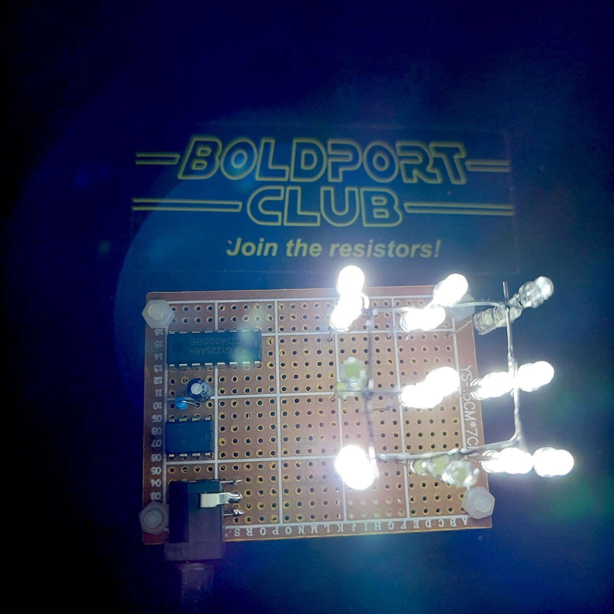

# #853 555 3x3x3 LED Cube

A 3x3x3 LED cube animated with 512 different patterns generated by a 555 timer and CD4020 binary counter.

Here's a quick demo..

## Notes

This is an [old 555 circuit](https://www.555-timer-circuits.com/3x3x3-cube.html)
to animate a 3x3x3 cube of white LEDs.

The 555 is used to clock a CD4020 14-stage binary counter, from which 9 outputs are used.
Each output controls a column of 3 LEDs in series.

There are no current limiting resistors as the chip can only deliver a maximum of 15mA per output.

Since we are using 9 outputs from the CD4020, it produces `2^9=512` distinct patterns before repeating.

### Circuit Design

Designed with Fritzing: see [LedCube.fzz](./LedCube.fzz).

The circuit setup on a breadboard for testing:

Testing:

### Final Build

Planning the construction on a 5x7cm protoboard:

As built:

Under test, works well when powered from 9V to 12V:

Not a bad result for just 4 components and the LEDs!

## Credits and References

* [LM555 Datasheet](https://www.futurlec.com/Linear/LM555CN.shtml)
* [CD4020 datasheet](https://www.futurlec.com/4000Series/CD4020.shtml)
* <https://www.555-timer-circuits.com/3x3x3-cube.html>
