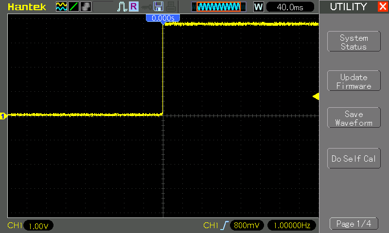

# #846 ML555

Celebrating the 55th birthday of the most evergreen IC of all time: the 555 timer,
with a reproduction using discrete components. This is the "Medium-Large 555" - a 555 timer built with BJTs and resistors, inspired by the work of the Evil Mad Scientist.

Here's a quick demo..

## Notes

This ia a "Medium-Large" version of the venerable 555, inspired by the
[555SE kit](https://wiki.evilmadscientist.com/555) from the Evil Mad Scientist.

Using simple BJTs and resistors, we can reproduce the classic 555 timer IC with discrete components.

Of course, I had to do this since it is May-2026: 55 years later, on the 5th May!

### The 555

The timer IC was designed in 1971 by Hans Camenzind under contract to Signetics,
making it 55 years old in 2026 and still going strong.
TI continue to actively manufacture and support the [LM555](https://www.ti.com/product/LM555)
in DIP and various surface mount packages.

### Circuit Design

Designed with Fritzing: see [ML555.fzz](./ML555.fzz).

The circuit is a direct implementation of the "equivalent circuit" from the NE555 datasheet, built using resistors and individual 2N3904 and 2N3906 transistors.

Setup on a breadboard...

### Parts

| Ref                          | Qty | Component   |
|------------------------------|-----|-------------|
| Q1-4, Q14-18, Q20-22, Q24    | 13  | 2N3904 NPN  |
| Q5-13, Q19A, Q19B, Q23, Q25  | 13  | 2N3906 PNP  |
| R2, R3, R7, R8, R9, R11, R15 | 7   | 4.7kΩ       |
| R2                           | 1   | 820Ω        |
| R4                           | 1   | 1kΩ         |
| R5                           | 1   | 10kΩ        |
| R6,R17                       | 2   | 100kΩ       |
| R10                          | 1   | 15kΩ        |
| R12                          | 1   | 6.8kΩ       |
| R13                          | 1   | 3.9kΩ       |
| R14                          | 1   | 220Ω        |
| R16                          | 1   | 100Ω        |

Substitutions:

* 820Ω - substitute with [1.5kΩ \|\| 1.8kΩ ≈ 818Ω](https://toolbox.tardate.com/?formula=1500%7C1800#ResistorCalculator)
* 15kΩ  - substitute with [12kΩ + 3kΩ = 15kΩ](https://toolbox.tardate.com/?formula=12000%2B3000#ResistorCalculator)

## Testing the Circuit

Let's take a standard 555 timer astable oscillator circuit:
[R1=10k, R2=330k and C1=2.2uF](https://visual555.tardate.com?r1=10&r2=330&c=2.2),
which predicts a frequency of just about 1Hz and 50% duty cycle. i.e. half a second on, half a second off.

Designed with Fritzing: see [ML555-async.fzz](./ML555-async.fzz).

The circuit is a direct implementation of a standard 555 astable oscillator
but using the breadboarded 555 in place of the DIP8 component.

### Results

Using our breadboarded 555 timer, how do the results compare?

The expected frequency is [0.997Hz](https://visual555.tardate.com?r1=10&r2=330&c=2.2). When I attach it to a scope, I see 1Hz.... pretty close!

## Credits and References

* [NE555 Datasheet](https://www.ti.com/lit/ds/symlink/ne555.pdf)
* <https://en.wikipedia.org/wiki/555_timer_IC>
* <https://wiki.evilmadscientist.com/555>
* [The Three Fives Kit: A Discrete 555 Timer](https://shop.evilmadscientist.com/productsmenu/tinykitlist/652-555kit)
