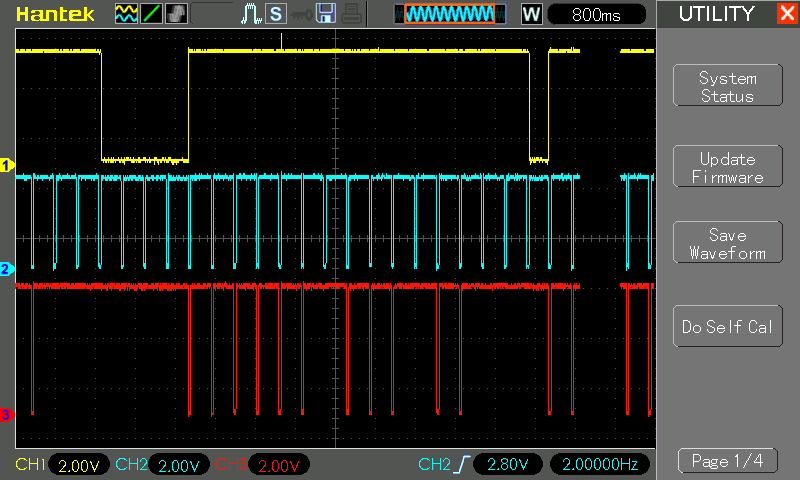

# #729 Missing Pulse Detector

Presenting a missing pulse detector circuit based on a 555 timer monostable, and tested using a 555/4011 interruptible pulse generator.

Here's a quick demo..

## Notes

The missing pulse detector is made using a 555 time in monostable mode.
Incoming pulses continually reset the timing cycle.
A missing pulse allows the timing cycle to complete, changing the output state.

The circuit is described in many places, including:

* [The 555 Timer Applications Sourcebook](../../../books/555-timer-applications-sourcebook/) - experiment 8
* [Engineer's Mini-Notebook 555 Timer IC Circuits](../../../books/engineers-mini-notebook-555-timer-ic-circuits/) p12

### Circuit Design

The circuit includes three main sub-systems:

* a test pulse generator (555 U1)
* a test pulse interrupter (pushbutton and CD4011 U3)
* the actual missing pulse detector (555 U2)

The test pulse generator:

* simply a 555 timer (555 U1) configured in astable mode running at [3.396 Hz, 88.9% duty cycle](https://visual555.tardate.com/?mode=astable&r1=330&r2=47&c=1).
* An indicator LED1 is attached to show the output `PULSE_GEN` in action

The test pulse interrupter:

* uses one NAND gate from CD4011 U3(1) to invert the `PULSE_GEN` output, so pulses are HIGH spikes at ~11.1% duty cycle
* combines with the normally-HIGH push-button into a second NAND gate from CD4011 U3(2), the output labelled `SIGNAL`
* when the push-button is not pressed:
    * CD4011 U3(2) output `SIGNAL` reproduces the `PULSE_GEN` signal
* when the push-button is pressed:
    * CD4011 U3(2) output `SIGNAL` is pulled HIGH

The missing pulse detector:

* is based on a 555 timer (555 U2) configured in monostable mode with [Time High = 1706 ms](https://visual555.tardate.com/?mode=monostable&r1=330&c=4.7)
* while the `SIGNAL` is pulled LOW (every pulse)
    * it continuously triggers the timing cycle, keeping the output HIGH
* when the `SIGNAL` LOW pulse is missed for longer than the monostable timing, then the output goes LOW
* the indicator LED2 is configured on the high side of the output, so that is lights when pulses are missed.

The monostable timing is set by R5/C2. These need to be adjusted so that the timing is longer than the expected period of incoming pulses. A practical missing pulse detector would switch R5 with a small fixed resistor (>=1kΩ) and a large potentiometer, and possible make C2 switchable between different "ranges" so that the sensitivity can be adjusted for the frequency of the signal being monitored.

Built on a breadboard for testing:

### Test

Here is the scope trace of a sample run. The signals

* CH1 (Yellow) - traces the output of the missing pulse detector
* CH2 (Blue) - traces the continuous `PULSE_GEN` pulse train
* CH3 (Red) - traces the `SIGNAL`, normally `PULSE_GEN` except when the push-button is pressed

The button was pressed 4 times during the sweep, but on ly the first and last were long enough to cause the missing pulse detector to indicate.

## Credits and References

* [The 555 Timer Applications Sourcebook](../../../books/555-timer-applications-sourcebook/)
* [Engineer's Mini-Notebook 555 Timer IC Circuits](../../../books/engineers-mini-notebook-555-timer-ic-circuits/)
* [LM555 Datasheet](https://www.futurlec.com/Linear/LM555CN.shtml)
* [CD4011 datasheet](https://www.futurlec.com/4000Series/CD4011.shtml)
* [2N3906 datasheet](https://www.futurlec.com/Transistors/2N3906.shtml)
