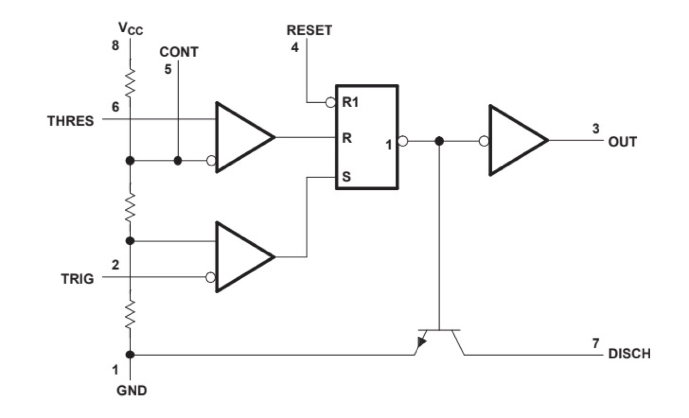
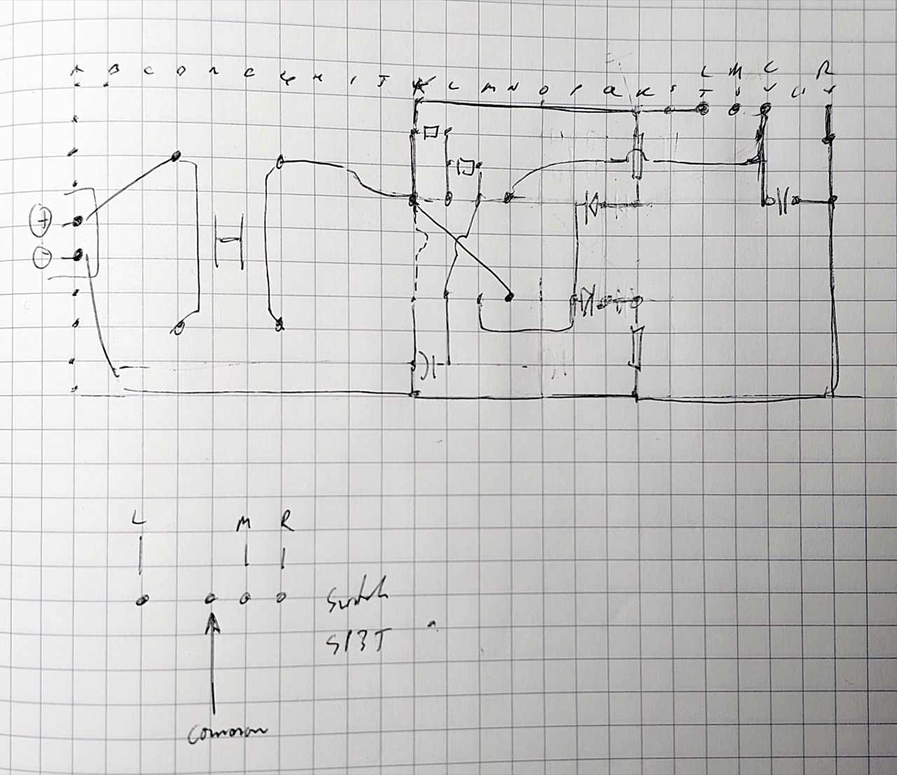

# #560 Simple 555 Tester

Testing a simple 555 project published in Elektor Jul-1980. The circuit uses an astable configuration to verify the performance of a 555 timer chip.

Here's a quick demo..

## Notes

Taking a look at an old 555 project published in Elektor Jul-1980 (page 31) - the
[simple 555 tester](https://www.elektormagazine.com/magazine/elektor-197999/44458).

> Although the 555 is generally very reliable, there are occasions when malfunction does occur. The circuit shown here will provide a simple and effective method of testing suspect devices.

### Circuit Design

The timer to be tested, IC1, is connected as an astable (free-running) multivibrator.

* When the 'push to test' button (S1) is closed capacitor C1 will start to charge up via resistors R1 and R2.
* As soon as the voltage level on this capacitor reaches the trigger point of the timer the internal flip-flop is activated and pin 7 is taken low to discharge C1.
* The flip-flop is reset when the voltage on C1 reaches the threshold level of the IC. This takes pin 7 high and the charge cycle starts once more.
* The output of the timer (pin 3) is connected to a pair of light-emitting diodes.
* When the output is high LED D2 will be on and D1 will be off.
* Conversely, when the output is low D1 will be on and D2 will be off.

The LEDs will flash on and off alternately — provided, of course, that the IC under test is a good one.

The circuit described uses
[R1=1k, R2=150k and C1=10uF](https://visual555.tardate.com/?mode=astable&r1=1&r2=150&c=10),
which results in a frequency of just about 0.5Hz and 50% duty cycle. i.e. one second on, one second off.

### Enhancing the Circuit with Control Input Test

An additional test that can be performed on a 555 chip is to verify the behaviour of the control pin (5).

* Most circuits will tie the control pin to ground with a 100nF capacitor to keep it stable.
* if it is pulled high, then the output will also be pulled high
* if it is pulled low, then the output will also be pulled low

So adding a SP3T switch to the control pin expands the test modes available:

* normal running
* output high
* output low

### Protoboard Build

Transferring the design to some protoboard...

## Credits and References

* [simple 555 tester](https://www.elektormagazine.com/magazine/elektor-197999/44458) - Published in Elektor 7/1980 on page 31
* [LM555 Datasheet](https://www.futurlec.com/Linear/LM555CN.shtml)
