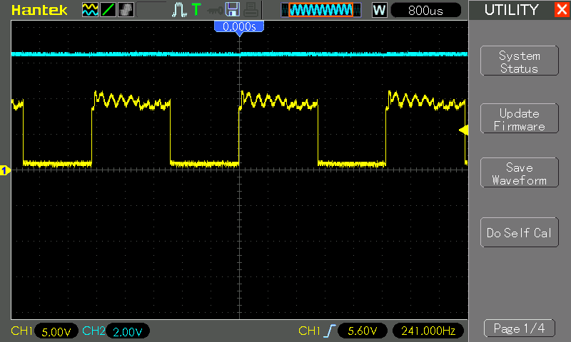
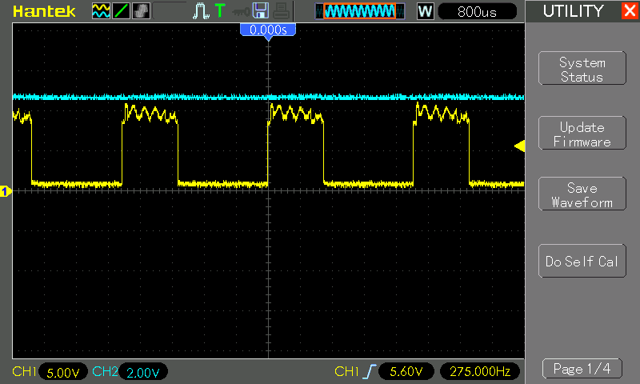

# #045 Simple Siren

Classic timer circuit producing a two-tone oscillation.

Here's a quick demo..

## Notes

This is a build of a circuit published by [electronicshub](https://www.electronicshub.org/ding-dong-sound-generator-circuit/).

It is allegedly a "ding dong" bell.. sounds more like a siren to me!

It operates with two oscillating 555 timers chained together.

The first 555 provides the low frequency oscillation between high and low output states. The frequency is determined by the values of R1, VR1 and C1.
With [R1=2kΩ, VR1 at 10kΩ and C1=47μF](https://visual555.tardate.com/?mode=astable&r1=2&r2=10&c=47) this runs at 1.4Hz and 55% duty cycle.

The pin 3 output of the first time switches the control voltage of the second 555 timer.

The oscillation of the second 555 drives the output piezo, and the frequency is modified by the control voltage.

### Construction

### Testing

In practice, with R3=1kΩ in place, the control voltage (`Vcontrol`) is was measured as follows:

* high `Vcontrol`: 4.80V
* low `Vcontrol`: 6.64V
* `VCC`: 9.2V

When `Vcontrol = 4.80V`, the frequency of the oscillation is 287 Hz - see the [actual calculation on WolframAlpha](https://www.wolframalpha.com/input?i=f+%3D+1%2F%28+100*10%5E-9+*+%282000+%2B+30000%29ln%281+%2B+4.8%2F%282+*+%289.2+-+4.8%29%29%29+%2B+100*10%5E-9+*+30000+*+ln%282%29+%29)

When `Vcontrol = 6.64V`, the frequency of the oscillation reduces to 211 Hz - see the [actual calculation on WolframAlpha](https://www.wolframalpha.com/input?i=f+%3D+1%2F%28+100*10%5E-9+*+%282000+%2B+30000%29ln%281+%2B+6.64%2F%282+*+%289.2+-+6.64%29%29%29+%2B+100*10%5E-9+*+30000+*+ln%282%29+%29).

The derivation of the formula considering a control voltage is explained in a
[question on EE.SE](http://electronics.stackexchange.com/questions/101530/what-is-the-equation-for-the-555-timer-control-voltage).
The formula with variables as named in this circuit is:

    f = 1/( C2.(R2+VR2)ln(1 + Vcontrol/(2(Vcc - Vcontrol))) + C2.VR2.ln(2) )

In practice, I'm seeing the frequency alternate between around 241 Hz and 275 Hz, as measured on an oscilloscope:

## Credits and References

* [LM555 Datasheet](https://www.futurlec.com/Linear/LM555CN.shtml)
* [Visual 555 Calculator](https://visual555.tardate.com)
* [What is the equation for the 555 timer control voltage?](http://electronics.stackexchange.com/questions/101530/what-is-the-equation-for-the-555-timer-control-voltage) - Q&A on EE.SE
* [Ding Dong Bell Sound Generator](https://www.electronicshub.org/ding-dong-sound-generator-circuit/) - original circuit from electronicshub
