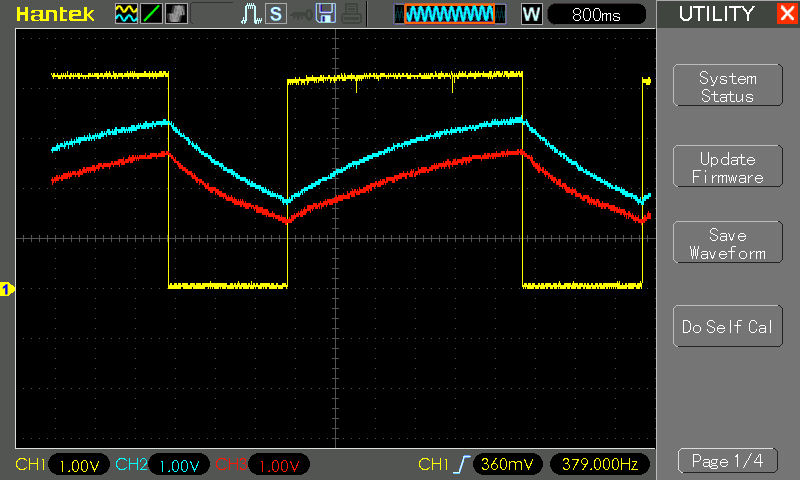
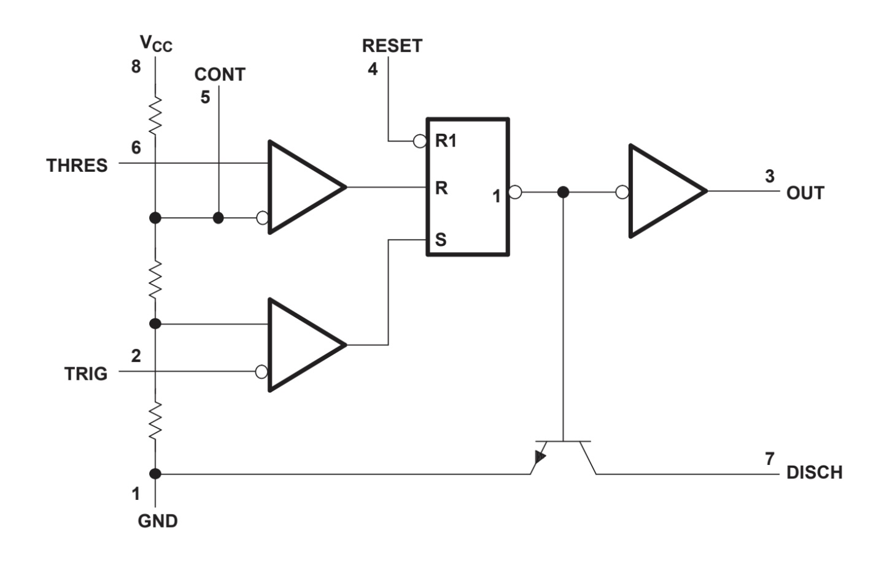

# #714 Slow Glow 2

A simple slowly-glowing LED effect using a 555 timer. This provides a better fade-in/fade-out than the Slow Glow circuit.

Here's a quick demo..

## Notes

This project is based on the [UP/DOWN FADING LED Circuit](https://www.555-timer-circuits.com/up-down-fading-led.html).
I've modified it for 5V operation.

It is an unusual circuit in a few respects:

* an unconventional 555 configuration
* using a high-side NPN transistor

The end result, however, is quite pleasing. It achieves a steady fade-in and fade-out of the LED.
Certainly a better result than my previous Slow Glow circuit:
[LEAP#559](../SlowGlow/).

### Circuit Design

The original circuit was designed for 9V. To use with 9V, recommended to change R2 to something higher to avoid over-driving the LED e.g. 470Ω.

With a 5V supply, it has just enough forward voltage to drive an LED

## How it Works

The following scope trace shows the circuit in operation:

* CH1 (Yellow) - timer output
* CH2 (Blue) - transistor base/capacitor anode/timer threshold & trigger
* CH3 (Red) - transistor emitter/LED anode
* Note: all inputs scaled to 1v/div but offset by -1v

Basic operating principle and notes:

* with the 555 output high, the capacitor C1 is charged via R1 with time constant (𝛕) of about [3.3s](https://www.wolframalpha.com/input?i=33k%CE%A9*100%C2%B5F).
* the 555 timer threshold/trigger pins are tied and will limit the oscillation between 1/3 and 2/3 VCC
* when capacitor C1 reaches 2/3 VCC, the 555 threshold pin resets the output low, starting discharge.
* The 555 discharge pin (7) is unused in this configuration. Discharge is via the transistor B-E connection, hence the slower discharge.
* when C1 reaches 1/3 VCC, the 555 trigger pin sets the output high, restarting the charge cycle.

## Credits and References

* [UP/DOWN FADING LED Circuit](https://www.555-timer-circuits.com/up-down-fading-led.html)
* [LM555 datasheet](https://www.futurlec.com/Linear/LM555CM.shtml)
