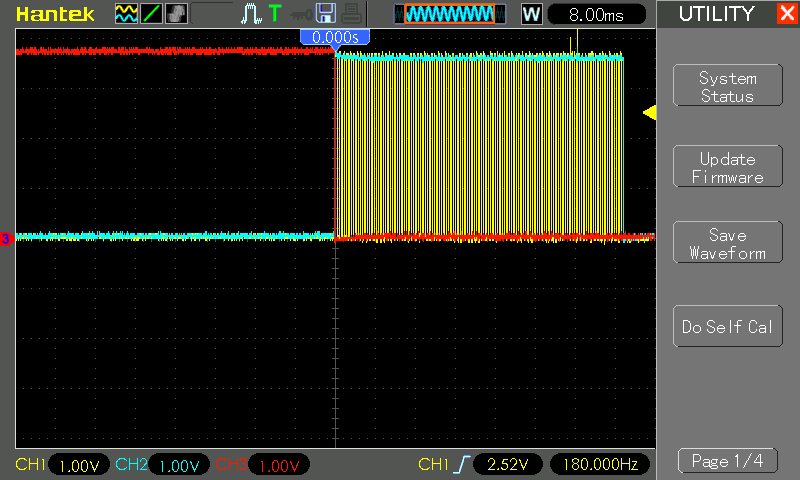
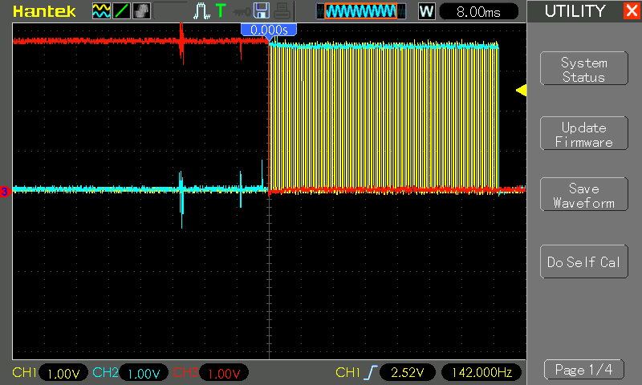

# #785 Tick Tock

A 555/74LS73 circuit that generates a tick-tock sound sequence and distinct frequencies.

Here's a quick demo..

## Notes

I wanted to create a mechanical clock-like "tick-tock" sound generator. I've found some inspiration in existing circuits:

* [Tic-Tic Sound Generator using IC 555](https://www.circuits-diy.com/tic-tic-sound-generator-using-ic-555/)
* [Tick Tock Sound Generator Circuit using 555 Timer IC](https://elonics.org/tick-tock-sound-generator-circuit-using-555-ic/)
* [Clock with LED Pendulum and Tick Tock Sound](https://circuitdigest.com/electronic-circuits/clock-with-led-pendulum-with-tick-tock-sound)

These all don't generate tick/tock pulses of distinct frequencies.

The circuit I've come up with here is quite a naïve composition
of the elements to build up a tunable tick-tock sound:

* adjustable clock frequency (precalculated for 1 Hz)
* specific "tick" and "tock" frequencies
    * can be altered by changing R5,R6,C4 values
    * could be made user-adjustable by replacing R5 and R6 with pots

There is probably a much more elegant and straight-forward way to achieve this. I haven't found a suitable circuit yet.
Something to ponder..

### Circuit Design

Designed with Fritzing: see [TickTock.fzz](./TickTock.fzz).

* U1: 555 configured as a low-frequency oscillator to provide the time signal:
    * [1Hz @ 50.7% duty cycle](https://visual555.tardate.com/?mode=astable&r1=2&r2=71&c=10)
    * with R1 = 2kΩ, R2 = 71kΩ (100kΩ pot), C1 = 10µF
* U2: 555 monostable triggered by U1, converts the time sync to short pulses of defined duration (`TICK`):
    * [52ms high](https://visual555.tardate.com/?mode=monostable&r1=4.7&c=10)
    * with R3 = 4.7kΩ, C3 = 10µF
* U3: 555 audio oscillator
    * enabled by U2 high pulses (`TICK`) to the control pin.
    * base frequency:
        * [1252 Hz](https://visual555.tardate.com/?mode=astable&r1=1&r2=57&c=0.01)
        * with R5 = 1kΩ, R6+R7 = 57kΩ, C4 = 10nF
    * high frequency, when `FNOTCH` high causing R7 bypass:
        * [1516 Hz](https://visual555.tardate.com/?mode=astable&r1=1&r2=47&c=0.01)
        * with R5 = 1kΩ, R6 = 47kΩ, C4 = 10nF
* U4: 74LS73 latch
    * clocked by U2 pulses (`TICK`)
    * alternating high/low Q1 output (`FNOTCH`)

For the breadboard build, I have added LED+Resistor indicators to the main signals: `CLOCK`, `TICK` `FNOTCH` (`Q1` and `~Q1`), `AF`.
These are not shown in the schematic.

The distinct tick/tock signals are capture on the scope below, where:

* CH1 (Yellow) - `AF` output from U3
* CH2 (Blue) - `TICK` output from U2
* CH3 (Red) - `CLOCK` output from U1

## Credits and References

* [LM555 Datasheet](https://www.futurlec.com/Linear/LM555CN.shtml)
* [74LS73 datasheet](https://www.futurlec.com/74LS/74LS73.shtml) - Dual JK Flip-Flop with Clear
* [Visual 555 Calculator](https://visual555.tardate.com)
