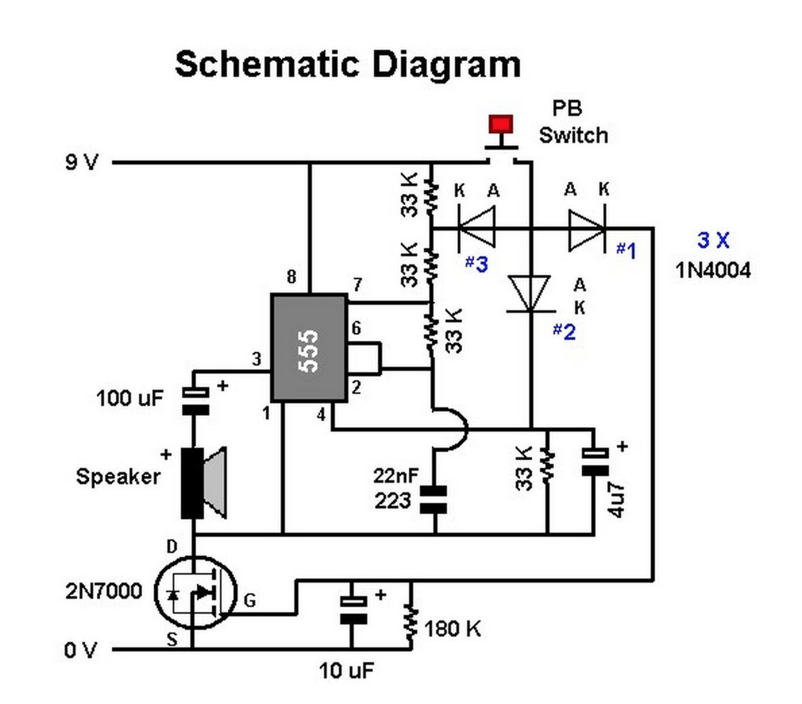

# #059 Two-tone Doorbell

A basic two-tone doorbell using a 555 timer oscillator, with n-channel FET for power conservation.

Here's a quick video of the circuit in action:

## Notes

When the button is pressed, it triggers three actions:

* 555 timer reset (4) is pulled high and charges the R4/C2 RC circuit
* it bypasses R1 (via D1) so that 555 astable behaviour is governed by R2/R3/C1
* it pulls Q1 gate high and charges the R5/C4 RC circuit

While the button is down ("ding"), the frequency of 555 astable oscillation
is governed by [R2=47kΩ, R3=47kΩ and C1=33nF](https://visual555.tardate.com/?mode=astable&r1=47&r2=47&c=0.033),
which results in a frequency of about 309Hz.

When the button is released:

* R1 comes into play, reducing the 555 astable oscillation
* 555 remains triggered while C2 drains through R4

The "dong" frequency of 555 astable oscillation
is governed by [R1+R2=94kΩ, R3=47kΩ and C1=33nF](https://visual555.tardate.com/?mode=astable&r1=94&r2=47&c=0.033),
which results in a frequency of about 232Hz.

The duration of the "dong" depends on the R4/C2 [RC time constant (𝛕)](http://en.wikipedia.org/wiki/RC_time_constant),
[220ms](https://www.wolframalpha.com/input/?i=22k%CE%A9+*+10%CE%BCF).
When the voltage on pin 4 falls below the reset threshold (typically 0.5V), the oscillation stops.

The circuit remains "live" while Q1 permits drain-source current flow. Q1 will remain on while C4 discharges and maintains gate voltage above the gate threshold voltage.

A couple of bypass capacitors minimize the impact of voltage spikes and noise on the operation of the 555 timer, especially during transitions of the timer's output transistors:

* 100nF (C5) between control pin (5) and ground
* 100nF (C6) across the power supply

### Construction

Designed with Fritzing: see [TwoToneDoorbell.fzz](./TwoToneDoorbell.fzz).

Testing on a breadboard:

### Protoboard Build

OK, this is a pretty crappy doorbell, but just for the heck of it I put the circuit on a protoboard and used as a
short-term replacement for a corroded/failed bell.

## Credits and References

* [2N7000 Datasheet](https://www.futurlec.com/Transistors/2N7000.shtml)
* [LM555 Datasheet](https://www.futurlec.com/Linear/LM555CN.shtml)
* [Visual 555 Calculator](https://visual555.tardate.com)

### CdS Electronics Two-tone Doorbell kit

<http://cdselectronics.com/kits/two%20tone%20door%20bell.htm> is an example of a similar circuit as a kit.
Appears to be an old site/company, not sure if still available.

