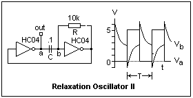

# #590 74HC04 Relaxation Oscillator

Testing a simple relaxation oscillator using the 74HC04 hex inverter with an RC network.

## Notes

The [74HC04](https://www.futurlec.com/74HC/74HC04.shtml) is a high-speed CMOS hex inverter, consisting of six independent NOT gates that perform logical inversion. It operates within a voltage range of 2V to 6V and features low power consumption with fast switching times. Unlike the 74HC14, it does not include Schmitt-trigger inputs, meaning it is best suited for clean digital signals rather than noisy or slowly changing inputs. Common applications include logic level conversion, signal inversion, and clock signal generation in digital circuits.

### Circuit Design

This relaxation oscillator uses two inverters with an RC network to slow down the state changes.

It is not necessary to use a Schmitt trigger input for this circuit, so the 74HC04 is used here.

### Test Result

The frequency is determined by the RC time constant (`f = 1 / (1.2 * R * C)`).
With R=1kΩ and C=100nF, the expected frequency is [8.333 kHz](https://www.wolframalpha.com/input?i=1%2F%281.2*1k%CE%A9*100nF%29).

Running on a breadboard, I am getting a somewhat different result: 7.04 kHz at 64.7% +duty cycle

## Credits and References

* [74HC04 Datasheet](https://www.futurlec.com/74HC/74HC04.shtml)
* [Relaxation oscillator](https://en.wikipedia.org/wiki/Relaxation_oscillator)
* [Inverter-based RC oscillator and its waveform](https://www.researchgate.net/figure/nverter-based-RC-oscillator-and-its-waveform_fig1_337297970)
* [Waveform Generators](https://www.electronics-tutorials.ws/waveforms/generators.html)
* [Circuit Properties of LS and HC Digital Logic](https://mysite.du.edu/~etuttle/electron/elect13.htm)
* See also:
    * [LEAP#588 74HC14 Schmitt Oscillator](https://leap.tardate.com/electronics101/74hc14/schmittoscillator/)
