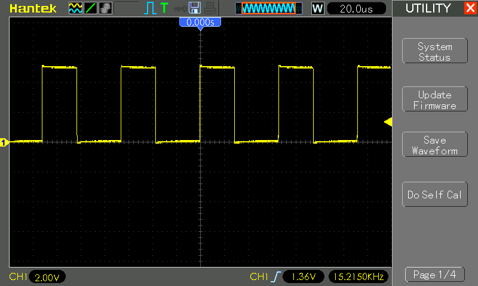
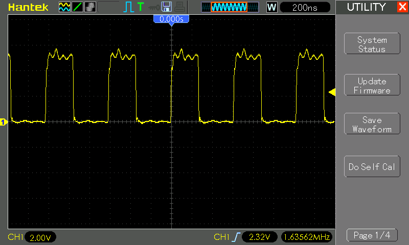
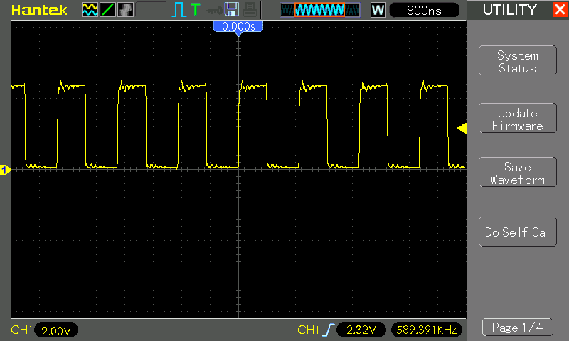

# #588 74HC14 Schmitt Oscillator

About the 74HC14 Hex Inverter with Schmitt Trigger Inputs, and testing its behaviour as a relaxation oscillator square wave generator.

## Notes

The [74HC14](https://www.futurlec.com/74HC/74HC14.shtml) is a high-speed CMOS hex Schmitt-trigger inverter. It consists of six independent inverters with Schmitt-trigger inputs, meaning each gate converts an input signal into a clean digital output while providing hysteresis, which helps eliminate noise and improve signal integrity. This makes it particularly useful for signal conditioning, waveform shaping, and debounce circuits. It operates within a voltage range of 2V to 6V, with low power consumption and fast switching characteristics, making it ideal for various digital applications.

Key Specifications:

* Supply Voltage: 2.0V to 6.0V
* Input Hysteresis (4.5V supply): 0.9V
* HIGH output voltage (4.5V supply, Iout = 4mA): 4.2V typical (3.98V min)
* LOW output voltage (4.5V supply, Iout = 4mA): 0.2V typical (0.26V max)
* Propagation delay (4.5V supply): 13-25ns

[LEAP#582 74LS14 Schmitt Oscillator](https://leap.tardate.com/electronics101/74ls14/schmittoscillator/)

### Test Circuit: The Schmitt Oscillator

> Note: For comparison, I've covered the same circuit with 74LS family chips in [LEAP#582 74LS14 Schmitt Oscillator](https://leap.tardate.com/electronics101/74ls14/schmittoscillator/)

An inverter Schmitt oscillator circuit is a simple and widely used configuration for generating square wave signals, typically built using a Schmitt-trigger inverter (like the 74LS14) along with a resistor and capacitor. The circuit works by exploiting the hysteresis property of the Schmitt-trigger, which causes the inverter to switch states at different voltage thresholds. The capacitor charges and discharges through the resistor, creating a time delay that determines the oscillation frequency. When the capacitor voltage reaches the upper threshold, the inverter switches to a low output, causing the capacitor to discharge; when it falls to the lower threshold, the inverter switches back to a high output, repeating the cycle. This results in a continuous square wave output whose frequency is determined by the RC time constant (`f = 1 / (1.2 * R * C)`). The circuit is valued for its simplicity, reliability, and ability to produce stable oscillations, making it useful in applications like clock generation, tone generation, and timing circuits.

### Circuit Design

### Test Results

The 74HC14 produces a square wave quite close to 50% duty cycle, unlike the 74LS variant.
It is also able to be used with a wider range of R and C values.

Note: in these tests, capacitors >=1µF are electrolytic, and < 1µF are monolithic ceramic.

| R1    | C1     | Calc Frequency                                                                      | Measured Frequency | +duty% | Waveform Quality |
|-------|--------|-------------------------------------------------------------------------------------|--------------------|--------|------------------|
| 220Ω  | 10nF   | [378.8 kHz](https://www.wolframalpha.com/input?i=1%2F%281.2*220%CE%A9*10nF%29)      | 589.4 kHz          | 46.5%  | poor, significant ringing |
| 220Ω  | 100nF  | [37.88 kHz](https://www.wolframalpha.com/input?i=1%2F%281.2*220%CE%A9*100nF%29)     | 68.49 kHz          | 46.7%  | good  |
| 1kΩ   | 20pF   | [41.67 MHz](https://www.wolframalpha.com/input?i=1%2F%281.2*1k%CE%A9*20pF%29)       |  39.6 MHz          | 50%    | bad, more like a sine wave  |
| 1kΩ   | 100pF  | [8.333 MHz](https://www.wolframalpha.com/input?i=1%2F%281.2*1k%CE%A9*100pF%29)      |  10.3 MHz          | 45.4%  | poor, significant distortion |
| 1kΩ   | 330pF  | [2.525 MHz](https://www.wolframalpha.com/input?i=1%2F%281.2*1k%CE%A9*330pF%29)      |  4.02 MHz          | 44.5%  | poor, significant distortion |
| 1kΩ   | 1nF    | [833.3 kHz](https://www.wolframalpha.com/input?i=1%2F%281.2*1k%CE%A9*1nF%29)        |  1.63 MHz          | 43.4%  | ok, significant ringing |
| 1kΩ   | 10nF   | [83.33 kHz](https://www.wolframalpha.com/input?i=1%2F%281.2*1k%CE%A9*10nF%29)       | 140.8 kHz          | 43.7%  | good |
| 1kΩ   | 33nF   | [25.25 kHz](https://www.wolframalpha.com/input?i=1%2F%281.2*1k%CE%A9*33nF%29)       | 40.58 kHz          | 43.9%  | good  |
| 1kΩ   | 100nF  | [8.333 kHz](https://www.wolframalpha.com/input?i=1%2F%281.2*1k%CE%A9*100nF%29)      | 15.21 kHz          | 44%    | good |
| 1kΩ   | 330nF  | [2.53 kHz](https://www.wolframalpha.com/input?i=1%2F%281.2*1k%CE%A9*330nF%29)       |  4.41 kHz          | 44%    | good |
| 1kΩ   | 1µF    | [833.3 Hz](https://www.wolframalpha.com/input?i=1%2F%281.2*1k%CE%A9*1%C2%B5F%29)    |  2.49 kHz          | 45.8%  | very good  |
| 1kΩ   | 10µF   | [83.33 Hz](https://www.wolframalpha.com/input?i=1%2F%281.2*1k%CE%A9*10%C2%B5F%29)   |    145 Hz          | 44%    | very good |
| 1kΩ   | 100µF  | [8.333 Hz](https://www.wolframalpha.com/input?i=1%2F%281.2*1k%CE%A9*100%C2%B5F%29)  |   13.9 Hz          | 44.2%  | good |
| 1kΩ   | 1000µF | [0.833 Hz](https://www.wolframalpha.com/input?i=1%2F%281.2*1k%CE%A9*1000%C2%B5F%29) |    1.8 Hz          | 48.2%  | poor, square but a little unstable |
| 1kΩ   | 2200µF | [0.378 Hz](https://www.wolframalpha.com/input?i=1%2F%281.2*1k%CE%A9*2200%C2%B5F%29) |    0.7 Hz          | 41.8%  | poor, square but unstable |
| 2.2kΩ | 10nF   | [37.88 kHz](https://www.wolframalpha.com/input?i=1%2F%281.2*2.2k%CE%A9*10nF%29)     | 65.78 kHz          | 43.4%  | good |
| 2.2kΩ | 100nF  | [3.788 kHz](https://www.wolframalpha.com/input?i=1%2F%281.2*2.2k%CE%A9*100nF%29)    |  7.59 kHz          | 43.6%  | good |
| 10kΩ  | 10nF   | [8.333 kHz](https://www.wolframalpha.com/input?i=1%2F%281.2*10k%CE%A9*10nF%29)      | 65.78 kHz          | 43.4%  | good, a little ringing |
| 10kΩ  | 100nF  | [833 Hz](https://www.wolframalpha.com/input?i=1%2F%281.2*10k%CE%A9*100nF%29)        |  1.72 kHz          | 43.5%  | good, a little ringing |
| 100kΩ | 10nF   | [833 Hz](https://www.wolframalpha.com/input?i=1%2F%281.2*100k%CE%A9*10nF%29)        |  1.44 kHz          | 43.2%  | good |
| 100kΩ | 100nF  | [83.3 Hz](https://www.wolframalpha.com/input?i=1%2F%281.2*100k%CE%A9*100nF%29)      |  169.6 Hz          | 43.3%  | good but a bit unstable |

### Some sample traces

Very nice wave at 1kΩ and C=100nF:

Getting distorted at 1kΩ and C=1nF:

220Ω and C=10nF:

## Credits and References

* [74HC14 Datasheet](https://www.futurlec.com/74HC/74HC14.shtml)
* [74LS14 Datasheet](https://www.futurlec.com/74LS/74LS14.shtml)
* [Schmitt Trigger Oscillators?!](https://forum.arduino.cc/t/schmitt-trigger-oscillators/144197) in the Arduino forums
* [Schmitt Waveform Generators](https://www.electronics-tutorials.ws/waveforms/generators.html) - very informative; compares LS14 with alternatives for waveform generation.
* [Circuit Properties of LS and HC Digital Logic](https://mysite.du.edu/~etuttle/electron/elect13.htm)
* [Schmitt Trigger Oscillator](https://electronics-course.com/schmitt-trigger-oscillator)
* See also:
    * [LEAP#022 Square Wave - Schmitt Oscillator](https://leap.tardate.com/electronics101/oscillators/schmittoscillator/)
    * [LEAP#582 74LS14 Schmitt Oscillator](https://leap.tardate.com/electronics101/74ls14/schmittoscillator/)
