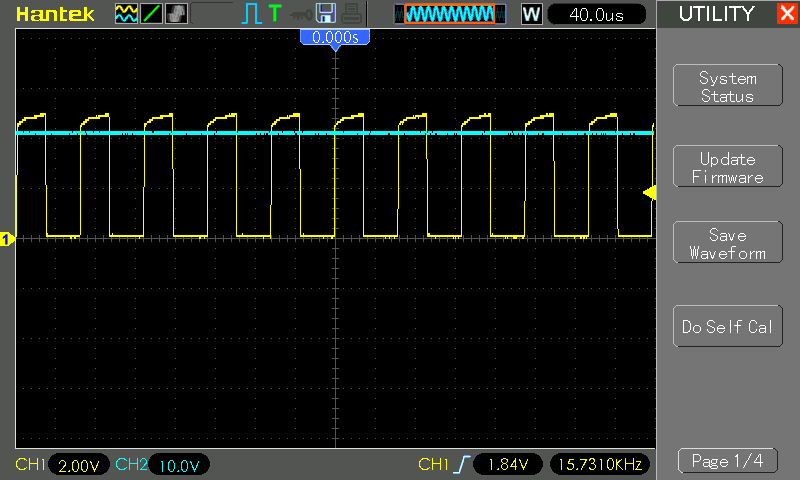

# #593 74HC14 Inverter Voltage Multiplier

Testing a voltage multiplier circuit based on a 74HC14 inverter-driven bucket brigade.

## Notes

An inverter-based bucket-brigade voltage multiplier is a circuit used to generate higher DC voltages from a lower input voltage. It operates by using a series of capacitors and switches (typically transistors or diodes) arranged in stages. Each stage alternately charges and discharges capacitors in a "bucket-brigade" fashion, transferring charge step-by-step to the next stage. Inverter-based designs use inverters to control the switching sequence. As the charge propagates through the stages, the voltage is progressively multiplied, resulting in an output voltage that is a multiple of the input voltage. This type of circuit is commonly used in low-power applications, such as boosting voltages in electronic devices or energy harvesting systems.

### Circuit Design

The circuit is based on a suggestion by [@steveschnepp](https://github.com/tardate/LittleArduinoProjects/issues/35)

The first inverter unit is configured as a Schmitt Oscillator to generate a square wave that is predicted to run at [8.33 kHz](https://www.wolframalpha.com/input?i=1%2F%281.2*1k%CE%A9*100nF%29).

Four bucket stages are included, which boosts the voltage to around 18-22V depending on load. The number of stages may be varied to generate different voltages.

A simple resistive load (LED1 and resistor R2) is attached to a final load capacitor C6 (33µF rated for 400V). There is no regulation of the output voltage.

### Test Results

The scope trace below captures the system in operation:

* CH1 (Yellow): oscillator output at 1Y.
    * Measured: 15.64 kHz 45.8%
    * Calculated: [8.33 kHz](https://www.wolframalpha.com/input?i=1%2F%281.2*1k%CE%A9*100nF%29)
* CH2 (Blue): voltage at OUT
    * Measured: 21.2V

## Credits and References

* [74HC14 datasheet](https://www.futurlec.com/74HC/74HC14.shtml)
