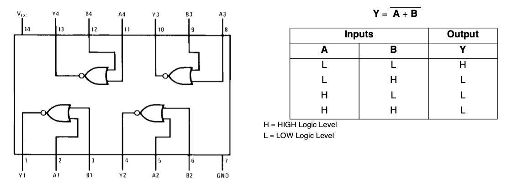
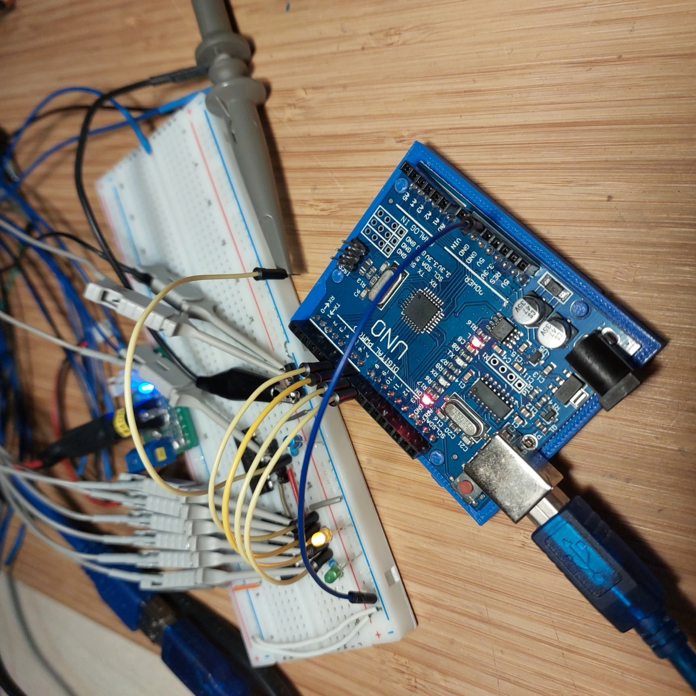
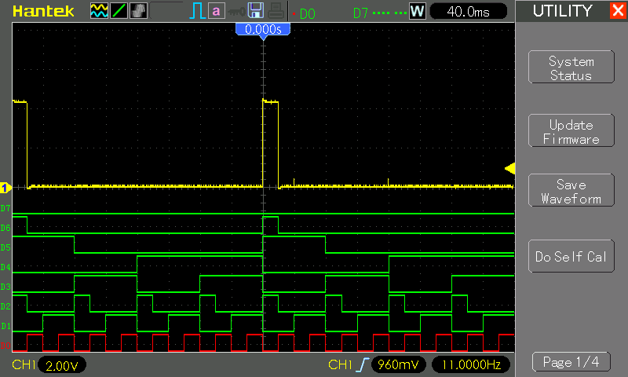

# #073 4-input NOR Gate

Demonstrates building a 4-input NOR gate from 74LS02 NOR gates and an 74LS08 AND gate, with test automation using an Arduino.

## Notes

See the [LEAP#072 74LS02 Quad 2-input NOR gate test](../NOR/) for more detail on the 74LS02.

This project demonstrates building a 4-input NOR gate from 74LS02 NOR gates and an 74LS08 AND gate.

### Construction

Designed with Fritzing: see [QuadNOR.fzz](./QuadNOR.fzz).

Setup on a breadboard for testing:

### The Sketch

See [QuadNOR.ino](./QuadNOR.ino).

The sketch simply drives the A1, B1, A2, B2 lines through all 16 combinations.

### Behaviour

Connected to a logic analyzer & scope for testing:

Here's the trace confirming the behaviour:

* D0-D6: A1, B1, AB1, A2, B2, AB2, Y1
* D7: unused
* CH1 (Yellow): Y1

The resulting logic table:

| A1 (D0) | B1 (D1) | AB1 (D2)| A2 (D3) | B2 (D4) | AB2 (D5)| Y1 (D6) |
|---------|---------|---------|---------|---------|---------|---------|
|       0 |       0 |       1 |       0 |      0  |       1 |      1  |
|       0 |       0 |       1 |       0 |      1  |       0 |      0  |
|       0 |       0 |       1 |       1 |      0  |       0 |      0  |
|       0 |       0 |       1 |       1 |      1  |       0 |      0  |
|       0 |       1 |       0 |       0 |      0  |       1 |      0  |
|       0 |       1 |       0 |       0 |      1  |       0 |      0  |
|       0 |       1 |       0 |       1 |      0  |       0 |      0  |
|       0 |       1 |       0 |       1 |      1  |       0 |      0  |
|       1 |       0 |       0 |       0 |      0  |       1 |      0  |
|       1 |       0 |       0 |       0 |      1  |       0 |      0  |
|       1 |       0 |       0 |       1 |      0  |       0 |      0  |
|       1 |       0 |       0 |       1 |      1  |       0 |      0  |
|       1 |       1 |       0 |       0 |      0  |       1 |      0  |
|       1 |       1 |       0 |       0 |      1  |       0 |      0  |
|       1 |       1 |       0 |       1 |      0  |       0 |      0  |
|       1 |       1 |       0 |       1 |      1  |       0 |      0  |

## Credits and References

* [LEAP#072 74LS02 Quad 2-input NOR gate test](../NOR/)
* [74LS02 datasheet](https://www.futurlec.com/74LS/74LS02.shtml)
* [7400 series](../../../notebook/logic_families/)
