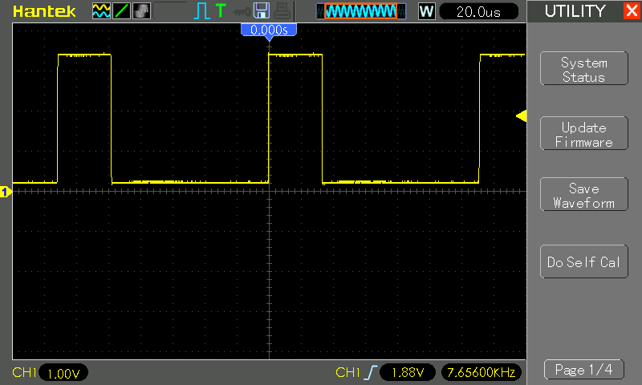
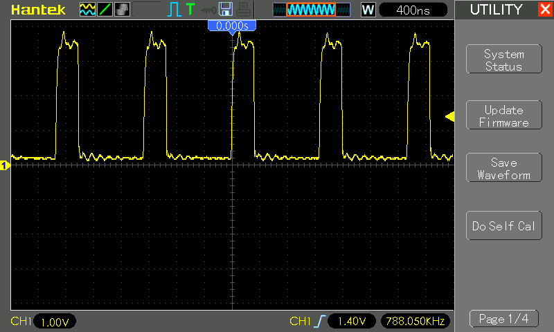
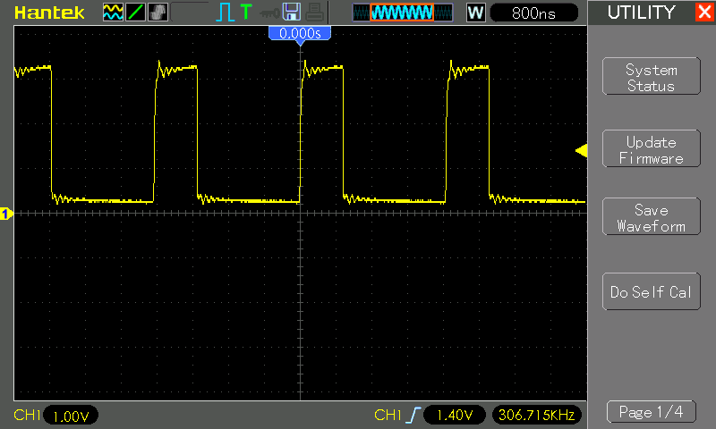

# #582 74LS14 Schmitt Oscillator

About the 74LS14 Hex Inverter with Schmitt Trigger Inputs, and testing its behaviour as a relaxation oscillator square wave generator.

## Notes

The [74LS14](https://www.futurlec.com/74LS/74LS14.shtml) is a popular hex inverter IC (integrated circuit) that belongs to the 74LS (low-power Schottky TTL) series of logic chips. It contains six independent Schmitt-trigger inverters, each of which takes an input signal and outputs its logical inverse. The Schmitt-trigger design provides hysteresis, making the 74LS14 particularly effective at cleaning up noisy signals and ensuring sharp transitions between logic states. It operates with a standard 5V power supply and is widely used in digital circuits for signal conditioning, waveform shaping, and debouncing switches. The 74LS14 is known for its reliability, ease of use, and compatibility with other TTL (Transistor-Transistor Logic) devices.

Key Specifications:

* Supply Voltage: 5.00 V (4.75 V to 5.25 V)
* Input Hysteresis: 0.8V
* HIGH output voltage: 3.4V typical (2.7V min)
* LOW output voltage: 0.35V typical (0.5V max)
* Propagation delay LOW-HIGH: 5-25ns
* Propagation delay HIGH-LOW: 5-33ns

### Test Circuit: The Schmitt Oscillator

> Note: I've covered this circuit before in [LEAP#022 Square Wave - Schmitt Oscillator](https://leap.tardate.com/electronics101/oscillators/schmittoscillator/), but this is an updated and more detailed treatment.

An inverter Schmitt oscillator circuit is a simple and widely used configuration for generating square wave signals, typically built using a Schmitt-trigger inverter (like the 74LS14) along with a resistor and capacitor. The circuit works by exploiting the hysteresis property of the Schmitt-trigger, which causes the inverter to switch states at different voltage thresholds. The capacitor charges and discharges through the resistor, creating a time delay that determines the oscillation frequency. When the capacitor voltage reaches the upper threshold, the inverter switches to a low output, causing the capacitor to discharge; when it falls to the lower threshold, the inverter switches back to a high output, repeating the cycle. This results in a continuous square wave output whose frequency is determined by the RC time constant (`f = 1 / (1.2 * R * C)`). The circuit is valued for its simplicity, reliability, and ability to produce stable oscillations, making it useful in applications like clock generation, tone generation, and timing circuits.

### Circuit Design

One inverter unit of the 74LS14 Hex Inverter with Schmitt Trigger Inputs is used as an oscillator.
The input and output levels are read with analog input pins, and the values is echoed to the Arduino serial port for plotting.

All unused outputs on the 74LS14 are left open circuit. Unused inputs are grounded, as is recommended to avoid unstable operation.

A second inverter unit is chained on the output and used to drive an indicator LED via an NFET switch.

For R1=1kΩ, and C1=100nF, the frequency of the oscillation is calculated as
[8333 Hz](https://www.wolframalpha.com/input?i=1+%2F+%281.2+*+1k%CE%A9+*+100nF%29):

    f = 1 / (1.2 * R * C)
    f = 1 / (1.2 * 1kΩ * 100nF)
    f = 8333 Hz

### Test Results

Schmitt inverters produce a non-symmetrical waveform. The duty cycle is about 33%, and levels not very stable.
This is particular to the LS (low-power Schottky) version of the 7414.

To oscillate at all, R values are recommended to be kept between 100Ω and 1kΩ, and C between 1nF and 1000µF.
In practice on my bench, I was able to push the limits a bit:

* R=2.2kΩ works, fails with R=4.7kΩ (C=100nF)
* still working with C=20pF (R=1kΩ), though the waveform is quite distorted
* still working with C=2200µF (R=1kΩ), with a good waveform

Note: in these tests, capacitors >=1µF are electrolytic, and < 1µF are monolithic ceramic.

| R1    | C1     | Calc Frequency | Measured Frequency | +duty% | Waveform Quality |
|-------|--------|----------------|--------------------|--------|------------------|
| 220Ω  | 10nF   |                |          306.7 kHz | 29.4%  | square but significant ringing |
| 220Ω  | 100nF  |                |           34.3 kHz | 28.8%  | ok, but a rising top |
| 1kΩ   | 20pF   |                |          12.50 MHz | 30.9%  | very poor        |
| 1kΩ   | 100pF  |                |           4.85 MHz | 26.1%  | poor |
| 1kΩ   | 330pF  |                |           2.04 MHz | 24.6%  | poor |
| 1kΩ   | 1nF    |                |          788.0 kHz | 25.0%  | square but significant ringing |
| 1kΩ   | 10nF   |                |          69.83 kHz | 25.1%  | square, a little ringing |
| 1kΩ   | 33nF   |                |          20.42 kHz | 25.4%  | square, a little ringing|
| 1kΩ   | 100nF  |                |           7.61 kHz | 25.4%  | good, square |
| 1kΩ   | 330nF  |                |           2.18 kHz | 25.3%  | good, square |
| 1kΩ   | 1µF    |                |            980 Hz  | 23.6%  | good, square |
| 1kΩ   | 10µF   |                |             63 Hz  | 25.1%  | good, square |
| 1kΩ   | 100µF  |                |            6.6 Hz  | 25.3%  | good, square |
| 1kΩ   | 1000µF |                |            0.8 Hz  | 25.1%  | good, square |
| 1kΩ   | 2200µF |                |            0.3 Hz  | 25.6%  | good, square |
| 2.2kΩ | 10nF   |                |          26.98 kHz | 18.9%  | square, a little ringing |
| 2.2kΩ | 100nF  |                |           2.92 kHz | 29.1%  | good, square|

### Some sample traces

Very nice wave at 1kΩ and C=100nF:

Getting distorted at 1kΩ and C=1nF:

220Ω and C=10nF:

## Credits and References

* [74LS14 Datasheet](https://www.futurlec.com/74LS/74LS14.shtml)
* [Schmitt Trigger Oscillators?!](https://forum.arduino.cc/t/schmitt-trigger-oscillators/144197) in the Arduino forums
* [Schmitt Waveform Generators](https://www.electronics-tutorials.ws/waveforms/generators.html) - very informative; compares LS14 with alternatives for waveform generation.
* [Circuit Properties of LS and HC Digital Logic](https://mysite.du.edu/~etuttle/electron/elect13.htm)
* [Schmitt Trigger Oscillator](https://electronics-course.com/schmitt-trigger-oscillator)
* [LEAP#022 Square Wave - Schmitt Oscillator](https://leap.tardate.com/electronics101/oscillators/schmittoscillator/)
