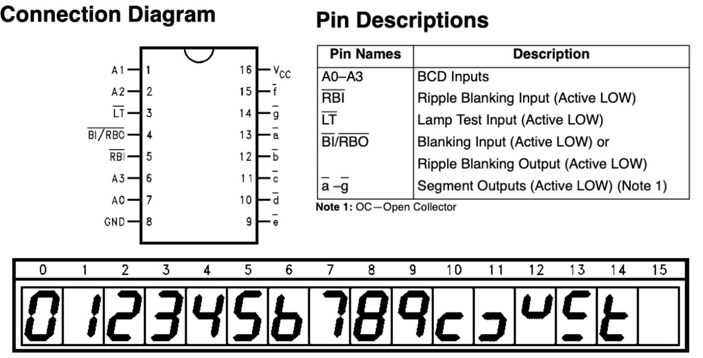
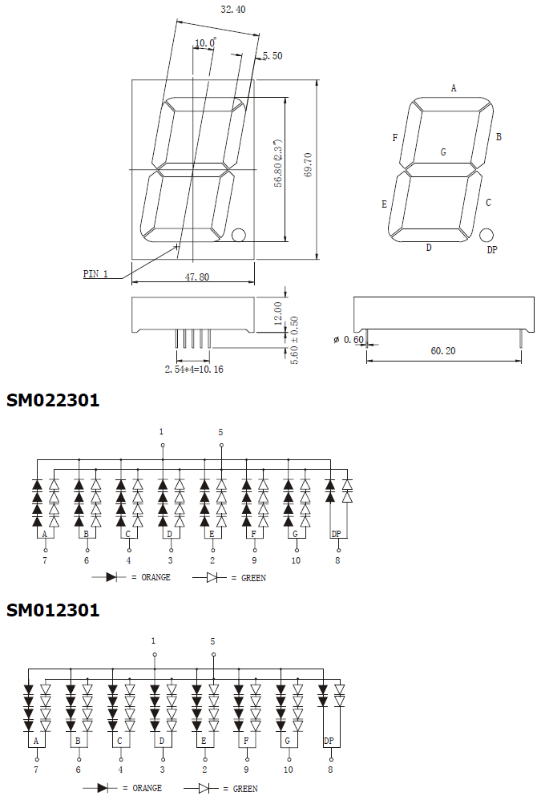

# #820 74LS47 7-segment LED Full Cycle

Demonstrating the 74LS47 7-segment common-anode LED driver with a simple 4-bit binary counter sequence.

Here's a quick demo..

## Notes

The 74LS47 is a TTL BCD-to-7-segment decoder/driver designed to drive **common-anode** LED displays. It takes a 4-bit binary-coded decimal (BCD) input and decodes it into seven active-low outputs (a–g) that illuminate the appropriate segments to display digits 0 through 9. The device includes open-collector outputs, allowing it to sink the relatively higher currents required by LED segments.
Each segment output is guaranteed to sink 24 mA in the ON (LOW) state and withstand 15V in the OFF (HIGH) state with a maximum leakage current of 250 µA.
Other built-in features include lamp test (LT), blanking input (BI), and ripple-blanking input/output (RBI/RBO) for suppressing leading zeros in multi-digit displays.

Operating from a 5V supply as part of the 74LS (Low-Power Schottky TTL) family, the 74LS47 offers fast response and robust performance in digital display applications. It is commonly used in counters, clocks, instrumentation panels, and educational projects where numeric output is required. Its direct compatibility with TTL logic and common-anode LED displays made it a standard choice in classic digital systems, and it remains relevant in legacy designs and retro-style electronics.

### 74LS47 Pinout

### 74LS161 Pinout

### Demonstration Circuit Design

This is a basic demonstration of driving a 7-segment display with the 74LS47.
It uses a 74LS161 to provide a full 4-bit binary count, displaying all 16 characters defined by the 74LS47 in sequence.

Key features of the circuit:

* uses a 74LS161 to provide a sequential binary count to drive the 74LS47
* the 74LS161 is clocked by [LEAP#791 555 Breadboard Pulse Generator](../../555Timer/BreadboardPulseGen/)
* the 74LS47 is configured:
    * LT puled high
    * address inputs wired directly from 74LS161 outputs
    * outputs wired to common-anode 7-segment display
* the 7-segment display I am using operates at 12V
    * hence separate power supplies: 5V for the logic, 12V for the display
    * since the display is common-anode, the circuit can happily share a common ground with split power supplies, and the 74LS47 is happy as long as LED current does not exceed 24 mA
    * see details below
* for the breadboard build, I am powering the circuit with 5V and then using a boost converter to provide the 12V for the LED display

Designed with Fritzing: see [Counter.fzz](./Counter.fzz).

### 7-Segment LED

The only common-anode devices I have on hand are some 2.3" high blue displays that operate at 12V.

* ["4PCS 2.3\" 2.3in digital 7 Segment Red/Green/Blue/White/yellow LED Display Nixie tube 2.3 inches 1 Bit Digital Tube Plastic Metal" (aliexpress seller listing)](https://www.aliexpress.com/item/32816599660.html)
    * purchased 4 pieces for US$10.68/lot (Dec-2017)
    * no longer offered by this seller
* ["4PCS 2.3\" 2.3in digital 7 Segment Red/Green/Blue/White/yellow LED Display Nixie tube 2.3 inches 1 Bit Digital Tube Plastic Metal" (aliexpress seller listing)](https://www.aliexpress.com/item/1005003644816588.html)
    * similar listing
    * currently 4 pieces SG$19.57/lot (Jan-2026)

## Credits and References

* [74LS47 datasheet](https://www.futurlec.com/74LS/74LS47.shtml) - 74LS47 BCD to 7-Segment Decoder/Driver with Open-Collector Outputs
* [74LS161 datasheet](https://www.futurlec.com/74LS/74LS161.shtml) - 4-bit Binary Counter with Asynchronous Reset
