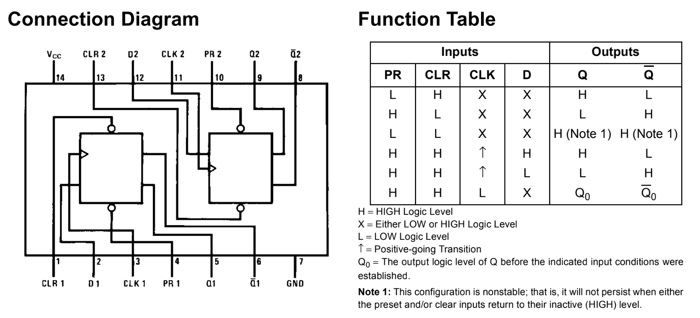
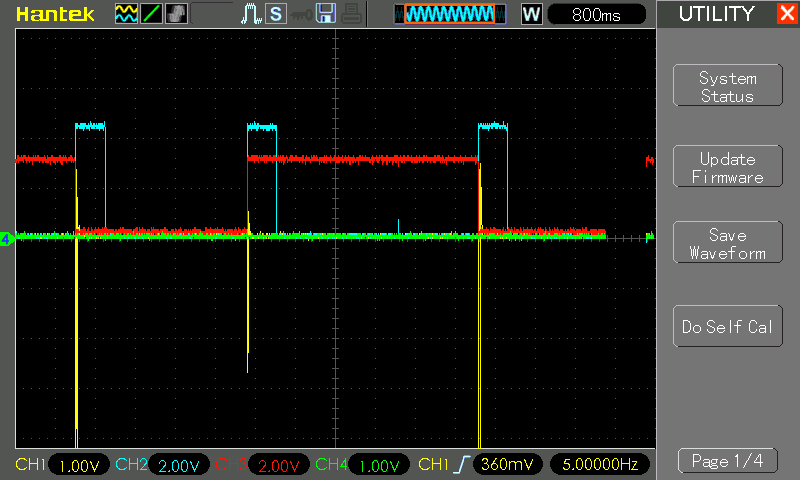

# #763 74LS74 Clap Switch

Building a clap-switch circuit with electret input, 555 trigger and 74LS74 latch.

Here's a quick demo..

## Notes

The 74LS74 is a dual D-type flip-flop with set (PRE), reset (CLR), and clock (CLK) inputs, designed for edge-triggered operation. Each flip-flop captures the D input value on the rising edge of the clock and outputs it on Q, with the complementary output on Q̅. The asynchronous set and reset inputs allow for direct control of the output states. Operating at 5V with low power consumption and fast switching speeds, the 74LS74 is commonly used in data storage, frequency division, and state machine applications in digital circuits.

### Circuit Design

The electret mic is biased and AC-coupled with an NPN BJT.
The transistor collector output will normally be pulled high until a loud enough sound is able to momentarily switch the BJT and pull the output lower. This is the signal that is fed to the 555 timer.

The 555 timer is configured in monostable mode in order to rectify the audio trigger into a clear pulse with a high time of
[517ms](https://visual555.tardate.com/?mode=monostable&r1=100&c=4.7).

The rising edge of the 555 trigger pulse will clock the 74LS74 D-latch.
The output of the D-latch will toggle between high and low for each trigger input.
Pushbutton S1 is wired to perform a manual clear if required (resets the output low).

### Test Result

The following scope trace captures the behaviour over 3 "claps":

* CH1 (Yellow) - shows the AC-coupled 555 trigger input (marked TRIGGER in the schematic)
* CH2 (Blue) - 555 output (marked PULSE in the schematic)
* CH3 (Red) - D-latch output Q1 (marked INDICATOR on the schematic)

## Credits and References

* [74LS74 Datasheet](https://www.futurlec.com/74LS/74LS74.shtml)
* [How the 74LS74 D Flip Flop Works: Pinout and Circuit Explained](https://www.allelcoelec.com/blog/how-the-74ls74-d-flip-flop-works-pinout-and-circuit-explained.html)
* [Comprehensive Guide to the 74LS74 Dual D Flip-Flop](https://www.allelcoelec.com/blog/Comprehensive-Guide-to-the-74LS74-Dual-D-Flip-Flop.html)
