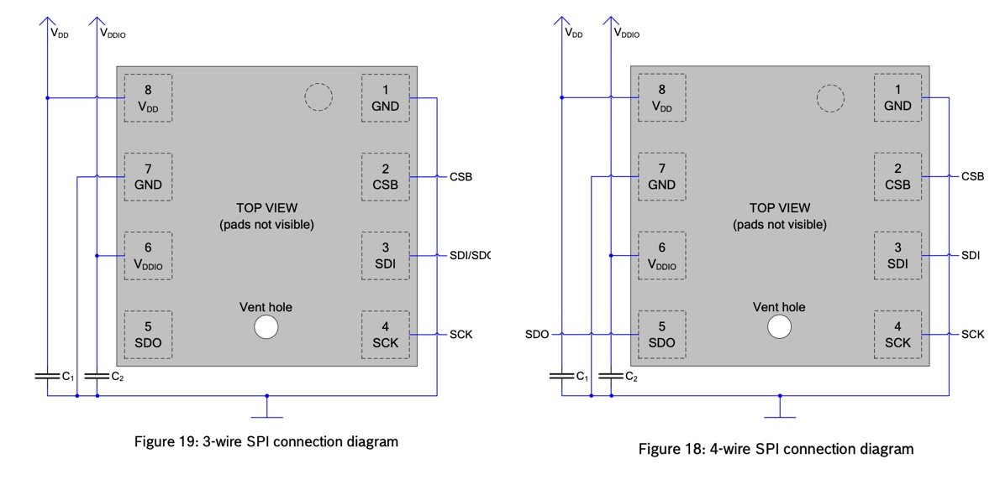
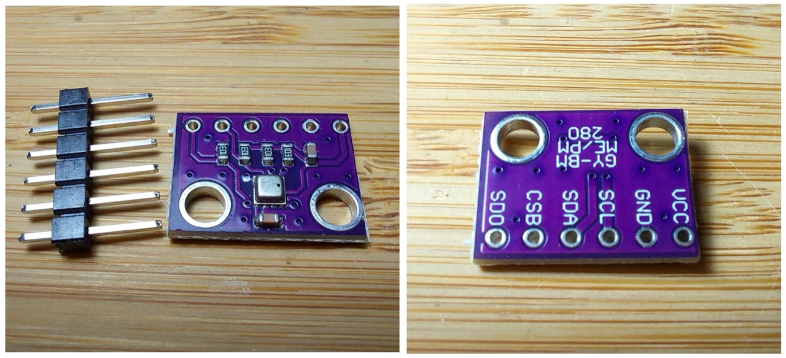
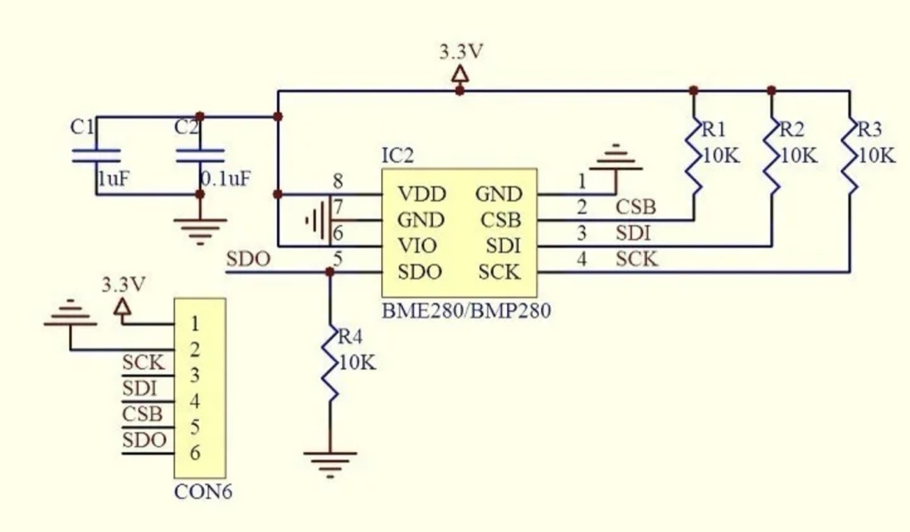
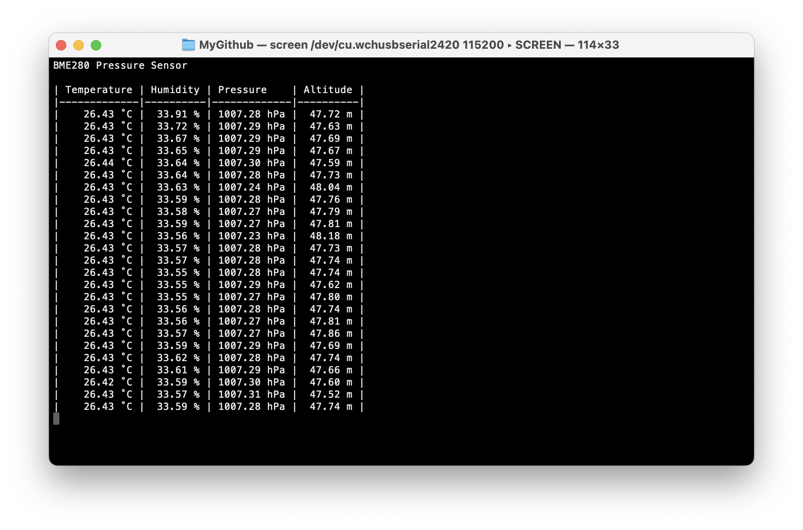
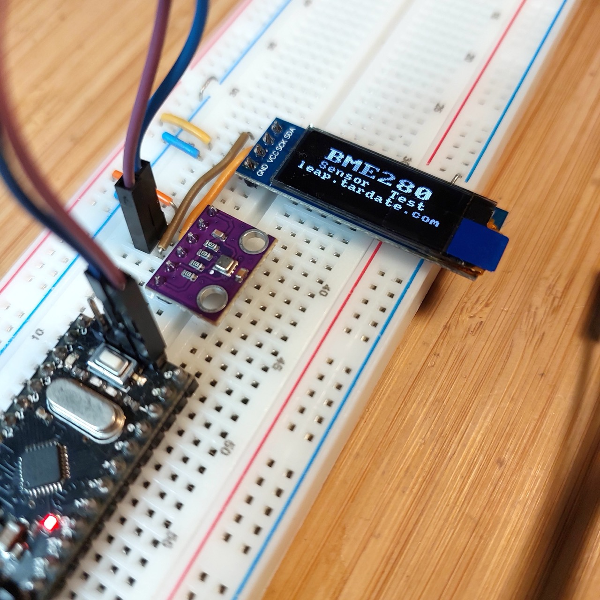
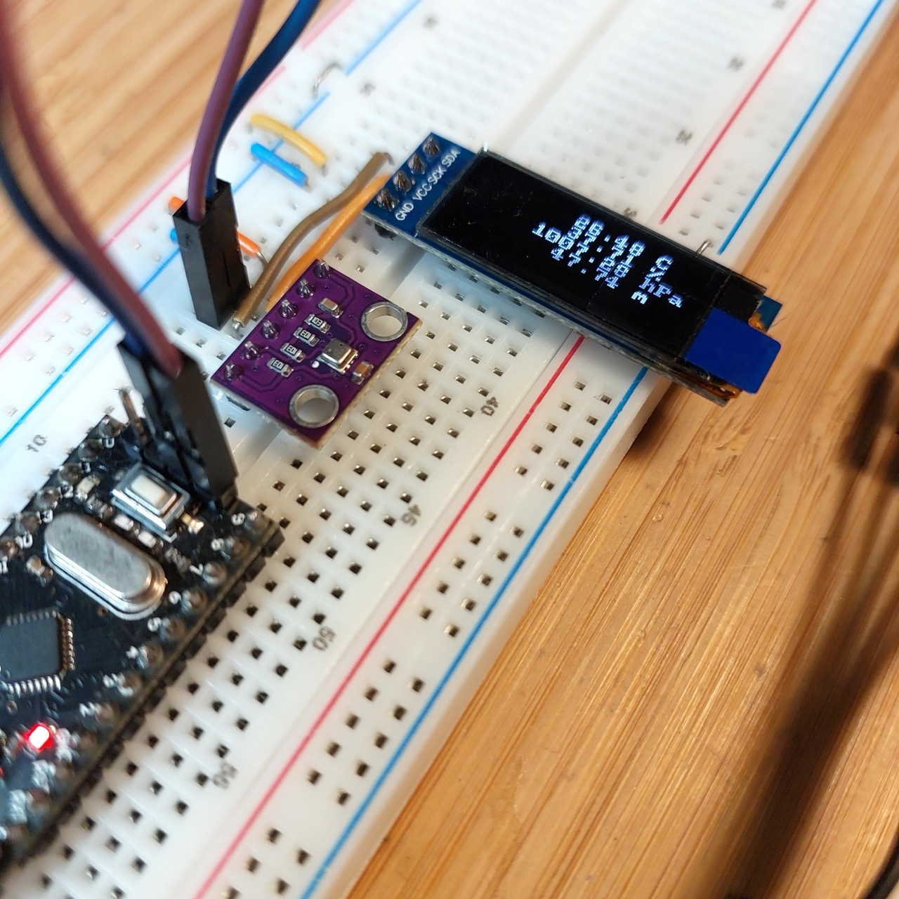
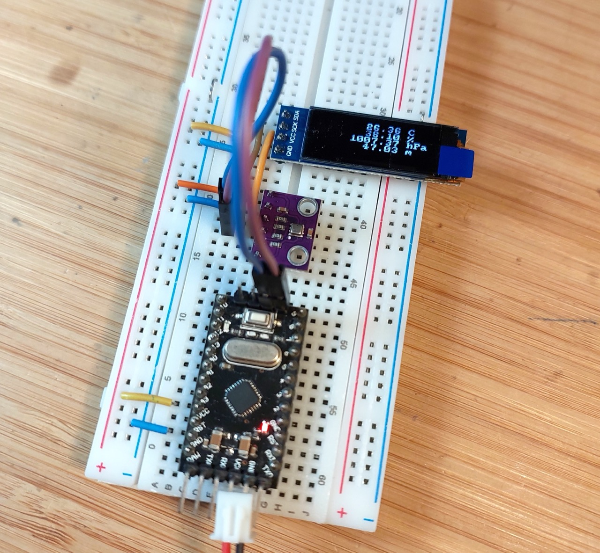

# #830 BME280 3.3V Module

Examine the BME280 barometric pressure, temperature, and humidity sensor. Demonstrate its functionality with a common GY-BME280 3.3V module and an Arduino Mini with 128x32 OLED display.

## Notes

I purchased a BME280 3.3V sensor module
["1-10pcs BME280 BMP280 5V 3.3V Digital Sensor Temperature Humidity Barometric Pressure Module I2C SPI for Arduino" (aliexpress seller listing)](https://www.aliexpress.com/item/1005008511564094.html)
for SG$3.72 (Jan-2026).

See [LEAP#829 BME280 5V Module](../Module5V/) for notes on the 5V version of the module.

### About the BME280

The BME280 is as combined digital humidity, pressure and temperature sensor based on proven sensing principles. Its small dimensions and low power consumption allow the implementation in battery driven devices such as handsets, GPS modules or watches.

The BME280 is register and performance compatible with the BMP280 digital pressure sensor.

The humidity sensor provides an extremely fast response time for fast context awareness applications and high overall accuracy over a wide temperature range.

The pressure sensor is an absolute barometric pressure sensor with extremely high accuracy and resolution and drastically lower noise than the Bosch Sensortec BMP180.

The integrated temperature sensor has been optimized for lowest noise and highest resolution. Its output is used for temperature compensation of the pressure and humidity sensors and can also be used for estimation of the ambient temperature.

BME280 can be operated in three power modes:

* sleep mode
* normal mode
* forced mode

In order to tailor data rate, noise, response time and current consumption to the needs of the user, a variety of oversampling modes, filter modes and data rates can be selected.

Absolute maximum ratings

* Voltage at any supply pin (VDD): -0.3 to 4.25V
* Voltage at any interface pin: -0.3 to VDD + 0.3V
* Storage Temperature: -45 to +85°C
* Pressure: 0 to 20 000 hPa

Specifications:

* Sensor Supply Voltage: 1.71 - 3.6V DC
* Interface Supply Voltage: 1.2 - 3.6V DC
* Interface: I²C (up to 3.4MHz), SPI (up to 10 MHz)
* Resolution:
    * Humidity: 0.008 %RRH
    * Temperature: 0.01 °C
    * Pressure: 0.0018 hPa
* Accuracy:
    * Humidity: ±3 %RH
    * Temperature: ±0.5 °C
    * Pressure: ±0.12 hPa
* I²C address:
    * SDO LOW : 0x76
    * SDO HIGH: 0x77
* Interface selection:
    * CSB LOW : SPI
    * CSB HIGH (VDDIO): I²C

### About the GY-BME280 3.3V Module

Some modules are designed for 3.3V or 5V operation, but the module I have exposes the BME280 directly and therefore must be used within the BME280's voltage limits (4.25V max).

The module simplifies power management by tieing VDD and VDDIO together - the same power supply is used for both.
The module is also fitted with four 10kΩ resistors and two capacitors that minimise the number of external components required:

* C1 and C2 decoupling capacitors for VDD and VDDIO
* a 10kΩ resistor pulls SDO to ground, pre-selecting I²C address 0x76
* a 10kΩ resistor pulls CSB high, pre-selecting the I²C interface
* 10kΩ resistor pull SDA and SCL lines high, eliminating the need for external pull-up resistors on the communication lines

Here's the schematic for the breakout board:

### Arduino Test Circuit Design

Since my module is 3.3V only, I'm going to test this with an Arduino Mini running at 3.3V rather than mess around with level shifters.
Note:

* I²C interface is selected by default (module built-in pull-up)
* I²C address 0x76 is selected by default (module built-in pull-down)
* pull-up resistors are not required on the I²C lines as they are built-in to the module
* 0.91" 128x32 white OLED LCD display module with SSD1306 Driver is attached to I²C for the display of readings

Designed with Fritzing: see [Module3V.fzz](./Module3V.fzz).

Connected on a breadboard with a USB-Serial adapter for programming:

### The Sketch

See [Module3V.ino](./Module3V.ino).

* [Adafruit_BME280_Library](https://github.com/adafruit/Adafruit_BME280_Library) to directly communicate with the BME280
    * Which uses <https://github.com/adafruit/Adafruit_BusIO>
    * And uses the standard Wire and SPI libraries
* [u8g2lib](https://github.com/olikraus/U8g2_Arduino) monochrome graphics library to drive the OLED screen

Sketch behaviour:

* during setup:
    * initialises the BME280, OLED screen, and built-in LED
    * displays a splash screen on the OLED
* each loop:
    * turns on the built-in LED during sampling
    * samples readings and calculates altitude
    * updates OLED display
    * streams sample to serial port

Calculating the approximate altitude requires the current sea level pressure for one's locale to be configured.
I'm using an estimate from
<https://tides4fishing.com/sg/singapore/singapore/forecast/atmospheric-pressure>
that is typically 1010-1015 hPa. Hard-coding this is obviously not very convenient - a live feed of the actual value would be ideal!

### Test Results

Connecting to the serial console using screen (e.g. `screen /dev/cu.wchusbserial2420 115200`) I can following the readings:

And following along with the readings on the display.

Switching over to power-only (no serial/USB), I've attached 3.3V from a power supply so the module can be run stand-along (not connected to a computer)

## Credits and References

* ["1-10pcs BME280 BMP280 5V 3.3V Digital Sensor Temperature Humidity Barometric Pressure Module I2C SPI for Arduino" (aliexpress seller listing)](https://www.aliexpress.com/item/1005008511564094.html)
    * Purchased BME280 3.3V module for SG$3.72 (Jan-2026)
* ["1-10pcs 0.91 Inch 128x32 IIC I2C White / Blue OLED LCD Display DIY Module SSD1306 Driver IC DC 3.3V 5V for arduino" (aliexpress seller listing)](https://www.aliexpress.com/item/1005008640132638.html)
    * Purchased for SG$2.27 free shipping eligible (Dec-2025)
* ["1pcs 0.91 inch OLED module 0.91" white OLED 128X32 OLED LCD LED Display Module 0.91" IIC Communicate" (aliexpress seller listing)](https://www.aliexpress.com/item/32672229793.html)
    * Previously purchased for US$2.75 (Apr-2017).
    * Currently listed for SG$1.79 + shipping (Jan-2026).
* [BME280 Datasheet](https://www.bosch-sensortec.com/media/boschsensortec/downloads/datasheets/bst-bme280-ds002.pdf)
* <https://github.com/adafruit/Adafruit_BME280_Library>
* [LEAP#829 BME280 5V Module](../Module5V/)
