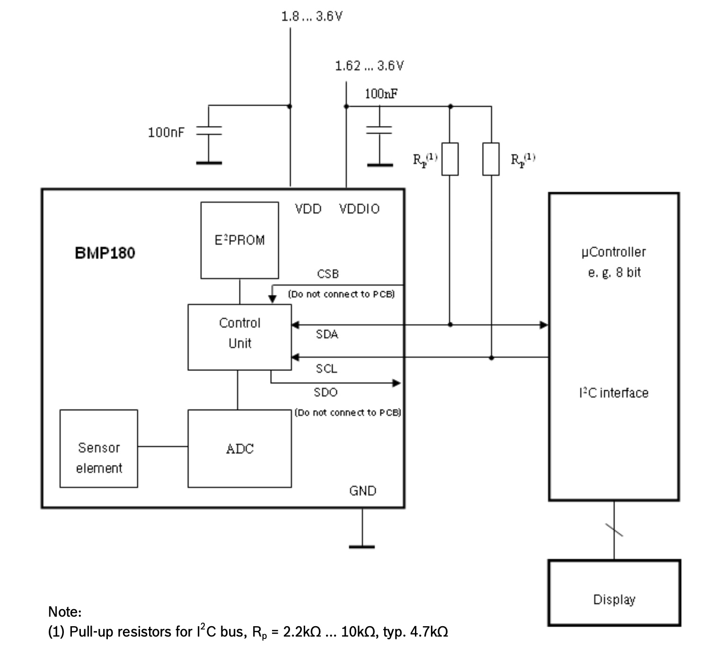
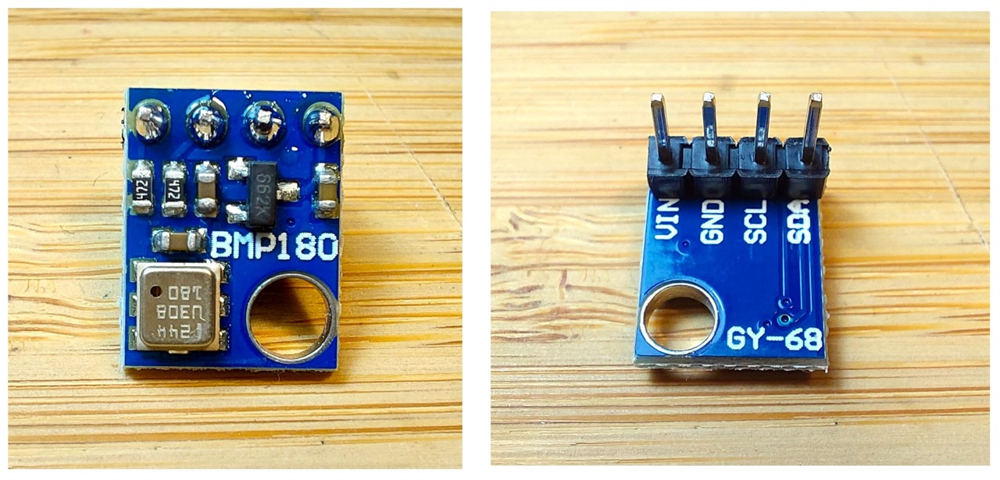
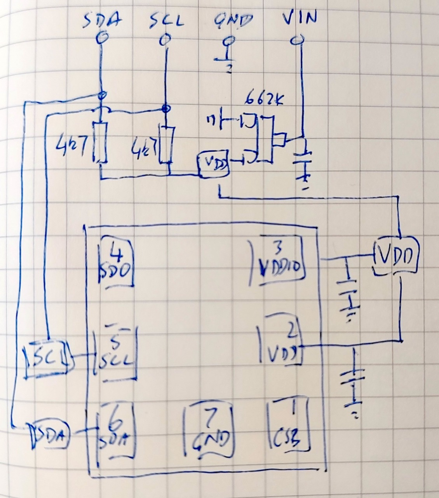
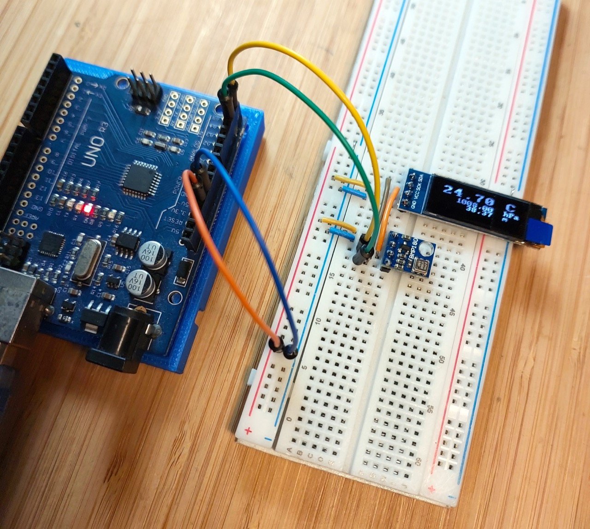

# #xxx BMP180 Module

Examine the BMP180 barometric pressure and temperature sensor. Demonstrate its functionality with a common GY-68 module and an Arduino Uno with 128x32 OLED display.

## Notes

I purchased a BMP180 3.3V sensor module
["GY-68 BMP180 BMP280 Digital Barometric Pressure Sensor Module for arduino" (aliexpress seller listing)](https://www.aliexpress.com/item/32709141948.html)
for SG$0.85 (Jun-2020). NB: it is no longer offered by this seller.

In this little project, I'll test the module with an Arduino sketch, with readings streamed to the serial port as well as shown on an OLED display.

The BMP180 was superseded by the BMP280, which offers higher resolution and also the choice of either I²C or SPI interfaces.
See [LEAP#826 BMP280 Module](../../BMP280/Module/) for a demonstration.

### About the BMP180

The BMP180 is the function compatible successor of the BMP085, a new generation of high precision digital pressure sensors for consumer applications.

The ultra-low power, low voltage electronics of the BMP180 is optimized for use in mobile phones, PDAs, GPS navigation devices and outdoor equipment.
With a low altitude noise of merely 0.25m at fast conversion time, the BMP180 offers superior performance.
The I²C interface allows for easy system integration with a microcontroller.

The BMP180 is based on piezo-resistive technology for EMC robustness, high accuracy and linearity as well as long term stability.

Absolute maximum ratings

* Voltage at any pin: -0.3 to 4.25V
* Storage Temperature: -45 to +85°C
* Pressure: 0 to 10 000 hPa

Specifications:

* Supply Voltage: 1.8 - 3.6V DC
* Interface: I²C (up to 3.4MHz)
* Resolution:
    * Temperature: 0.1 °C
    * Pressure: 0.01 hPa
* Accuracy:
    * Temperature: +-0.5 °C
    * Pressure: +-1 hPa
* I²C address: 0x77

### About the GY-68 Module

The GY-68 module is designed with additional support components on board to make
it easy to use the BMP180 in a wide range of applications with minimal external components.

* Size: 21mm x 18mm
* 1.8V to 6V Supply Voltage

In particular, it includes a
[662k](https://jlcpcb.com/partdetail/HXYMOSFET-662K/C7470756)
voltage regulator, so that it can theoretically work with external power of 1.8V to 6V.
The module also includes:

* 4.7kΩ pull-up resistors on the I²C SCL and SDA lines
* decoupling capacitors on the VDD and VDDIO pins
* The module simplifies power management by tieing VDD and VDDIO together - the same power supply is used for both

Here's a quick sketch of how the components on the breakout board are connected:

### Arduino Test Circuit Design

Since the module supports up to 6V, I'm going to test this with an Arduino Uno.
Note:

* pull-up resistors are not required on the I²C lines as they are built-in to the module
* 0.91" 128x32 white OLED LCD display module with SSD1306 Driver is attached to I²C for the display of readings

Designed with Fritzing: see [Module.fzz](./Module.fzz).

Connected on a breadboard with Arduino Uno controller:

### The Sketch

See [Module.ino](./Module.ino) for the test sketch. It uses the following libraries:

* [Adafruit BMP085 Library](https://github.com/adafruit/Adafruit-BMP085-Library) to directly communicate with the BMP180
    * Which uses <https://github.com/adafruit/Adafruit_BusIO>
    * And uses the standard Wire libraries
* [u8g2lib](https://github.com/olikraus/U8g2_Arduino) monochrome graphics library to drive the OLED screen

Sketch behaviour:

* during setup:
    * initialises the BMP180, OLED screen, and built-in LED
    * displays a splash screen on the OLED
* each loop:
    * turns on the built-in LED during sampling
    * samples readings and calculates altitude
    * updates OLED display
    * streams sample to serial port

### Test Results

Connecting to the serial console using screen (e.g. `screen /dev/cu.usbmodem24201 115200`) I can following the readings:

And following along with the readings on the display.

## Credits and References

* ["GY-68 BMP180 BMP280 Digital Barometric Pressure Sensor Module for arduino" (aliexpress seller listing)](https://www.aliexpress.com/item/32709141948.html)
    * Originally purchased BMP180 3.3V version for SG$0.85 (Jun-2020)
    * No longer offered by this seller
* ["1-10pcs 0.91 Inch 128x32 IIC I2C White / Blue OLED LCD Display DIY Module SSD1306 Driver IC DC 3.3V 5V for arduino" (aliexpress seller listing)](https://www.aliexpress.com/item/1005008640132638.html)
    * Purchased for SG$2.27 free shipping eligible (Dec-2025)
* ["1pcs 0.91 inch OLED module 0.91" white OLED 128X32 OLED LCD LED Display Module 0.91" IIC Communicate" (aliexpress seller listing)](https://www.aliexpress.com/item/32672229793.html)
    * Previously purchased for US$2.75 (Apr-2017).
    * Currently listed for SG$1.79 + shipping (Jan-2026).
* [BMP180 Datasheet](https://cdn-shop.adafruit.com/datasheets/BST-BMP180-DS000-09.pdf)
* [BMP180 brochure](https://www.tinytronics.nl/product_files/000198_BMP180.pdf)
* [Adafruit BMP085 Library](https://github.com/adafruit/Adafruit-BMP085-Library)
