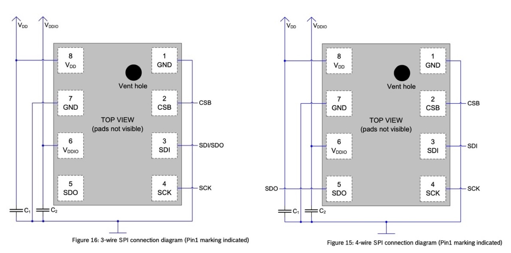
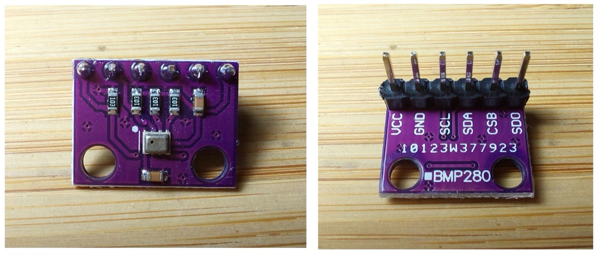
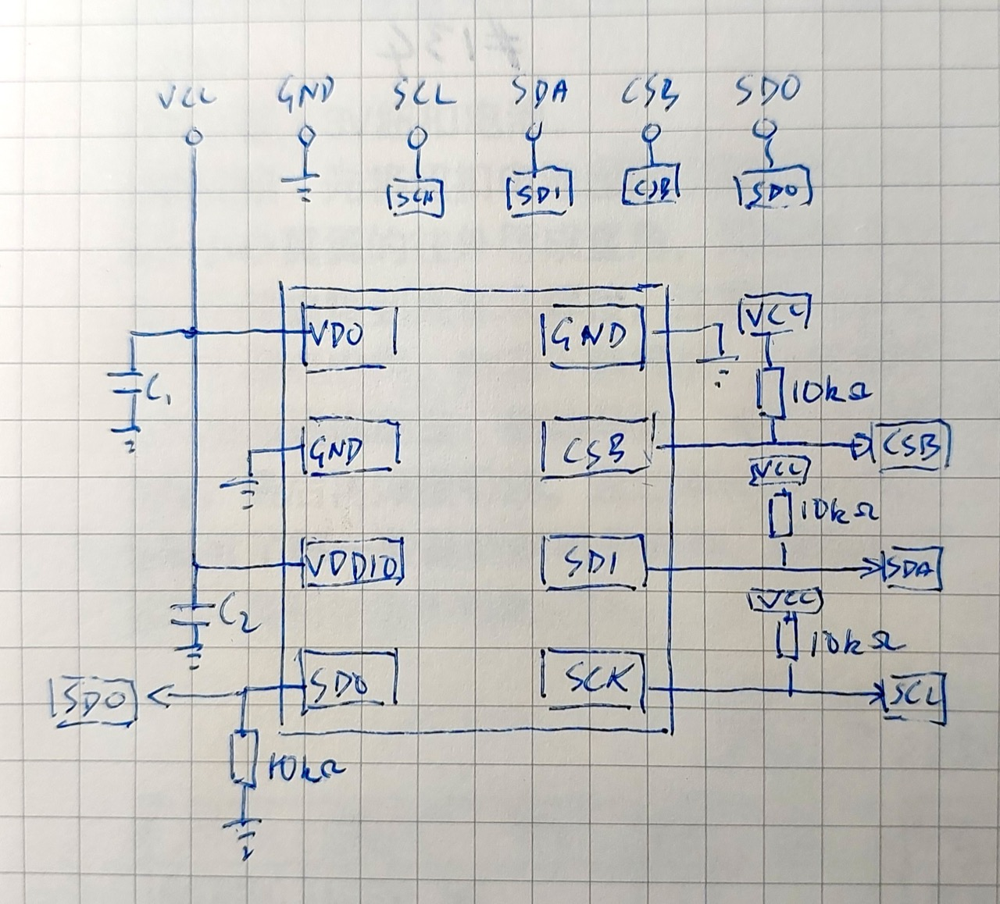
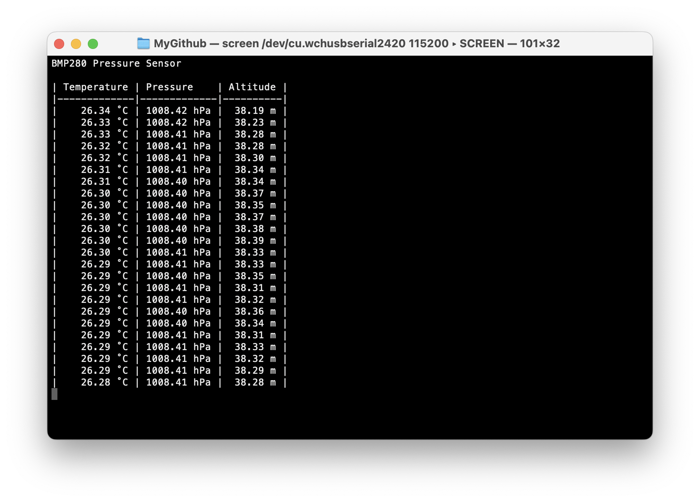
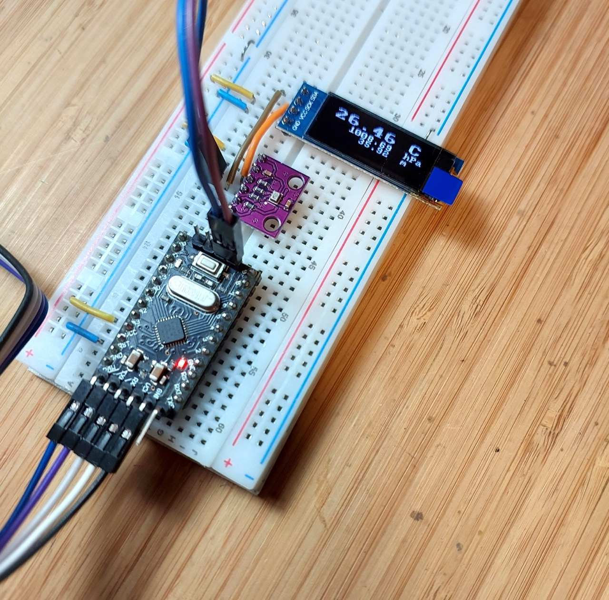
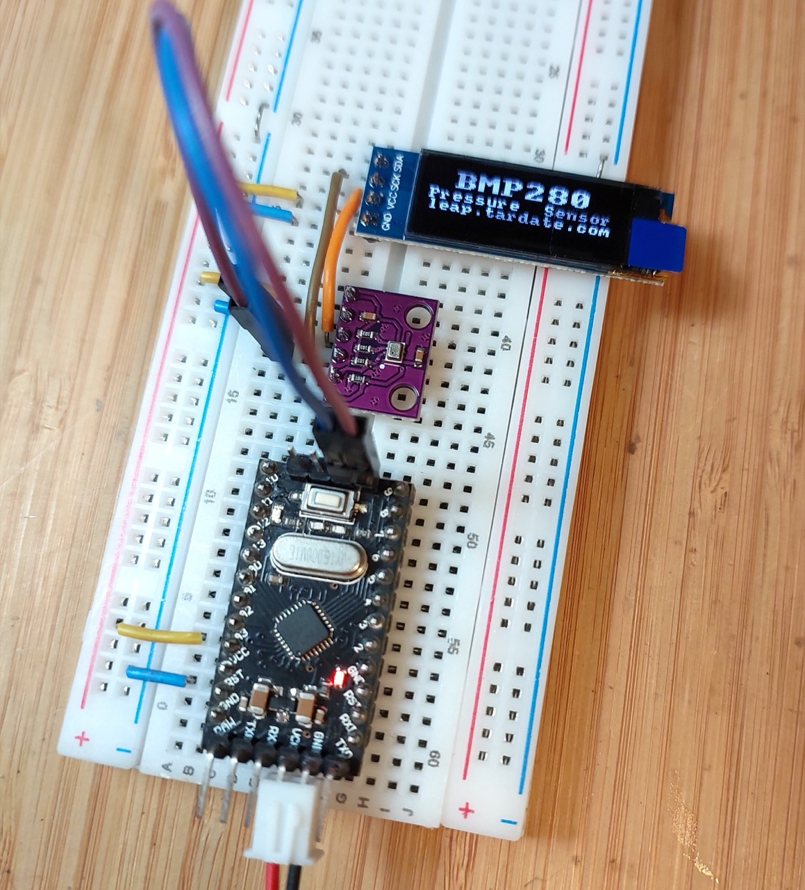
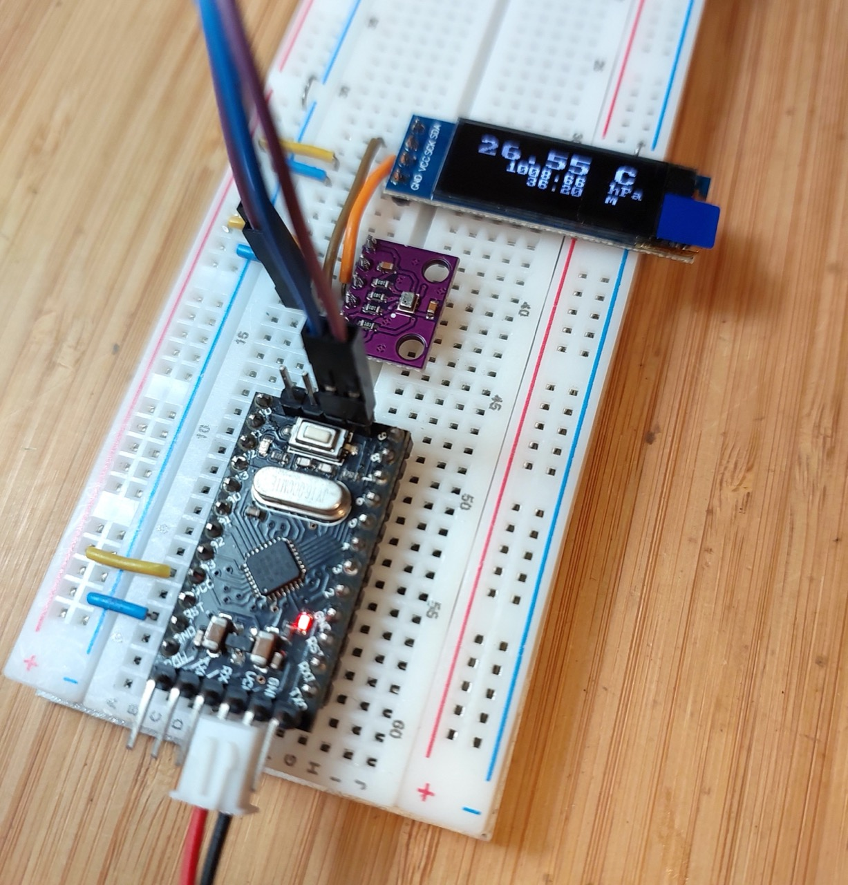

# #826 BMP280 Module

Examine the BMP280 barometric pressure and temperature sensor. Demonstrate its functionality with a common GY-BMP280-3.3 module and an Arduino Mini with 128x32 OLED display operating at 3.3V.

Here's a quick demo..

## Notes

I purchased a BMP280 sensor module
["GY-68 BMP180 BMP280 Digital Barometric Pressure Sensor Module for arduino" (aliexpress seller listing)](https://www.aliexpress.com/item/32709141948.html)
for SG$0.82 (Jun-2020).

In this little project, I'll test the module with an Arduino sketch, with readings streamed to the serial port as well as shown on an OLED display.

### About the BMP280

BMP280 is an absolute barometric pressure sensor especially designed for mobile applications. The sensor module is housed in an extremely compact package. Its small dimensions and its low power consumption allow for the implementation in battery driven devices such as mobile phones, GPS modules or watches.

As its predecessor BMP180, the BMP280 is based on Bosch's proven piezo-resistive pressure sensor technology featuring high accuracy and linearity as well as long term stability and high EMC robustness.

Numerous device operation options offer highest flexibility to optimize the device regarding power consumption, resolution and filter performance. A tested set of default settings for example use case is provided to the developer in order to make design-in as easy as possible.

Absolute maximum ratings

* Voltage at any supply pin (VDD): -0.3 to 4.25V
* Voltage at any interface pin: -0.3 to VDD + 0.3V
* Storage Temperature: -45 to +85°C
* Pressure: 0 to 20 000 hPa

Specifications:

* Supply Voltage: 1.8 - 5V DC
* Interface: I²C (up to 3.4MHz), SPI (up to 10 MHz)
* Operational Range:
    * Temperature: -40 to +85°C
    * Humidity: 0-100%
    * Pressure: 300-1100 hPa
* Resolution:
    * Temperature: 0.01°C
    * Humidity: 0.008%
    * Pressure: 0.18Pa
* Accuracy:
    * Temperature: +-1°C
    * Humidity: +-3%
    * Pressure: +-1Pa
* I²C address:
    * SDO LOW : 0x76
    * SDO HIGH: 0x77
* Interface selection:
    * CSB LOW : SPI
    * CSB HIGH (VDDIO): I²C

### About the GY-BMP280-3.3 Module

Some modules are designed for 3.3V or 5V operation, but the module I have exposes the BMP280 directly and therefore must be used within the BMP280's voltage limits (4.25V max).

Module specifications:

* GY-BMP280 module high-precision atmospheric pressure sensor module altimeter sensor 3.3V
* Module model: GY-BMP280-3.3
* Use chip: BMP280
* Power supply: 3V
* Communication method: standard IIC/SPI communication protocol
* Air pressure range: 300-1100hPa
* Using Immersion Gold PCB, machine welding process to ensure quality
* Pin spacing: 2.54mm
* Module size: 11.5mm*15mm

The module simplifies power management by tieing VDD and VDDIO together - the same power supply is used for both.
The module is also fitted with four 10kΩ resistors and two capacitors that minimise the number of external components required:

* C1 and C2 decoupling capacitors for VDD and VDDIO
* a 10kΩ resistor pulls SDO to ground, pre-selecting I²C address 0x76
* a 10kΩ resistor pulls CSB high, pre-selecting the I²C interface
* 10kΩ resistor pull SDA and SCL lines high, eliminating the need for external pull-up resistors on the communication lines

Here's a quick sketch of how the components on the breakout board are connected:

### Arduino Test Circuit Design

Since my module is 3.3V only, I'm going to test this with an Arduino Mini running at 3.3V rather than mess around with level shifters.
Note:

* I²C interface is selected by default (module built-in pull-up)
* I²C address 0x76 is selected by default (module built-in pull-down)
* pull-up resistors are not required on the I²C lines as they are built-in to the module
* 0.91" 128x32 white OLED LCD display module with SSD1306 Driver is attached to I²C for the display of readings

Designed with Fritzing: see [Module.fzz](./Module.fzz).

Connected on a breadboard with USB-Serial adapter for programming:

### The Sketch

See [Module.ino](./Module.ino) for the test sketch. It uses the following libraries:

* [Adafruit_BMP280_Library](https://github.com/adafruit/Adafruit_BMP280_Library) to directly communicate with the BMP280
    * Which uses <https://github.com/adafruit/Adafruit_BusIO>
    * And uses the standard Wire and SPI libraries
* [u8g2lib](https://github.com/olikraus/U8g2_Arduino) monochrome graphics library to drive the OLED screen

Sketch behaviour:

* during setup:
    * initialises the BMP280, OLED screen, and built-in LED
    * displays a splash screen on the OLED
* each loop:
    * turns on the built-in LED during sampling
    * samples readings and calculates altitude
    * updates OLED display
    * streams sample to serial port

Calculating the approximate altitude requires the current sea level pressure for one's locale to be configured.
I'm using an estimate from
<https://tides4fishing.com/sg/singapore/singapore/forecast/atmospheric-pressure>
that is typically 1010-1015 hPa. Hard-coding this is obviously not very convenient - a live feed of the actual value would be ideal!

### Test Results

Connecting to the serial console using screen (e.g. `screen /dev/cu.wchusbserial2420 115200`) I can following the readings:

And following along with the readings on the display.

Switching over to power-only (no serial/USB), I've attached 3.3V from a power supply so the module can be run stand-along (not connected to a computer)

## Credits and References

* ["GY-68 BMP180 BMP280 Digital Barometric Pressure Sensor Module for arduino" (aliexpress seller listing)](https://www.aliexpress.com/item/32709141948.html)
    * Originally purchased BMP280 3.3V version for SG$0.82 (Jun-2020)
    * No longer offered by this seller
* ["1-10pcs 1.8-5V GY-BME280 5V BMP280 5V BMP280-3.3V BMP180 precision altimeter atmospheric pressure BMP280 sensor module" (aliexpress seller listing)](https://www.aliexpress.com/item/1005006824236173.html)
    * Another seller listing the BMP280 3.3V version for SG$1.38 (Jan-2026)
* ["1-10pcs 0.91 Inch 128x32 IIC I2C White / Blue OLED LCD Display DIY Module SSD1306 Driver IC DC 3.3V 5V for arduino" (aliexpress seller listing)](https://www.aliexpress.com/item/1005008640132638.html)
    * Purchased for SG$2.27 free shipping eligible (Dec-2025)
* ["1pcs 0.91 inch OLED module 0.91" white OLED 128X32 OLED LCD LED Display Module 0.91" IIC Communicate" (aliexpress seller listing)](https://www.aliexpress.com/item/32672229793.html)
    * Previously purchased for US$2.75 (Apr-2017).
    * Currently listed for SG$1.79 + shipping (Jan-2026).
* [BMP280 Datasheet](https://www.bosch-sensortec.com/media/boschsensortec/downloads/datasheets/bst-bmp280-ds001.pdf)
* <https://github.com/adafruit/Adafruit_BMP280_Library>
* [Adafruit BMP280 I2C or SPI Barometric Pressure & Altitude Sensor - STEMMA QT](https://www.adafruit.com/product/2651)
* [BMP280 temperature and pressure sensor on an Arduino](https://www.youtube.com/watch?v=dF2E9IUYfks) - YouTube by nenioc187
