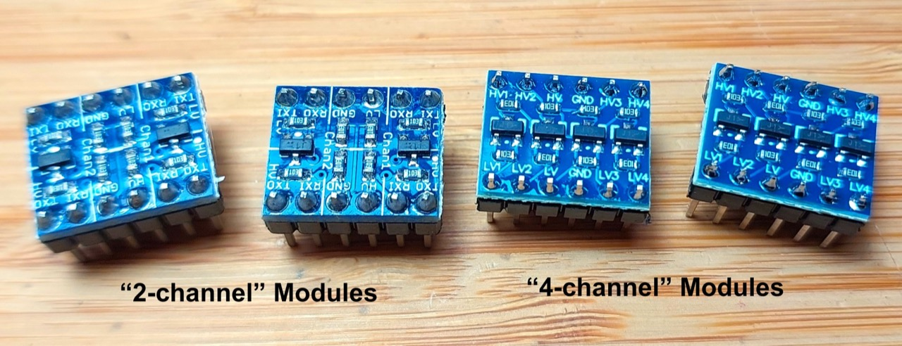
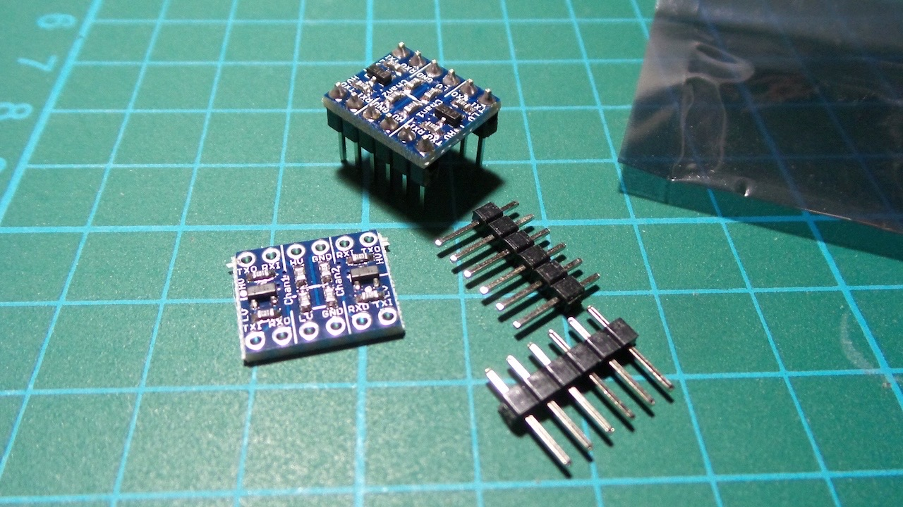
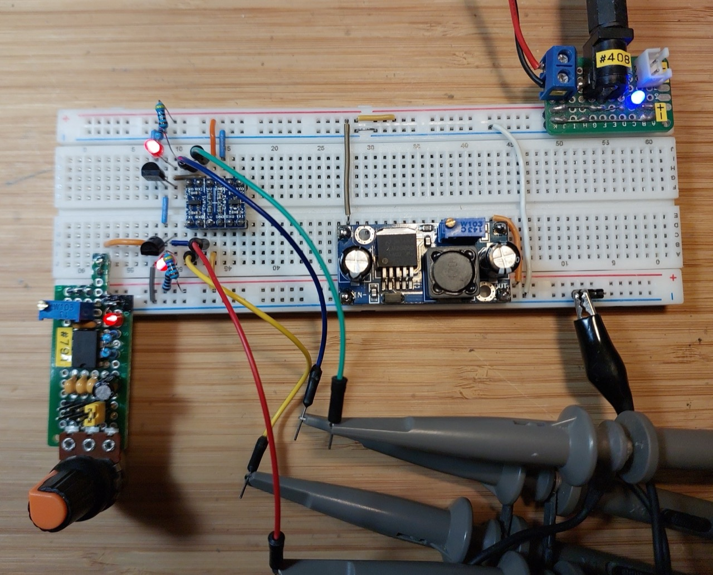
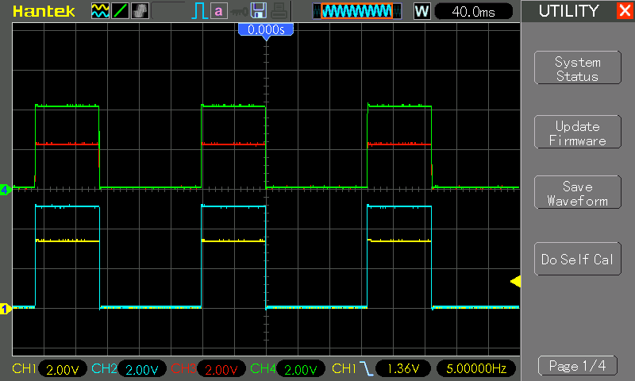
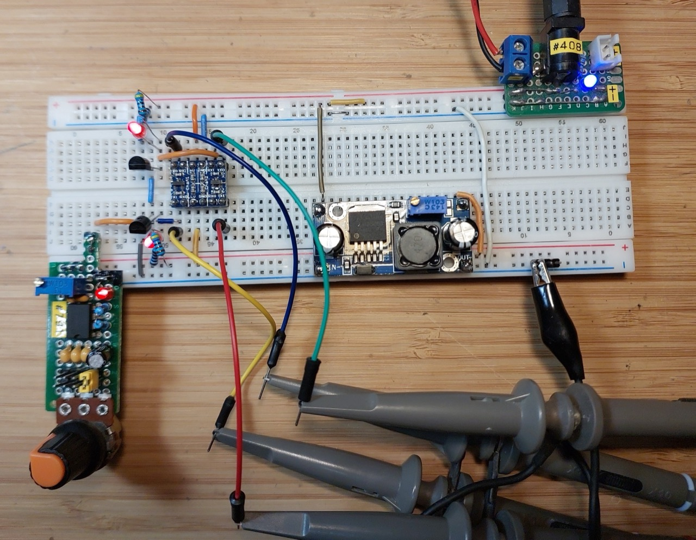
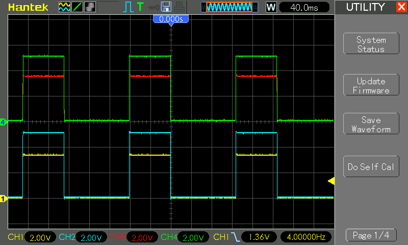
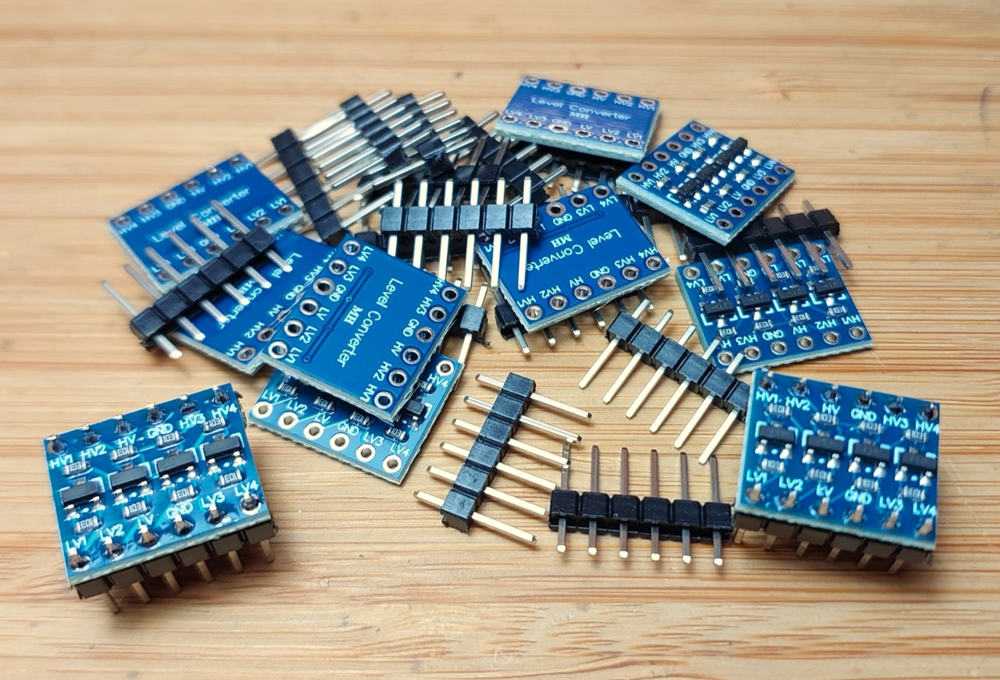
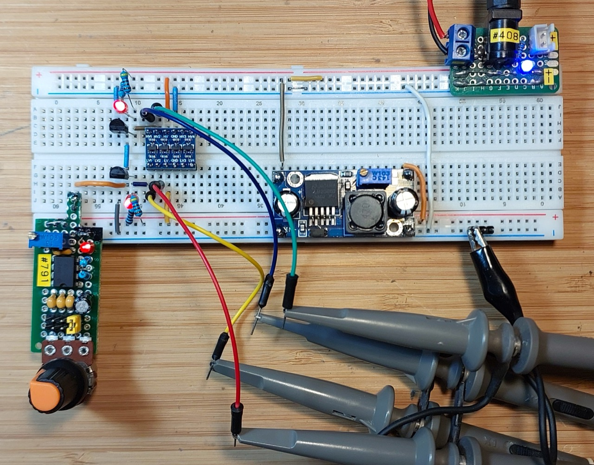
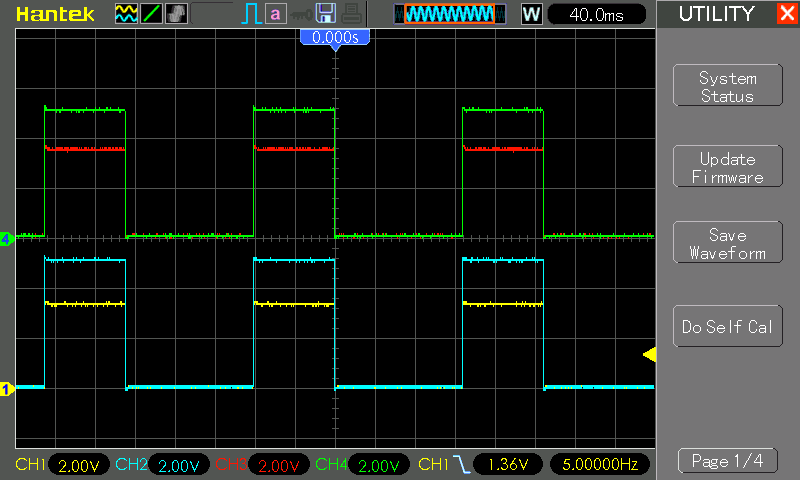

# #134 Bidirectional Level Shifter Modules

Review and test some 2-channel and 4-channel bi-directional 5/3.3V level shifter modules.

## Notes

3.3/5V level-shifting modules are quite common, as the need to interface 5V microcontrollers with 3.3V devices/sensors (or vice versa) is pretty common. Often these are billed for
[I²C](https://en.wikipedia.org/wiki/I%C2%B2C)
or [SPI](https://en.wikipedia.org/wiki/Serial_Peripheral_Interface_Bus),
although they are non-specific and can be used for level-shifting any kind of digital signal.
Note: yes, digital high/low signals only; they do not provide an analog scaling of voltages.

See the [LEAP#133 Bi-directional Level Shifter](../) project,
which demonstrates the basic FET trick used by these modules.

There are two types of modules commonly found for sale. I'll test:

* "2-channel" level-shifter modules: 2 pairs of input/output signals, using 1 FET for each pair
* "4-channel" level-shifter modules: 4 independent input/output signals with an FET each

## Test Circuit Design

Designed with Fritzing: see [Modules.fzz](./Modules.fzz).

The test circuit establishes a 5V high-voltage and 3.3V low-voltage rail and simulates signals in both directions. the circuit comprises:

* a controlling square wave, generated with [LEAP#791 555 Breadboard Pulse Generator](../../555Timer/BreadboardPulseGen/)
* the square wave toggles independent n-FET gates
    * with drains pulled high with a 4.7kΩ resistor
    * and parallel indicator LEDs
* the high-side nFET drain is tied to the high-side level-shifter input
* the low-side nFET drain is tied to the low-side level-shifter input
* a 4-channel oscilloscope is used to monitor the 4 input output signals:
    * CH1 (Yellow): signal 1 - low-side input
    * CH2 (Blue): signal 1 - high-side output
    * CH3 (Green): signal 2 - high-side input
    * CH4 (Red): signal 3 - low-side output
* The schematic shows separate 5V and 3.3V power supplies. In the breadboard experiments below however, I am using:
    * 5V from a bench power supply
    * 3.3V rail generated with a buck converter: [LEAP#822 LM2596S 1.23V-30V Buck Converter Module](../../Power/SwitchModePowerSupplies/BuckConverterModules/LM2596SModule2/)

In the ideal case, input and output signals should be perfectly matched, with a full voltage swing on the high and low sides.

### 2-channel Level Shifters

I purchased a pack of 10 for US$3.39/lot (Jul-2015)
["10PCS Two Channel IIC I2C Logic Level Converter Bi-Directional Module 5V to 3.3V" (aliexpress seller listing)](https://www.aliexpress.com/item/32213240585.html).

The modules have two pairs of "transmit" and "receive" lines. It turns out that transmit and receive are handled differently:

* TXD/TXI uses a standard MOSFET level shifting circuit, so is usable in either direction with accurate levels
* RXD/RXI uses a simple voltage divider. This is OK for signals from high side to low side, but not in the reverse direction.

#### Testing 2-channel Level Shifters - Single Channel

First I'll test bi-directional signals connected on the one channel:

* TXD/TXI used for signal from low to high side
* RXD/RXI used for signal from high to low side

TXD/TXI, used for signal from low to high side, works perfectly:

* CH1 (Yellow): signal 1 - low-side input, oscillates perfectly between 0-3.3V
* CH2 (Blue): signal 1 - high-side output, oscillates perfectly between 0-5V

RXD/RXI, used for signal from high to low side, is not perfect but probably "good enough" in most cases (due to the resistor divider networks involved):

* CH3 (Green): signal 2 - high-side input, oscillates between 0-~4.1V
* CH4 (Red): signal 3 - low-side output, oscillates between 0-~2.2V

#### Testing 2-channel Level Shifters - Channel Per Signal

Next I'll test bi-directional signals connected with their own channel:

* TXD/TXI used for signal from low to high side
* TXD/TXI used for signal from high to low side

TXD/TXI, used for signal from low to high side, works perfectly:

* CH1 (Yellow): signal 1 - low-side input, oscillates perfectly between 0-3.3V
* CH2 (Blue): signal 1 - high-side output, oscillates perfectly between 0-5V

TXD/TXI, used for signal from high to low side, also works perfectly:

* CH3 (Green): signal 2 - high-side input, oscillates perfectly between 0-5V
* CH4 (Red): signal 3 - low-side output, oscillates perfectly between 0-3.3V

In this configuration, all signals are perfectly level-shifted, but it does mean that one module can only handle two signals.

### 4-channel Level Shifters

I purchased a pack of 10  for SG$2.54/lot (Jan-2026)
["10pcs 4 channel IIC I2C Logic Level Converter Bi-Directional Module 5V to 3.3V" (aliexpress seller listing)](https://www.aliexpress.com/item/1005006068381598.html)

The modules have independent pairs of input/output lines. Each uses a FET for level-shifting and can be used in either direction.

#### Testing 4-channel Level Shifters

I'll test bi-directional signals connected with their own channel:

* LV1/HV1 used for signal from low to high side
* LV2/HV2 used for signal from high to low side

 LV1/HV1, used for signal from low to high side, works perfectly:

* CH1 (Yellow): signal 1 - low-side input, oscillates perfectly between 0-3.3V
* CH2 (Blue): signal 1 - high-side output, oscillates perfectly between 0-5V

LV2/HV2, used for signal from high to low side, also works perfectly:

* CH3 (Green): signal 2 - high-side input, oscillates perfectly between 0-5V
* CH4 (Red): signal 3 - low-side output, oscillates perfectly between 0-3.3V

In this configuration, all signals are perfectly level-shifted, and one module can handle up to 4 independent signals.

## Credits and References

* [LEAP#133 Bi-directional Level Shifter](../) - project testing the basic level-shifting FET trick
* ["10PCS Two Channel IIC I2C Logic Level Converter Bi-Directional Module 5V to 3.3V" (aliexpress seller listing)](https://www.aliexpress.com/item/32213240585.html)
    * Originally purchased in a pack of 10 for US$3.39/lot (Jul-2015), but no longer available from this seller.
* ["5/10/50pcs 4channel 2 channel IIC I2C Logic Level Converter Bi-Directional Module 5V to 3.3V For Arduino" (aliexpress seller listing)](https://www.aliexpress.com/item/1005006255186878.html)
    * Similar product (2-channel) currently listing in a pack of 10 for SG$2.90/lot
    * Also offer a 4-channel version currently listing in a pack of 10 for SG$2.80/lot
* ["10pcs 4 channel IIC I2C Logic Level Converter Bi-Directional Module 5V to 3.3V" (aliexpress seller listing)](https://www.aliexpress.com/item/1005006068381598.html)
    * Originally purchased 10 pieces for SG$2.54/lot (Jan-2026)
* [I²C](https://en.wikipedia.org/wiki/I%C2%B2C) - wikipedia
* [SPI](https://en.wikipedia.org/wiki/Serial_Peripheral_Interface_Bus) - wikipedia
* [Philips Application Note AN97055](https://cdn.sparkfun.com/tutorialimages/BD-LogicLevelConverter/an97055.pdf)
* [Bi-Directional Logic Level Converter Hookup Guide](https://learn.sparkfun.com/tutorials/bi-directional-logic-level-converter-hookup-guide) - excellent resource from sparkfun
