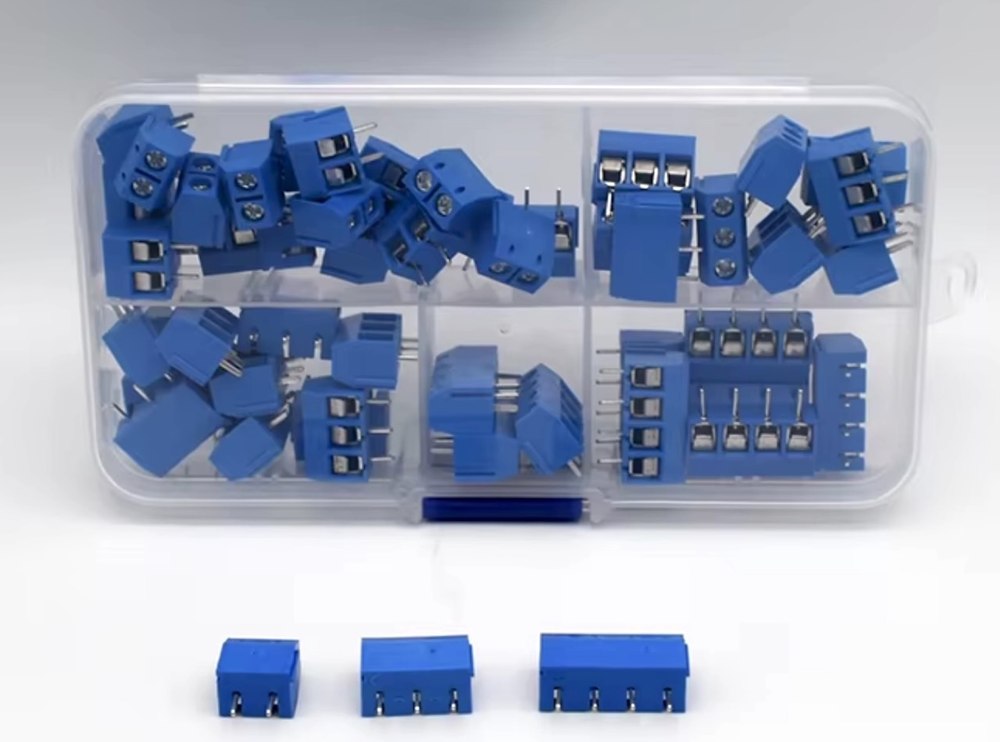
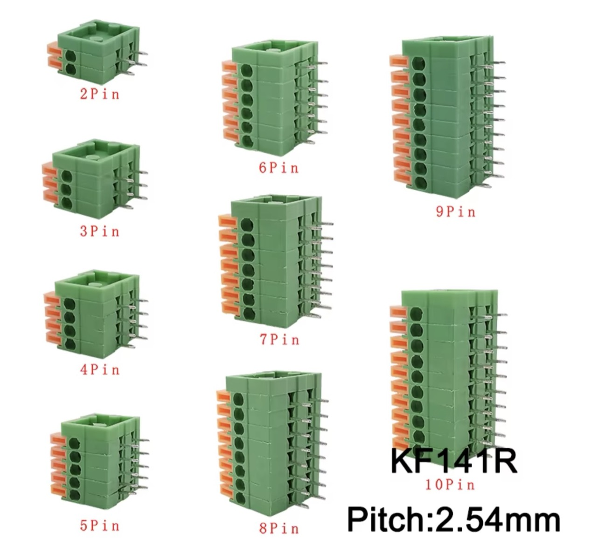

# #594 Breadboard Bling: Terminal Blocks

Making some breadboard-compatible terminal blocks for securely connecting random wired devices in circuit.

## Notes

When quickly building a circuit on a breadboard, there's often a component that just has unterminated wires.

At first, one  may just try and poke the wires into the breadboard.
If the wires are un-tinned, this will usually result in completely fraying the ends.
So the soldering iron gets pulled out to tin the wires.

When the wires inevitably fall out at a crucial juncture in an experiment, it's time to solder some kind of connector to the wires. Maybe just some 2.54mm pitch pins that can be plugged into the breadboard.

And then the wires eventually break at the connector due to metal fatigue..

Bottom line, a real hassle!

### Terminal Blocks to the Rescue

Terminal blocks are modular, insulated connectors used to securely join or terminate multiple wires in circuits, providing a reliable and organized method for managing electrical connections. They consist of a housing made of insulating material (such as plastic or ceramic) and metal terminals (often brass or copper) that conduct electricity and clamp wires in place using screws, spring clamps, or push-in mechanisms. Terminal blocks are widely used in industrial control panels, power distribution systems, and electronic devices to simplify wiring, enable easy maintenance, and ensure safe connections. They come in various types, including barrier strips, feed-through blocks, and ground terminals, and can accommodate different wire sizes, voltages, and current ratings. Their modular design allows for flexibility in circuit design and troubleshooting, making them essential components in both electrical and electronic systems.

There are a wide range of terminal blocks available for industrial applications. For more information, see for example:

* <https://switchesplus.com.au/Exploring-Terminal-Blocks-All-you-need-to-know~61572>
* <https://en.wikipedia.org/wiki/Electrical_connector#Screw_terminals>

### PCB Mounted Terminal Blocks with Screw Connectors

The most common type of terminal blocks one may see in the electronic hobbyist arena is the screw-connector, with pins for through-hole PCB mounting.

* e.g. this box set of 2, 3 and 4 terminal units: [50 Pcs/BOX Pitch 5.0mm Straight Pin 2P 3P Screw PCB Terminal Block Connector 10A 300V 24-18AWG](https://www.aliexpress.com/item/1005005595075178.html)

### PCB Mounted Terminal Blocks with Screwless Connectors

Perhaps more convenient are screwless connectors

* e.g. [10Pcs 2.54mm Pitch KF141V KF141R Push-in Spring Screwless Terminal Block Straight/Bent Foot 2/3/4/5/6/7/8/9/10P PCB Connector](https://www.aliexpress.com/item/1005002381186641.html)

### Building a Breadboard Module

I don't have any screwless terminal blocks, which would be ideal, so for now I've just put some 2-pin and 3-pin screwed terminal blocks on protoboard with pin connectors to make them breadboard-mountable.

These work just fine, and are useful for adding various devices to a breadboard circuit, for example a voltmeter module:

## Credits and References

* [50 Pcs/BOX Pitch 5.0mm Straight Pin 2P 3P Screw PCB Terminal Block Connector 10A 300V 24-18AWG](https://www.aliexpress.com/item/1005005595075178.html)
* [10Pcs 2.54mm Pitch KF141V KF141R Push-in Spring Screwless Terminal Block Straight/Bent Foot 2/3/4/5/6/7/8/9/10P PCB Connector](https://www.aliexpress.com/item/1005002381186641.html)
