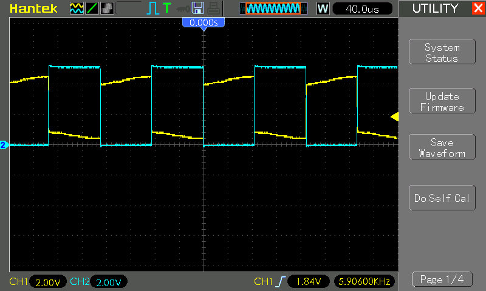
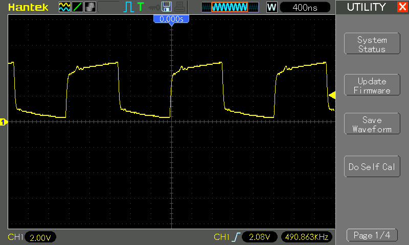
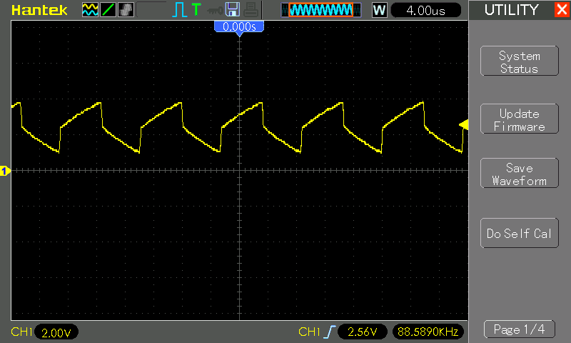

# #600 CD40106 Schmitt Oscillator

About the CD40106 Hex Inverter with Schmitt Trigger Inputs, and testing its behaviour as a relaxation oscillator square wave generator.

## Notes

The [CD40106](https://www.futurlec.com/4000Series/CD40106.shtml) is a hex Schmitt-trigger inverter, featuring six independent inverters with built-in hysteresis to improve noise immunity and signal integrity. It operates over a wide voltage range of 3V to 15V, making it compatible with both low-power and high-voltage applications. The Schmitt-trigger action ensures clean transitions between logic states, making it ideal for signal conditioning, waveform shaping, and switch debounce circuits. Compared to standard inverters like the 74HC04, the CD40106 is better suited for handling slow or noisy input signals.

### Test Circuit: The Schmitt Oscillator

An inverter Schmitt oscillator circuit is a simple and widely used configuration for generating square wave signals, typically built using a Schmitt-trigger inverter (like the 74LS14) along with a resistor and capacitor. The circuit works by exploiting the hysteresis property of the Schmitt-trigger, which causes the inverter to switch states at different voltage thresholds. The capacitor charges and discharges through the resistor, creating a time delay that determines the oscillation frequency. When the capacitor voltage reaches the upper threshold, the inverter switches to a low output, causing the capacitor to discharge; when it falls to the lower threshold, the inverter switches back to a high output, repeating the cycle. This results in a continuous square wave output whose frequency is determined by the RC time constant (`f = 1 / (1.2 * R * C)`). The circuit is valued for its simplicity, reliability, and ability to produce stable oscillations, making it useful in applications like clock generation, tone generation, and timing circuits.

### Circuit Design

### Test Results

The CD40106 produces a wave very close to 50% duty cycle.
It works well with a wide range of R and C values, though the waveform degrades with sloped top/tail and eventually morphs to a sine-like wave at more extreme frequencies.

Actual frequency is not well predicted by simply using the RC time constant.

Note: in these tests, capacitors >=1µF are electrolytic, and < 1µF are monolithic ceramic.

| R1    | C1     | Calc Frequency                                                                      | Measured Frequency | +duty% | Waveform Quality |
|-------|--------|-------------------------------------------------------------------------------------|--------------------|--------|------------------|
| 220Ω  | 10nF   | [378.8 kHz](https://www.wolframalpha.com/input?i=1%2F%281.2*220%CE%A9*10nF%29)      | 88.6 kHz           | 49.6%  | poor. steep ramps on hi/low side |
| 220Ω  | 100nF  | [37.88 kHz](https://www.wolframalpha.com/input?i=1%2F%281.2*220%CE%A9*100nF%29)     | 10.83 kHz          | 48.9%  | poor. very steep ramps on hi/low side |
| 1kΩ   | 20pF   | [41.67 MHz](https://www.wolframalpha.com/input?i=1%2F%281.2*1k%CE%A9*20pF%29)       | 4.95 MHz           | 49.8%  | almost sinusoidal |
| 1kΩ   | 100pF  | [8.333 MHz](https://www.wolframalpha.com/input?i=1%2F%281.2*1k%CE%A9*100pF%29)      | 2.487 MHz          | 49.9%  | square but very rounded |
| 1kΩ   | 330pF  | [2.525 MHz](https://www.wolframalpha.com/input?i=1%2F%281.2*1k%CE%A9*330pF%29)      | 1.157 MHz          | 49.9%  | square but rounded top |
| 1kΩ   | 1nF    | [833.3 kHz](https://www.wolframalpha.com/input?i=1%2F%281.2*1k%CE%A9*1nF%29)        | 490.9 kHz          | 49.9%  | square but slightly sloped ends with a little top ringing |
| 1kΩ   | 10nF   | [83.33 kHz](https://www.wolframalpha.com/input?i=1%2F%281.2*1k%CE%A9*10nF%29)       | 49.57 kHz          | 50.0%  | good, square |
| 1kΩ   | 33nF   | [25.25 kHz](https://www.wolframalpha.com/input?i=1%2F%281.2*1k%CE%A9*33nF%29)       | 14,77 kHz          | 50.0%  | good, square |
| 1kΩ   | 100nF  | [8.333 kHz](https://www.wolframalpha.com/input?i=1%2F%281.2*1k%CE%A9*100nF%29)      | 5.906 kHz          | 49.6%  | ok, sloped top and tail |
| 1kΩ   | 330nF  | [2.53 kHz](https://www.wolframalpha.com/input?i=1%2F%281.2*1k%CE%A9*330nF%29)       | 1.642 kHz          | 50.0%  | ok, sloped top and tail |
| 1kΩ   | 1µF    | [833.3 Hz](https://www.wolframalpha.com/input?i=1%2F%281.2*1k%CE%A9*1%C2%B5F%29)    |  77.3 Hz           | 50.0%  | ok, sloped top and tail |
| 1kΩ   | 10µF   | [83.33 Hz](https://www.wolframalpha.com/input?i=1%2F%281.2*1k%CE%A9*10%C2%B5F%29)   |  47.6 Hz           | 50.0%  | ok, sloped top and tail |
| 1kΩ   | 100µF  | [8.333 Hz](https://www.wolframalpha.com/input?i=1%2F%281.2*1k%CE%A9*100%C2%B5F%29)  |   5.1 Hz           | 49.9%  | ok, sloped top and tail |
| 1kΩ   | 1000µF | [0.833 Hz](https://www.wolframalpha.com/input?i=1%2F%281.2*1k%CE%A9*1000%C2%B5F%29) | 0.595 Hz           | 47.6%  | ok, sloped top and tail |
| 1kΩ   | 2200µF | [0.378 Hz](https://www.wolframalpha.com/input?i=1%2F%281.2*1k%CE%A9*2200%C2%B5F%29) | 0.208 Hz           | 49.6%  | ok, sloped top and tail |
| 2.2kΩ | 10nF   | [37.88 kHz](https://www.wolframalpha.com/input?i=1%2F%281.2*2.2k%CE%A9*10nF%29)     | 27.83 kHz          | 48.8%  | good, square |
| 2.2kΩ | 100nF  | [3.788 kHz](https://www.wolframalpha.com/input?i=1%2F%281.2*2.2k%CE%A9*100nF%29)    | 3.105 kHz          | 48.7%  | good, square |
| 10kΩ  | 10nF   | [8.333 kHz](https://www.wolframalpha.com/input?i=1%2F%281.2*10k%CE%A9*10nF%29)      | 7.092 kHz          | 47.5%  | very good, square |
| 10kΩ  | 100nF  | [833 Hz](https://www.wolframalpha.com/input?i=1%2F%281.2*10k%CE%A9*100nF%29)        |  776.3 Hz          | 47.5%  | very good, square |
| 100kΩ | 10nF   | [833 Hz](https://www.wolframalpha.com/input?i=1%2F%281.2*100k%CE%A9*10nF%29)        | 722.5 Hz           | 47.1%  | very good, square |
| 100kΩ | 100nF  | [83.3 Hz](https://www.wolframalpha.com/input?i=1%2F%281.2*100k%CE%A9*100nF%29)      |  78.86 Hz          | 47.2%  | very good, square |

### Some sample traces

Very decent wave at 1kΩ and C=100nF.

* CH1 (yellow): oscillator output, showing distinct gradients at the top/tail of the cycle
* CH2 (blue): measuring the buffered output from the second inverter, showing the wave nicely rectified to a clean square wave.

Getting distorted at 1kΩ and C=1nF:

Top/tail distortion quite extreme with 220Ω and C=10nF:

## Credits and References

* [CD40106 Datasheet](https://www.futurlec.com/4000Series/CD40106.shtml)
* <https://www.build-electronic-circuits.com/4000-series-integrated-circuits/ic-40106/>
* [Schmitt Trigger Oscillators?!](https://forum.arduino.cc/t/schmitt-trigger-oscillators/144197) in the Arduino forums
* [Schmitt Waveform Generators](https://www.electronics-tutorials.ws/waveforms/generators.html) - very informative; compares LS14 with alternatives for waveform generation.
* [Circuit Properties of LS and HC Digital Logic](https://mysite.du.edu/~etuttle/electron/elect13.htm)
* [Schmitt Trigger Oscillator](https://electronics-course.com/schmitt-trigger-oscillator)
* See also:
    * [LEAP#582 74LS14 Schmitt Oscillator](../../74LS14/SchmittOscillator/)
    * [LEAP#588 74HC14 Schmitt Oscillator](../../74HC14/SchmittOscillator/)
