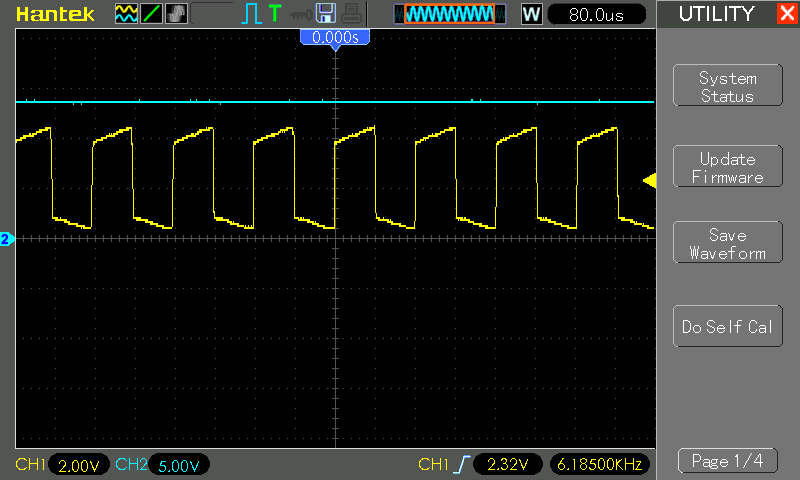

# #602 CD40106 Inverter Voltage Multiplier

Testing a voltage multiplier circuit based on a CD40106 inverter-driven bucket brigade.

## Notes

An inverter-based bucket-brigade voltage multiplier is a circuit used to generate higher DC voltages from a lower input voltage. It operates by using a series of capacitors and switches (typically transistors or diodes) arranged in stages. Each stage alternately charges and discharges capacitors in a "bucket-brigade" fashion, transferring charge step-by-step to the next stage. Inverter-based designs use inverters to control the switching sequence. As the charge propagates through the stages, the voltage is progressively multiplied, resulting in an output voltage that is a multiple of the input voltage. This type of circuit is commonly used in low-power applications, such as boosting voltages in electronic devices or energy harvesting systems.

### Circuit Design

The circuit is based on a suggestion by [@steveschnepp](https://github.com/tardate/LittleArduinoProjects/issues/35)

The first inverter unit (1A/Y) is configured as a Schmitt Oscillator to generate a square wave that is predicted to run at [8.33 kHz](https://www.wolframalpha.com/input?i=1%2F%281.2*1k%CE%A9*100nF%29).

Anther inverter is used to buffer the oscillator (6A/Y) - in practice, if this is not used, the oscillator is significantly dampened by the load.

Four bucket stages are included, which boosts the voltage to around 12-21V depending on load. The number of stages may be varied to generate different voltages.

A simple resistive load (LED1 and resistor R2) is attached to a final load capacitor C6 (33µF rated for 400V). There is no regulation of the output voltage.

### Test Results

The scope trace below captures the system in operation:

* CH1 (Yellow): oscillator output at 1Y.
    * Measured: 6.188 kHz 49.8%
    * Calculated: [8.33 kHz](https://www.wolframalpha.com/input?i=1%2F%281.2*1k%CE%A9*100nF%29)
* CH2 (Blue): voltage at OUT
    * Measured: 13.6V

Conclusion: the CD40106 is not as affective as the 74HC14 in this role. See [LEAP#593 74HC14 Inverter Voltage Multiplier](../../74HC14/VoltageMultiplier/) for comparative results.

## Credits and References

* [CD40106 Datasheet](https://www.futurlec.com/4000Series/CD40106.shtml)
* <https://www.build-electronic-circuits.com/4000-series-integrated-circuits/ic-40106/>
* See also:
    * [LEAP#593 74HC14 Inverter Voltage Multiplier](../../74HC14/VoltageMultiplier/)
