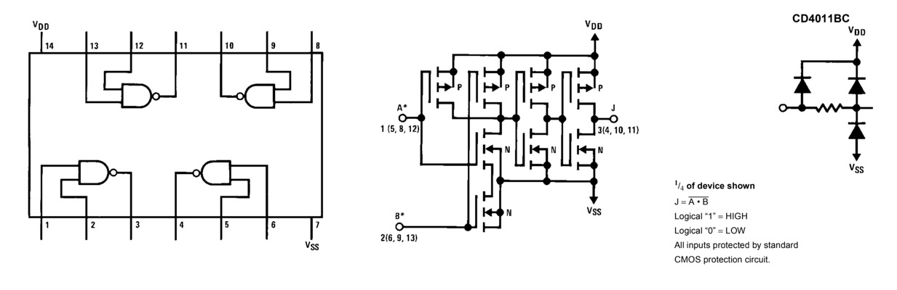

# #xxx CD4011 SR Latch

Set-Reset latch implemented with CD4011 NAND gates.

Here's a quick demo..

## Notes

### About the CD4011

The CD4011 is a CMOS quad 2-input NAND gate, containing four independent NAND gates in a single package. Each gate performs the standard NAND logic function, outputting a logic low only when both inputs are high. Like other devices in the 4000-series family, it operates over a wide supply voltage range of 3V to 15V, offering high noise immunity and low static power consumption, making it versatile for use in both digital and mixed-signal systems.

Because the NAND gate is a universal logic gate, the CD4011 can be used to implement virtually any digital logic function, including AND, OR, NOR, XOR, and more, simply by combining its gates in different ways. This makes it valuable in a broad range of applications such as timing circuits, pulse generation, simple latches, and general-purpose logic building blocks. Its ease of use, reliability, and flexibility make it a staple IC in both educational and professional circuit designs.

### SR Latch

An SR (Set-Reset) latch is one of the simplest types of sequential logic circuits, built using two cross-coupled logic gates—typically NOR or NAND gates. It has two inputs, labeled S (Set) and R (Reset), and two outputs, Q and its complement Q̅. The latch “remembers” its state: when S is activated, the latch sets Q to 1; when R is activated, it resets Q to 0. If both inputs are 0, the latch maintains its previous state, making it a basic memory element.

#### Truth Table

| Set(t) | Reset(t) | Output Q(t+1) |
|--------|----------|---------------|
|      0 |        0 | no change     |
|      0 |        1 | 0             |
|      1 |        0 | 1             |
|      1 |        1 | invalid state |

### Circuit Design

Designed with Fritzing: see [SRLatch.fzz](./SRLatch.fzz).

This circuit has two push-button inputs, a CD4011 quad 2-input NAND gate IC, and LED indicators for the Q and ~Q outputs.

The third common input `Enable` is pulled high. The latch may be disabled if this input is pulled low - a switch could be added for this if desired.

The breadboard build:

## Credits and References

* [CD4011 datasheet](https://www.futurlec.com/4000Series/CD4011.shtml)
* <https://www.build-electronic-circuits.com/4000-series-integrated-circuits/ic-4011/>
* [S-R Latch With Enable Input using NAND Gates](https://www.allaboutcircuits.com/textbook/experiments/chpt-7/nand-gate-s-r-enabled-latch/)

## Video References

### SR latch - Ben Eater

