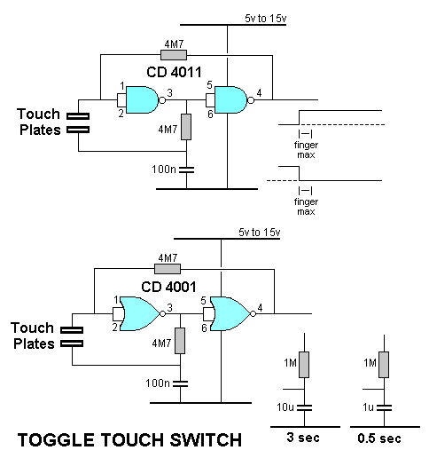

# #795 CD4011 Toggle Touch Switch

Testing a common CD4011 touch switch circuit with single on/off toggle pad.

Here's a quick demo..

## Notes

This is a common touch switch circuit based on two NAND gates from a CD4011.

I've made a touch pad from a small piece of copper-clad circuit board, with pins
for plugging into a breadboard.

In practice, the performance is quite unreliable, certainly not good enough for a real-world application.

### Circuit Design

Designed with Fritzing: see [ToggleTouchSwitch.fzz](./ToggleTouchSwitch.fzz).

### Performance

Testing on a breadboard:

See a quick demo..

In practice, the performance is quite unreliable. It appears very dependent on ambient humidity, and how dry or moist one's fingers are.
Certainly not reliable enough for a real-world application.

Replacing the touch pads with a push-button actually works quite well. Adjusting the capacitor value could improve debouncing the switch.

## Credits and References

* [CD4011 datasheet](https://www.futurlec.com/4000Series/CD4011.shtml)

### Reference Circuit #1

<https://www.talkingelectronics.com/projects/TouchSwitch/TouchSwitch-1.html>

