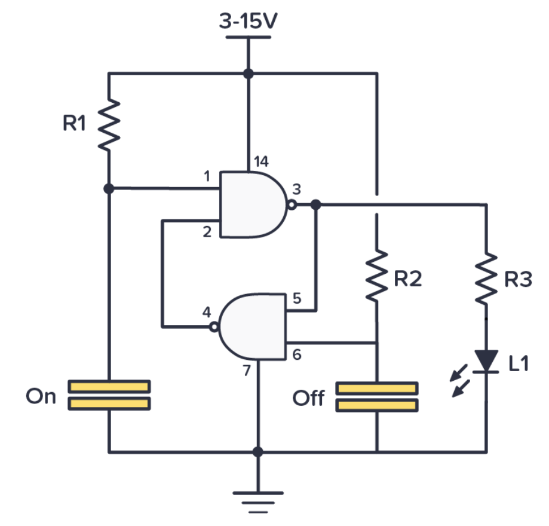
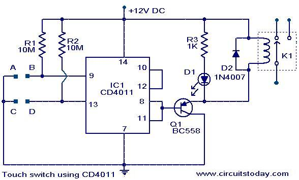

# #794 CD4011 Touch Switch

Testing a common CD4011 touch switch circuit with separate on and off pads.

Here's a quick demo..

## Notes

This is a common touch switch circuit based on two NAND gates from a CD4011.

I've made touch pads from a small piece of copper-clad circuit board, with pins
for plugging into a breadboard.

The two gates are connected in a ring and are bistable.
When power is applied, the gates will race to see which is initialised as "on", the other being "off" (a small 100pF capacitor to ground on one of the touch inputs can be used to force a consistent startup state).

Touching a pad will pull the corresponding input low, flipping the output state.

I my environment, the input pull-up resistors (R1, R2) need to be quite stiff to work.
I had success with 10MΩ, but with 1MΩ or lower, the touch switch did not work.

If the fingertips are too dry, the switch may also not work (or require a long press to activate).
Slightly dampening one's fingers can improve operation.

Since the output of a CD4011 is not capable of sinking or sourcing a high current, you can buffer the output of the gate with the third gate in the chip and wire it as an inverter.

### Circuit Design

Designed with Fritzing: see [TouchSwitch.fzz](./TouchSwitch.fzz).

Testing on a breadboard:

## Credits and References

* [CD4011 datasheet](https://www.futurlec.com/4000Series/CD4011.shtml)

### Reference Circuit #1

The following circuit is featured in many sources, such as:

* <https://www.build-electronic-circuits.com/4000-series-integrated-circuits/ic-4011/>
* <https://www.allelcoelec.com/blog/cd4011-nand-gate-explained-features-and-usage.html>

Although having the same construction as the circuit I've used, in most cases they specify R1=R2=10kΩ. In my environment and operating conditions, this does not work.

### Reference Circuit #2

As published on:

* <https://circuitstoday.com/touch-switch-using-cd4011>
* <https://a2zdoityourself.wordpress.com/2019/01/09/touch-switch-circuits/>
* <https://www.talkingelectronics.com/projects/TouchSwitch/TouchSwitch-1.html>

A similar circuit, but with higher value pull-ups and a transistor-switched output.
The example shows driving a relay.

