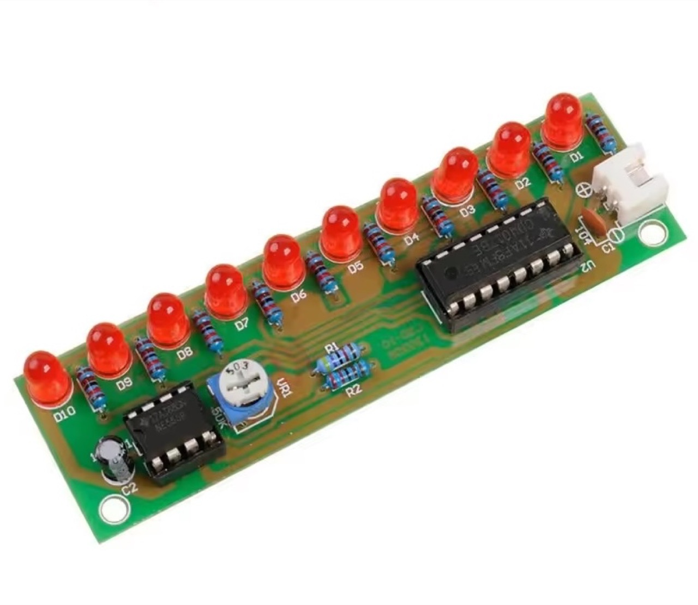
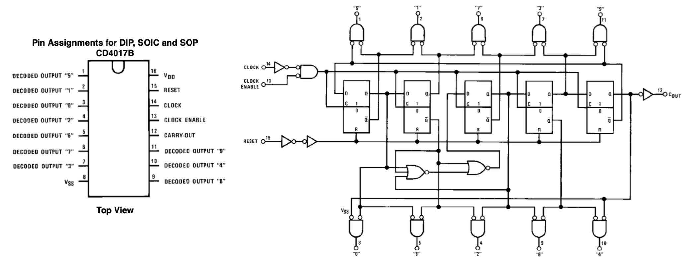

# #xxx CD4017 LED Chaser

Introducing the CD4017 decade counter with the LED Chaser demo circuit.

Here's a quick demo..

## Notes

The CD4017 decade counter shows up in many digital circuits
where it is useful for "fanning out" a clock pulse
across sequentially activated lines.

The "LED Chaser" is perhaps the most simple demonstration,
which I'll build below. It can also be picked up in kit form
for small change, for example, the following listing on aliexpress:

> NE555 + CD4017 Practice Learning Kits LED Light Chaser Sequencer Follower Scroller Module electronic DIY Kit For Arduino

### About the CD4017

The CD4017 is a CMOS decade counter/divider with 10 decoded outputs, often used in sequencing and timing applications. It counts from 0 to 9 on each rising edge of the clock input and activates one of its ten outputs (Q0 to Q9) sequentially, with only one output high at any given time. It also includes a carry-out (CO) output, which goes high after every 10 clock pulses, making it easy to cascade multiple CD4017s for extended counting. Reset and clock enable inputs allow control over the counting sequence, providing flexibility in design.

Operating over a wide voltage range from 3V to 15V, the CD4017 features high noise immunity and low power consumption, typical of CMOS logic. It is widely used in LED chasers, light sequencers, event counters, and simple frequency dividers. Its straightforward operation and compatibility with other 4000-series logic make it a popular choice for both educational projects and practical digital timing solutions.

### LED Chaser Circuit Design

Commonly called a "LED Chaser", this is likely the simplest circuit for demonstrating the CD4017.

We simply:

* drive the clock with a 555 timer - in this case running at about [1.5Hz](https://visual555.tardate.com/?mode=astable&r1=2&r2=10&c=10).
* wire an LED to each output Q0-Q9

In this we can see the counter toggling the outputs from Q0 to Q9.

I've just built this up on a breadboard:

## Credits and References

* [CD4017 datasheet](https://www.futurlec.com/4000Series/CD4017.shtml)
* <https://www.build-electronic-circuits.com/4000-series-integrated-circuits/ic-4017/>
* [NE555 + CD4017 Practice Learning Kits LED Light Chaser Sequencer Follower Scroller Module electronic DIY Kit For Arduino](https://www.aliexpress.com/item/33035452884.html) - aliexpress

## Video References

### 4000 Series Logic ICs: The 4017 Decade Counter by David Watts

### 4017 Decade Counter and Frequency Divider by EHobby Guy

