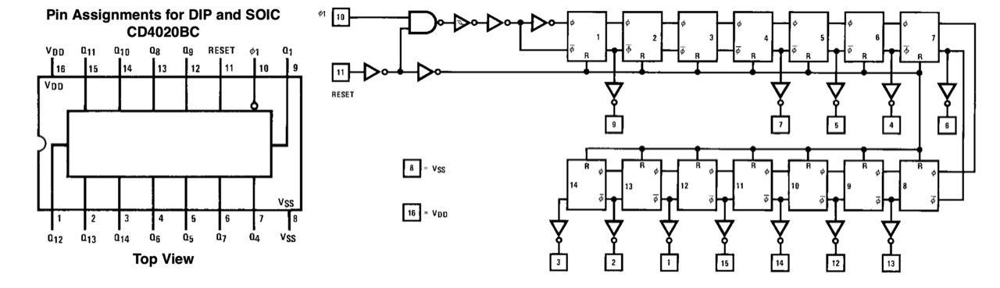

# #852 CD4020 Counter

Introducing the CD4020 14-stage binary counter with a basic demonstration circuit.

Here's a quick demo..

## Notes

The CD4020 14-Stage Ripple Carry Binary Counter is most commonly used as a frequency divider.
It skips stages 2 and 3 to fit the higher order divisors 4-14 on a 16 pin package.

### About the CD4020

The CD4020 is a CMOS 14-stage ripple-carry binary counter that functions as both an event counter and a frequency divider. With each input clock pulse, the internal flip-flops divide the clock frequency by successive powers of two, providing multiple binary outputs ranging from divide-by-16 up to divide-by-16,384 (intermediate stages are available, though not every stage is brought out to package pins). An asynchronous master reset input clears the counter to zero, making it easy to restart timing or counting operations. As a ripple counter, its outputs change sequentially rather than simultaneously, making it best suited for counting and clock division rather than synchronous logic.

Operating from a supply voltage of 3V to 15V, the CD4020 offers the low power consumption, wide operating range, and high noise immunity typical of the CMOS 4000 series. It is widely used in long-duration timers, clock dividers, digital clocks, frequency synthesizers, and sequencing applications where large divide ratios are required without the need for additional logic. Its ability to generate many divided clock frequencies from a single input makes it a versatile and economical component in both hobbyist and professional digital circuit designs.

### Circuit Design

The following circuit is a simple demonstration of the CD4024:

* a 555 timer provides a clock pulse
* LEDs are attached to display the state of the output pins
* a push-button pulls the RESET pin momentarily high to reset the counter

Designed with Fritzing: see [Counter.fzz](./Counter.fzz).

Setup on a breadboard. For demonstration purposes I have attached
[LEAP#791 555 Breadboard Pulse Generator](../../555Timer/BreadboardPulseGen/)
to provide the clock signal.

### Measuring the Output

I've attached a logic analyzer to measure the output transitions:

* D0: attached to Q1
* D1-D7: attached to Q8-Q14 respectively
* CH1 (Yellow): attached to Q14 to sync on the slowest changing signal

Circuit with logic analyzer attached:

## Credits and References

* [CD4020 datasheet](https://www.futurlec.com/4000Series/CD4020.shtml)
