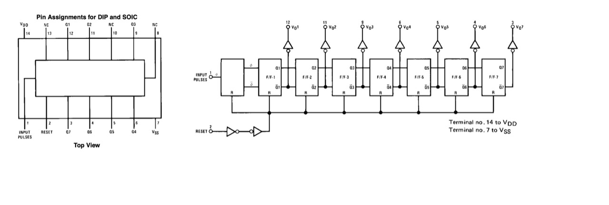

# #850 CD4024 Counter

Introducing the CD4024 7-stage binary counter with a basic demonstration circuit.

Here's a quick demo..

## Notes

The CD4024 7-Stage Ripple Carry Binary Counter is most commonly used as a frequency divider,
such as in Modular Synthesizers.

### About the CD4024

The CD4024 is a CMOS 7-stage ripple-carry binary counter that divides an input clock frequency by successive powers of two. Each stage toggles the next, producing outputs corresponding to divide-by-2, divide-by-4, divide-by-8, and so on up to divide-by-128. An asynchronous master reset input clears all stages to zero, allowing the counter to be restarted at any time. Because it is a ripple counter, each stage changes state slightly after the previous one, making it ideal for frequency division but less suitable for applications requiring all outputs to change simultaneously.

Operating over a wide supply voltage range of 3V to 15V, the CD4024 combines the low power consumption and high noise immunity characteristic of the CMOS 4000 series. It is commonly used in frequency dividers, timers, event counters, clock generation, and digital sequencing circuits. Its simplicity, reliability, and ability to generate multiple divided clock signals from a single input have made it a popular building block in both hobbyist and industrial digital designs.

### Circuit Design

The following circuit is a simple demonstration of the CD4024:

* a 555 timer provides a clock pulse
* LEDs are attached to display the state of the output pins
* a push-button pulls the RESET pin momentarily high to reset the counter

Designed with Fritzing: see [Counter.fzz](./Counter.fzz).

Setup on a breadboard. For demonstration purposes
I have attached
[LEAP#791 555 Breadboard Pulse Generator](../../555Timer/BreadboardPulseGen/)
to provide the clock signal.

### Measuring the Ouput

I've attached a logic analyzer to measure the output transitions:

* D0-D6: attached to Q1-Q7 respectively
* D7: attached to CLK
* CH1 (Yellow): attached to Q7 to sync on the slowest changing signal

Circuit with logic analyzer attached:

## Credits and References

* [CD4024 datasheet](https://www.futurlec.com/4000Series/CD4024.shtml)
