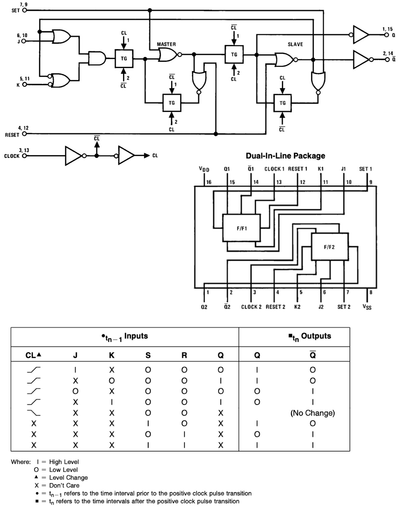
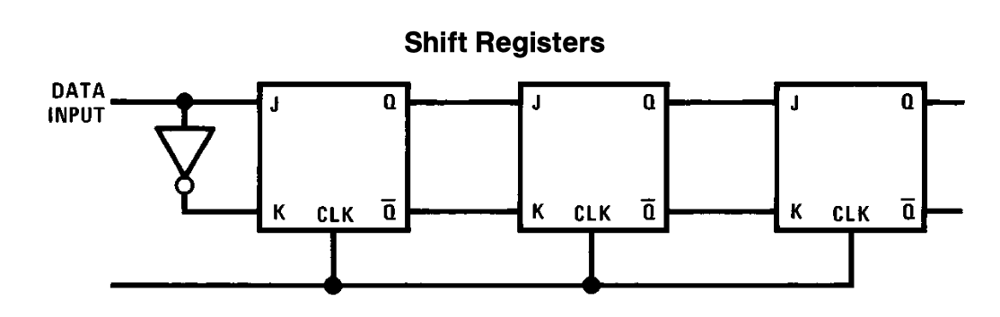
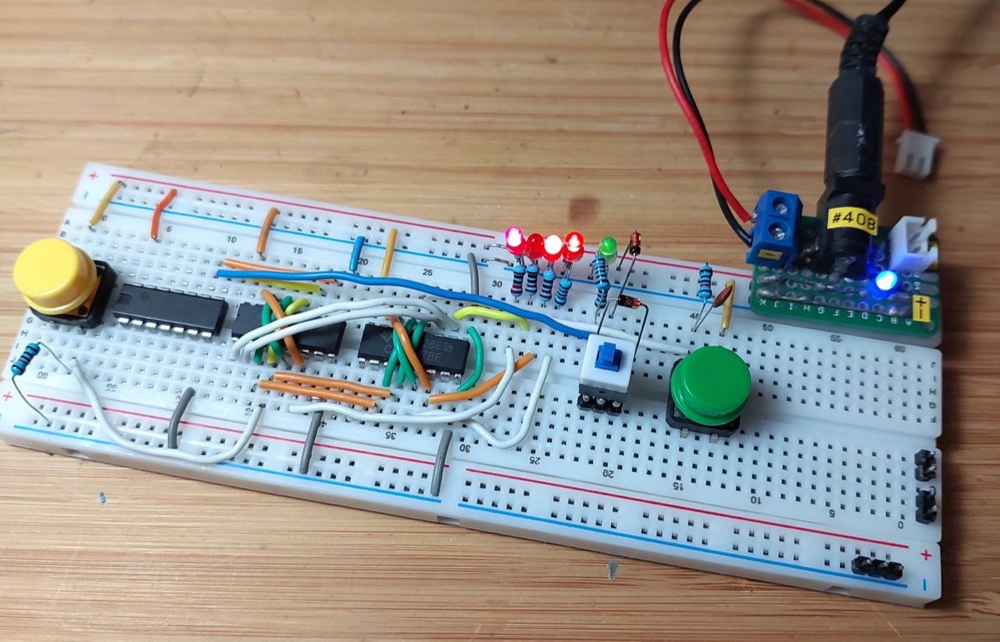
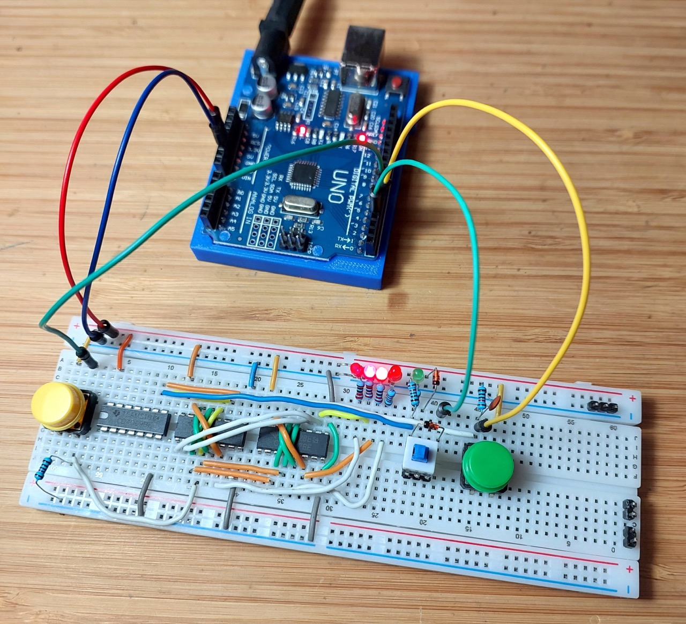

# #xxx CD4027 Shift Register

Build a 4-bit shift register made with CD4027 J-K flip-flops, setup for both manual control and an Arduino-driven demonstration sequence.

Here's a quick demo..

## Notes

### About the CD4027

The CD4027 is a dual J-K master-slave flip-flop integrated circuit from the CMOS 4000 series, featuring two independent flip-flops with set (S), reset (R), clock (CLK), J, and K inputs, along with Q and Q̅ outputs. It is edge-triggered, meaning state changes occur on the specified clock transition (typically the falling edge), and it provides versatile functionality by supporting the basic operations of a J-K flip-flop—set, reset, toggle, and hold—depending on the J and K input states.

Designed for a wide operating voltage range from 3V to 15V, the CD4027 offers low power consumption and high noise immunity, making it suitable for a variety of digital logic applications such as frequency division, counters, shift registers, and simple memory storage. As a member of the CMOS family, it is pin-compatible with other 4000-series logic ICs and is ideal for use in both prototyping and final embedded system designs where flexibility and reliability are important.

### Implementing a Shift Register

A chain of D flip-flops is perhaps the most fundamental shift register design,
but it is possible to do the same with JK flip-flop,
with the addition of an inverter so that the JKs configured to act like D flip-flops (J = D, K = ~D).

The functional design is included as an example in some datasheets for the CD4027:

### Circuit Design

The 4-bit shift register is built from 2x CD4027B JK flip-flops,
with a CD4069 to invert the initial data line.

I've setup the circuit on a breadboard with the features to allow manual control:

* a switch to set the data line level
* a push-button (with RC debouncing) to manually toggle the clock
* a push-button to trigger reset

An Arduino Uno is used to run an automated demo.
The circuit is setup so the Arduino can be connected to run its demo without needing to disconnect the manual switches:

* push-buttons are configured with pull-down resistors so that they are safe to remain connected when the, but should not be pressed while the Arduino is in control
* the data switch should ideally be in the OFF/LOW position, but diodes protect from a short-circuit if not

Powering the circuit:

* I've shown the circuit powered by a 5V supply. This can be used for manual or Arduino control
* If only Arduino control is required, the circuit can be powered from the 5V pin from the Arduino instead.

### Manual Control

For manual control, disconnect the Arduino - at least the GPIO lines.

* press the reset button `S1-RESET` to set all outputs LOW
* to shift in a HIGH value:
    * switch `S3-DATA` to HIGH
    * press the clock button `S2-CLK`
* to shift in a LOW value:
    * switch `S3-DATA` to LOW
    * press the clock button `S2-CLK`

### Arduino Control

The [ShiftRegister.ino](./ShiftRegister.ino) script runs a simple demo cycle to exercise the shift register:

* trigger reset
* shift in the numbers 1 through 16 with a short delay after each
* repeat

## Credits and References

* [CD4069 datasheet](https://www.futurlec.com/4000Series/CD4069.shtml)
* [CD4027B datasheet](https://www.futurlec.com/4000Series/CD4027.shtml)
* [CD4027B product information (TI)](https://www.ti.com/product/CD4027B)
