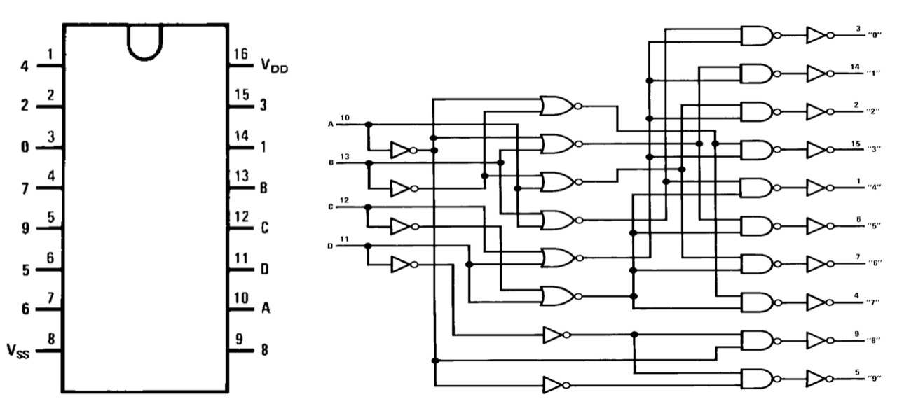

# #834 CD4028 Quad Exclusive Interlock

Building a 4-pole exclusive interlock using the CD4028 BCD to Decimal decoder, with a simple LED switching demonstration.

## Notes

This circuit demonstrates how the CD4028 BCD-to-decimal decoder may be used to implement a 4-pole (quad) exclusive interlock.

A quad exclusive interlock is a system with four possible outputs where at most one is allowed to be enabled at a time, and the others are locked out.

* Output A ON: B, C, D must be OFF
* Output B ON: A, C, D must be OFF
* Output C ON: A, B, D must be OFF
* Output D ON: A, B, C must be OFF

> NB: A simple quad interlock is a control or safety system where four separate checks (interlocks) must all be OK before the system can turn on, move, or continue running.
> This can be implemented with an AND gate.

### About the CD4028

The CD4028 is a CMOS BCD-to-decimal decoder that converts a 4-bit binary-coded decimal (BCD) input into one of ten mutually exclusive outputs. For each valid BCD input (0000–1001), exactly one of the ten outputs goes high, making it useful for selecting one of ten lines in sequencing, display control, or demultiplexing applications. Unlike 7-segment decoders, the CD4028 provides fully decoded individual outputs, which can directly drive logic inputs, transistors, or indicator LEDs.

Operating over a wide supply voltage range of 3V to 15V, the CD4028 offers the low power consumption and high noise immunity typical of the CMOS 4000 series. It is commonly used in counters, scanning circuits, keypad decoding, and control systems where a one-of-ten output is required. Because of its simple decoding logic and wide voltage tolerance, the CD4028 is especially useful in mixed-voltage and low-power designs, as well as in classic CMOS-based digital circuits.

### Quad Interlock Circuit Design

The truth table below illustrates the design for inputs A-B-C-D.

| D | C | B | A | 0 | 1 | 2 | 3 | 4 | 5 | 6 | 7 | 8 | 9 | State                               |
|---|---|---|---|---|---|---|---|---|---|---|---|---|---|-------------------------------------|
| 0 | 0 | 0 | 0 | 1 | 0 | 0 | 0 | 0 | 0 | 0 | 0 | 0 | 0 | All outputs low                     |
| 0 | 0 | 0 | 1 | 0 | 1 | 0 | 0 | 0 | 0 | 0 | 0 | 0 | 0 | A exclusively asserted, Q1 HIGH     |
| 0 | 0 | 1 | 0 | 0 | 0 | 1 | 0 | 0 | 0 | 0 | 0 | 0 | 0 | B exclusively asserted, Q2 HIGH     |
| 0 | 0 | 1 | 1 | 0 | 0 | 0 | 1 | 0 | 0 | 0 | 0 | 0 | 0 | All outputs low                     |
| 0 | 1 | 0 | 0 | 0 | 0 | 0 | 0 | 1 | 0 | 0 | 0 | 0 | 0 | C exclusively asserted, Q4 HIGH     |
| 0 | 1 | 0 | 1 | 0 | 0 | 0 | 0 | 0 | 1 | 0 | 0 | 0 | 0 | All outputs low                     |
| 0 | 1 | 1 | 0 | 0 | 0 | 0 | 0 | 0 | 0 | 1 | 0 | 0 | 0 | All outputs low                     |
| 0 | 1 | 1 | 1 | 0 | 0 | 0 | 0 | 0 | 0 | 0 | 1 | 0 | 0 | All outputs low                     |
| 1 | 0 | 0 | 0 | 0 | 0 | 0 | 0 | 0 | 0 | 0 | 0 | 1 | 0 | D exclusively asserted, Q8 HIGH     |
| 1 | 0 | 0 | 1 | 0 | 0 | 0 | 0 | 0 | 0 | 0 | 0 | 0 | 1 | All outputs low                     |
| 1 | 0 | 1 | 0 | 0 | 0 | 0 | 0 | 0 | 0 | 0 | 0 | 1 | 0 | All outputs low (invalid BCD state) |
| 1 | 0 | 1 | 1 | 0 | 0 | 0 | 0 | 0 | 0 | 0 | 0 | 0 | 1 | All outputs low (invalid BCD state) |
| 1 | 1 | 0 | 0 | 0 | 0 | 0 | 0 | 0 | 0 | 0 | 0 | 1 | 0 | All outputs low (invalid BCD state) |
| 1 | 1 | 0 | 1 | 0 | 0 | 0 | 0 | 0 | 0 | 0 | 0 | 0 | 1 | All outputs low (invalid BCD state) |
| 1 | 1 | 1 | 0 | 0 | 0 | 0 | 0 | 0 | 0 | 0 | 0 | 1 | 0 | All outputs low (invalid BCD state) |
| 1 | 1 | 1 | 1 | 0 | 0 | 0 | 0 | 0 | 0 | 0 | 0 | 0 | 1 | All outputs low (invalid BCD state) |

Hence we have 4 exclusive states:

* A OUTPUT = A AND Q1
* B OUTPUT = B AND Q2
* C OUTPUT = C AND Q4
* D OUTPUT = D AND Q8

Each output is implemented with a simple NFET switch, wired to only turn on when both inputs are high.

The breadboard circuit has:

* green LEDs to indicate input state
* red LEDs to indicate output state

Designed with Fritzing: see [QuadExclusiveInterlock.fzz](./QuadExclusiveInterlock.fzz).

Setup on a breadboard, with all inputs LOW, therefore output LOW:

### Testing

When all (or more than one) inputs are high, all outputs are low:

When all inputs are low, all outputs are low:

When only input A high, output A is high:

When only input B high, output B is high:

When only input C high, output C is high:

When only input D high, output D is high:

## Credits and References

* [CD4028 Datasheet](https://www.futurlec.com/4000Series/CD4028.shtml)
* [CD4028B Product Information (ti.com)](https://www.ti.com/product/CD4028B)
* [DIY Audio Input Switch Circuit with CD4028 & LM3915](https://www.smbom.com/news/11989)
* [Four Interlock Switch Controller(CD4028) Circuit](http://www.seekic.com/circuit_diagram/Control_Circuit/Four_Interlock_Switch_ControllerCD4028_Circuit.html)
